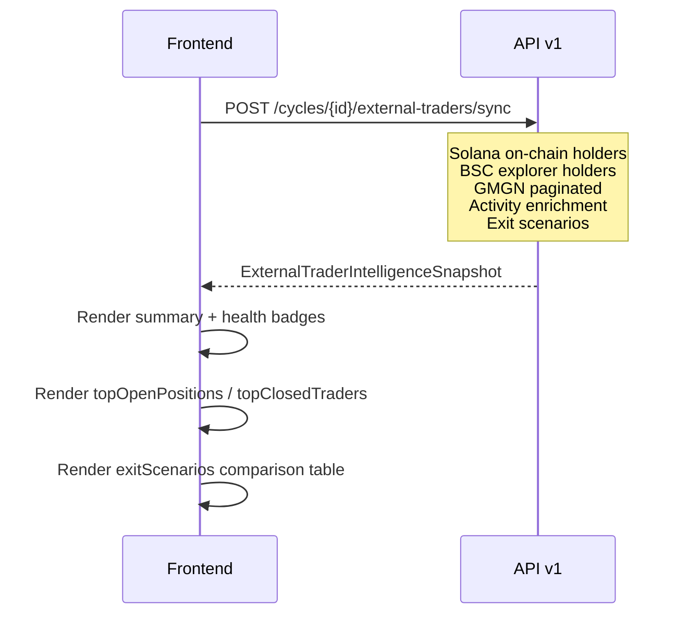
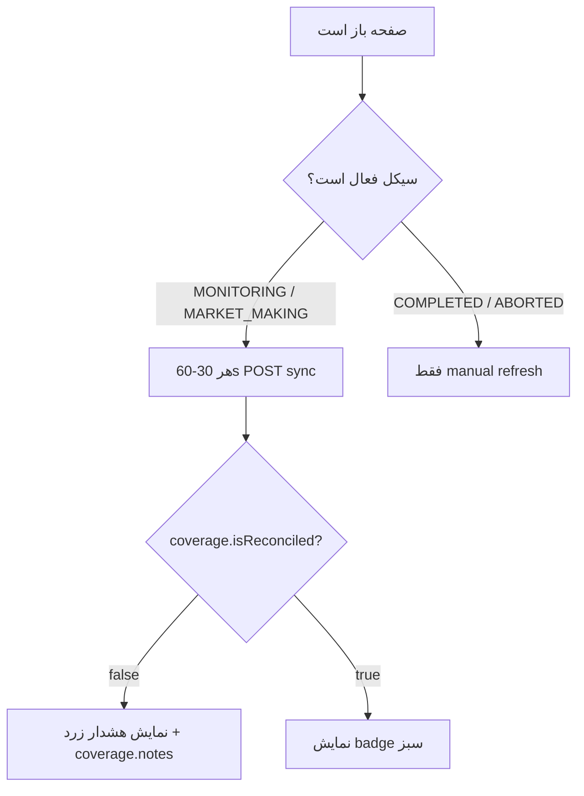
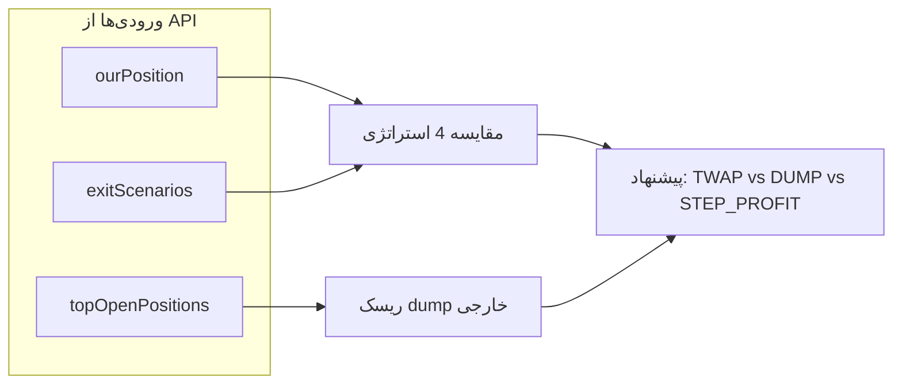

# External Trader Intelligence — مستند فرانت‌اند

> **نسخه API:** `api/v1`  
> **Swagger tag:** `Analysis`  
> **وضعیت:** Production-ready  
> **آخرین به‌روزرسانی:** 2026-06-30

این سند برای تیم فرانت است تا صفحه **تحلیل تریدرهای خارجی** و **سناریوهای خروج** را روی هر سیکل پیاده‌سازی کنند.

---

## فهرست

1. [هدف و دامنه](#هدف-و-دامنه)
2. [تفاوت با Cycle Analysis](#تفاوت-با-cycle-analysis)
3. [احراز هویت](#احراز-هویت)
4. [Endpoints](#endpoints)
5. [فلوهای پیشنهادی UI](#فلوهای-پیشنهادی-ui)
6. [ساختار پاسخ کامل](#ساختار-پاسخ-کامل)
7. [منطق کسب‌وکار](#منطق-کسب‌وکار)
8. [سناریوهای خروج (Exit Scenarios)](#سناریوهای-خروج-exit-scenarios)
9. [کیفیت داده و بدون گپ بودن](#کیفیت-داده-و-بدون-گپ-بودن)
10. [خطاها](#خطاها)
11. [نکات عملکردی](#نکات-عملکردی)
12. [TypeScript types](#typescript-types-برای-فرانت)
13. [نمونه پاسخ](#نمونه-پاسخ-خلاصه)
14. [چک‌لیست UI](#چک‌لیست-ui)

---

## هدف و دامنه

قابلیت **External Trader Intelligence** برای هر `cycleId` که توکن on-chain دارد، این‌ها را برمی‌گرداند:

| بخش | توضیح |
|-----|--------|
| **تریدرهای خارجی** | همه walletهایی که holder/trader توکن هستند **به‌جز** walletهای داخلی ما و آدرس‌های سیستمی (pool / bonding curve) |
| **پوزیشن باز** | خارجی‌هایی که **هنوز توکن دارند** + ارزش USD |
| **پوزیشن بسته** | خارجی‌هایی که **خرید/فروش کرده‌اند** و balance توکن نزدیک صفر است |
| **جمع‌بندی سرمایه** | `buyUsd`, `sellUsd`, `netFlowUsd`, `openPositionUsd`, `realizedPnlUsd` به تفکیک segment |
| **موقعیت ما** | SOL/BNB آزاد، توکن held، سود قبلاً realize شده، mark-to-market |
| **سناریوهای خروج** | تخمین `totalFinalUsd` برای MARK_TO_MARKET / DUMP / TWAP / STEP_PROFIT |
| **کیفیت داده** | `coverage`, `reconciliation`, `dataComplete` per trader |

### پیش‌نیاز

- سیکل باید **توکن launch شده** داشته باشد (`token.address` معتبر on-chain).
- سیکل‌های بدون توکن → `404 Cycle token is not available on-chain`.

---

## تفاوت با Cycle Analysis

| | `GET/POST .../analysis` | `GET/POST .../external-traders` |
|--|-------------------------|----------------------------------|
| **تمرکز** | سرمایه و walletهای **داخلی** ما | تریدرهای **خارجی** + تصمیم خروج |
| **organicFlow** | تخمین aggregate در `economics` | reconcile با لیست per-wallet |
| **خروج** | ندارد | `exitScenarios[]` |
| **لیست wallet** | market + owner wallets ما | `traders[]` خارجی |

**توصیه:** در UI سیکل، هر دو endpoint را کنار هم نشان دهید — Analysis برای «پول ما»، External Traders برای «بازار و ریسک خارجی».

---

## احراز هویت

همه endpointها نیاز به API key دارند:

```http
x-api-key: <API_KEY>
```

Base URL نمونه production:

```text
http://212.64.199.144:5420/api/v1
```

Swagger UI (در صورت فعال بودن): `{BASE}/docs`

---

## Endpoints

### 1. دریافت snapshot (سریع — بدون refresh زنجیره)

```http
GET /api/v1/cycles/{cycleId}/external-traders
```

| | |
|--|--|
| **Method** | `GET` |
| **Auth** | `x-api-key` |
| **Path param** | `cycleId` — UUID سیکل |
| **Body** | ندارد |
| **رفتار** | `sync: false` — balance native از DB؛ holderها و GMGN live fetch می‌شوند؛ wallet balance refresh on-chain **نمی‌شود** |

---

### 2. Refresh کامل (توصیه برای صفحه اصلی)

```http
POST /api/v1/cycles/{cycleId}/external-traders/sync
```

| | |
|--|--|
| **Method** | `POST` |
| **Auth** | `x-api-key` |
| **Path param** | `cycleId` — UUID |
| **Body** | ندارد |
| **رفتار** | `sync: true` — علاوه بر موارد بالا: refresh balance native walletها از RPC؛ `organicFlow` با `forceRefreshTokenInfo` |

**UI:** دکمه «Refresh» / «Sync» همیشه `POST .../sync` بزند. اولین بار ورود به صفحه هم sync کنید.

---

### cURL نمونه

```bash
curl -s -X POST \
  -H "x-api-key: YOUR_API_KEY" \
  "http://212.64.199.144:5420/api/v1/cycles/632cf5cb-4b3a-44e9-8b93-7da678c7a895/external-traders/sync"
```

---

## فلوهای پیشنهادی UI

### فلو 1 — ورود به صفحه سیکل



### فلو 2 — Auto-refresh دوره‌ای (اختیاری)



### فلو 3 — تصمیم خروج اپراتور



### فلو 4 — جدول تریدرها با فیلتر

```text
traders[] (کامل) ──sort──► نمایش در DataTable
         │
         ├── فیلتر positionStatus: OPEN | CLOSED | NEVER_HELD
         ├── فیلتر dataComplete: true | false
         └── جستجو روی address
```

**نکته:** `topOpenPositions` و `topClosedTraders` هر کدام حداکثر **۱۰۰** ردیف برتر هستند (برای کارت‌های خلاصه). جدول کامل از `traders[]` استفاده کند.

---

## ساختار پاسخ کامل

نوع ریشه: `ExternalTraderIntelligenceSnapshot`

### سطح ریشه

| فیلد | نوع | توضیح |
|------|-----|--------|
| `cycleId` | `string` (uuid) | شناسه سیکل |
| `network` | `"SOLANA"` \| `"BSC"` | شبکه |
| `status` | `CycleStatus` | وضعیت سیکل (مثلاً `COMPLETED`, `MONITORING`) |
| `token` | `object` \| `null` | متادیتای توکن + قیمت live |
| `summary` | `object` | جمع‌بندی segmentها |
| `traders` | `ExternalTraderRow[]` | **لیست کامل** همه تریدرهای خارجی |
| `topOpenPositions` | `ExternalTraderRow[]` | تا ۱۰۰ تا — بیشترین `tokenBalanceUsd` با `OPEN` |
| `topClosedTraders` | `ExternalTraderRow[]` | تا ۱۰۰ تا — `CLOSED` بر اساس `capitalDeployedUsd` |
| `exitScenarios` | `ExitScenarioEstimate[]` | همیشه **۴** آیتم |
| `ourPosition` | `object` | موقعیت سرمایه ما |
| `coverage` | `object` | پوشش holder و کیفیت داده |
| `reconciliation` | `object` | تطبیق حجم با organic flow |
| `syncedAt` | `string` (ISO 8601) | زمان تولید snapshot |

---

### `token`

| فیلد | نوع | توضیح |
|------|-----|--------|
| `id` | uuid | شناسه DB |
| `address` | string | mint / contract |
| `symbol` | string | نماد |
| `priceUsd` | number | قیمت spot |
| `liquidityUsd` | number | نقدینگی pool |
| `marketCapUsd` | number | مارکت کپ |
| `holderCount` | number | تعداد holder گزارش‌شده (GMGN / on-chain) |

---

### `summary`

چهار segment با ساختار یکسان `ExternalTraderSegmentSummary`:

| Segment | معنی |
|---------|------|
| `all` | همه تریدرهای خارجی شناسایی‌شده |
| `openPositions` | فقط `positionStatus === "OPEN"` |
| `closedPositions` | فقط `positionStatus === "CLOSED"` |
| `neverHeld` | فقط `positionStatus === "NEVER_HELD"` |

هر segment:

| فیلد | توضیح |
|------|--------|
| `traderCount` | تعداد wallet |
| `buyUsd` | مجموع خرید USD |
| `sellUsd` | مجموع فروش USD |
| `netFlowUsd` | `buyUsd - sellUsd` |
| `openPositionUsd` | مجموع ارزش توکن باقی‌مانده در دست خارجی‌ها |
| `tokenBalance` | مجموع مقدار توکن (human units) |
| `realizedPnlUsd` | مجموع PnL تحقق‌یافته (از GMGN) |

فیلدهای meta در `summary`:

| فیلد | توضیح |
|------|--------|
| `totalReportedHolders` | holder count گزارش‌شده (منهای داخلی در coverage) |
| `identifiedExternalTraders` | تعداد wallet خارجی در `traders[]` |
| `coveragePercent` | `identified / reported * 100` |
| `internalWalletCount` | تعداد wallet داخلی فیلتر شده (market + owner + main fee) |
| `excludedSystemAddresses` | pool / bonding curve حذف شده |

---

### `ExternalTraderRow` (هر تریدر)

| فیلد | نوع | توضیح |
|------|-----|--------|
| `address` | string | آدرس wallet (Solana base58 / BSC lowercase `0x`) |
| `positionStatus` | enum | `OPEN` \| `CLOSED` \| `NEVER_HELD` |
| `tokenBalance` | number | مقدار توکن فعلی |
| `tokenBalanceUsd` | number | ارزش USD balance |
| `buyUsd` | number | حجم خرید تجمیعی |
| `sellUsd` | number | حجم فروش تجمیعی |
| `netFlowUsd` | number | `buyUsd - sellUsd` |
| `buyCount` | number | تعداد خرید |
| `sellCount` | number | تعداد فروش |
| `realizedPnlUsd` | number | سود/ضرر realize شده (GMGN) |
| `capitalDeployedUsd` | number | `max(buyUsd, tokenBalanceUsd)` |
| `dataComplete` | boolean | آیا buy/sell برای این wallet کامل است |
| `missingFields` | string[] | مثلاً `["buyUsd"]` — برای badge هشدار |
| `sources` | string[] | منبع داده (جدول زیر) |

#### `sources` — مقادیر ممکن

| مقدار | معنی |
|-------|------|
| `on_chain` | Solana — اسکن SPL token accounts |
| `explorer_holders` | BSC — `tokenholderlist` از Etherscan/BscScan |
| `gmgn_holders` | GMGN top holders (paginated) |
| `gmgn_traders` | GMGN top traders (paginated) |
| `gmgn_activity` | GMGN `wallet_activity` enrichment |
| `merged` | (رزرو — فعلاً در خروجی per-row استفاده نمی‌شود) |

---

### `ourPosition`

| فیلد | توضیح |
|------|--------|
| `freeNativeUsd` | SOL/BNB آزاد در walletهای market+owner سیکل (USD) |
| `tokenHeld` | مجموع توکن held (market + owner) |
| `tokenHeldUsd` | ارزش spot توکن |
| `alreadyRealizedUsd` | profit extraction + emergency sell این سیکل |
| `markToMarketUsd` | `freeNativeUsd + tokenHeldUsd + alreadyRealizedUsd` |
| `ownerHeldPercent` | درصد supply در wallet owner |
| `marketHeldPercent` | درصد supply در walletهای market |

---

### `coverage`

| فیلد | توضیح |
|------|--------|
| `onChainHolderCount` | تعداد holder از RPC Solana |
| `explorerHolderCount` | تعداد holder از BSC explorer |
| `gmgnHolderRows` | ردیف‌های GMGN holders |
| `gmgnTraderRows` | ردیف‌های GMGN traders |
| `gmgnActivityEnriched` | تعداد walletهای enrich شده با activity pass |
| `mergedUniqueExternal` | تعداد نهایی `traders[]` |
| `reportedHolderCount` | مرجع برای محاسبه coverage |
| `coveragePercent` | درصد پوشش holder |
| `dataCompletePercent` | درصد trader با `dataComplete: true` |
| `completeness` | `full` \| `partial` \| `unavailable` |
| `isReconciled` | تطبیق با organic flow (بعد از enrichment) |
| `notes` | توضیحات متنی برای اپراتور / UI tooltip |

#### `completeness`

| مقدار | شرط |
|-------|------|
| `full` | Solana on-chain یا BSC explorer holder scan موفق |
| `partial` | فقط GMGN ranked lists |
| `unavailable` | هیچ منبع معتبری نیست |

---

### `reconciliation`

| فیلد | توضیح |
|------|--------|
| `aggregatedExternalBuyUsd` | جمع `buyUsd` همه `traders[]` |
| `aggregatedExternalSellUsd` | جمع `sellUsd` |
| `organicFlowExternalBuyUsd` | از `organicFlow.externalBuyUsd` سیکل |
| `organicFlowExternalSellUsd` | از `organicFlow.externalSellUsd` |
| `buyUsdDelta` | aggregated − organic (buy) |
| `sellUsdDelta` | aggregated − organic (sell) |
| `incompleteTraderCount` | تعداد `dataComplete === false` |
| `incompleteOpenPositionCount` | incomplete با `OPEN` |
| `dataCompletePercent` | درصد کامل بودن داده per-wallet |
| `isReconciled` | `true` اگر incomplete=0 و deltaها در tolerance |
| `notes` | پیام‌های تطبیق |

**Tolerance `isReconciled`:**  
`incompleteTraderCount === 0` و  
`|delta| <= max(250, aggregated * 0.15)` برای buy و sell.

---

### `exitScenarios[]` — همیشه ۴ استراتژی

| `strategy` | برچسب UI پیشنهادی | معنی |
|------------|-------------------|------|
| `MARK_TO_MARKET` | وضعیت فعلی | بدون فروش جدید — bag با spot price |
| `DUMP` | فروش اضطراری یکجا | ۱۰۰٪ توکن در یک batch + slippage emergency |
| `TWAP` | TWAP سیستم | batch طبق `profitExtract` settings |
| `STEP_PROFIT` | سود پله‌ای | فروش تا `minMarketHoldPercent` |

هر آیتم:

| فیلد | توضیح |
|------|--------|
| `strategy` | enum بالا |
| `label` | توضیح انگلیسی از backend |
| `tokenSold` | مقدار توکن فروخته‌شده (تخمین) |
| `tokenSoldUsdSpot` | ارزش spot قبل از slippage |
| `slippageUsd` | ضرر slippage |
| `slippagePercent` | درصد slippage |
| `tokenProceedsUsd` | USD حاصل از فروش توکن |
| `freeNativeUsd` | native آزاد ما |
| `alreadyRealizedUsd` | قبلاً realize شده |
| `totalFinalUsd` | **عدد کلیدی برای مقایسه استراتژی‌ها** |
| `batches` | تعداد batch فروش |
| `durationEstimateSec` | زمان تخمینی اجرا |
| `remainingTokenUsd` | توکن unsold (مهم برای STEP_PROFIT) |
| `assumptions` | فرضیات مدل — نمایش در tooltip |

**فرمول `totalFinalUsd`:**

- `MARK_TO_MARKET`: `freeNativeUsd + spotTokenUsd + alreadyRealizedUsd`
- `DUMP` / `TWAP`: `freeNativeUsd + tokenProceedsUsd + alreadyRealizedUsd`
- `STEP_PROFIT`: همان + `remainingTokenUsd` (توکن نگه‌داشته‌شده با spot)

**منبع تنظیمات slippage (backend):**

| پارامتر | منبع settings |
|---------|----------------|
| `dumpSlippageBps` | `treasury.consolidate.defaultSlippageBps` (پیش‌فرض Solana 1500) |
| `twapSlippageBps` | `strategy.profitExtract.slippageBps` (پیش‌فرض 600) |
| `sellBatchRatio` | `strategy.profitExtract.sellBatchRatio` |
| `maxSellBatchPercent` | `strategy.profitExtract.maxSellBatchPercent` |
| `minMarketHoldPercent` | `strategy.profitExtract.minMarketHoldPercent` |

---

## منطق کسب‌وکار

### `positionStatus`

```text
OPEN      → tokenBalance > 1 OR tokenBalanceUsd > $0.50
CLOSED    → balance نزدیک صفر ولی buyUsd یا sellUsd > $0.50
NEVER_HELD → در لیست trader بدون balance و بدون حجم معامله
```

### `dataComplete` و `missingFields`

| وضعیت | کامل وقتی |
|-------|-----------|
| `OPEN` | `gmgn_traders` یا `gmgn_activity` دارد **یا** `buyUsd > 0` |
| `CLOSED` | هم `buyUsd` و هم `sellUsd` > 0 |
| `NEVER_HELD` | همیشه complete |

اگر `dataComplete === false` → در UI آیکون هشدار + نمایش `missingFields`.

### چه walletهایی «داخلی» فیلتر می‌شوند؟

- همه `MARKET` و `TOKEN_OWNER` متصل به `cycleId`
- آدرس `main_fee_wallet` (Solana یا BSC)
- آدرس‌های سیستمی pool: `pool_address`, `bonding_curve`, `lp_address`, `raydium_pool`, ...

### منابع داده backend (برای شفافیت UI)

| شبکه | Holder (کامل) | Buy/Sell |
|------|---------------|----------|
| **Solana** | RPC `getProgramAccounts` (TOKEN + TOKEN-2022) | GMGN traders + activity enrichment |
| **BSC** | Etherscan `tokenholderlist` (تا 10k) | GMGN traders + activity enrichment |

**محدودیت‌های ثابت (backend):**

| ثابت | مقدار |
|------|-------|
| GMGN page size | 100 |
| GMGN max pages | 25 (تا ~2500 ردیف) |
| Activity enrichment | 180 wallet برتر incomplete |
| Enrichment concurrency | 8 |
| Top lists در پاسخ | 100 |

---

## سناریوهای خروج (Exit Scenarios)

### UI پیشنهادی — کارت مقایسه

```text
┌─────────────────┬──────────────┬───────────┬──────────┐
│ استراتژی        │ totalFinalUsd│ slippage  │ زمان     │
├─────────────────┼──────────────┼───────────┼──────────┤
│ فعلی (MTM)      │ $13,308      │ —         │ —        │
│ DUMP            │ $12,450      │ -$420     │ ~30s     │
│ TWAP            │ $13,100      │ -$180     │ ~6 min   │
│ STEP_PROFIT     │ $13,250      │ -$120     │ ~4 min   │
└─────────────────┴──────────────┴───────────┴──────────┘
```

- **رنگ سبز:** بالاترین `totalFinalUsd` (با احتیاط — MTM slippage واقعی ندارد)
- **رنگ قرمز:** `slippagePercent` بالا در DUMP
- **Tooltip:** `assumptions[]` هر ردیف

### رابطه با ریسک خارجی

اگر `summary.openPositions.openPositionUsd` بالا و `topOpenPositions` زیاد است → احتمال dump خارجی بیشتر → در UI کنار DUMP هشدار «فشار فروش خارجی».

---

## کیفیت داده و بدون گپ بودن

### Badge سلامت داده (پیشنهاد UI)

همه شرط‌ها `true` → **«داده کامل»** (سبز):

```typescript
const isHealthy =
  coverage.completeness === 'full' &&
  coverage.coveragePercent >= 99 &&
  reconciliation.isReconciled === true &&
  reconciliation.incompleteTraderCount === 0;
```

### اگر healthy نیست

| شرط | پیام UI |
|-----|---------|
| `completeness !== 'full'` | «پوشش holder ناقص — on-chain scan ناموفق» |
| `coveragePercent < 99` | «{n}% holder شناسایی شد» |
| `incompleteTraderCount > 0` | «{n} wallet بدون buy/sell کامل» |
| `!isReconciled` | نمایش `reconciliation.notes` |

---

## خطاها

| HTTP | بدنه | علت |
|------|------|-----|
| `401` | `Invalid API key` | `x-api-key` نادرست |
| `404` | `Cycle not found` | `cycleId` نامعتبر |
| `404` | `Cycle token is not available on-chain` | توکن launch نشده / address placeholder |
| `5xx` | — | GMGN/RPC/Explorer timeout — retry با backoff |

**رفتار پیشنهادی فرانت:**

- `404` token → پیام «سیکل هنوز توکن on-chain ندارد» + disable صفحه
- `5xx` / timeout → toast + دکمه retry
- `POST sync` ممکن است **۱۵–۹۰ ثانیه** طول بکشد → loading state با progress text

---

## نکات عملکردی

1. **همیشه `POST /sync` برای داده تصمیم‌گیری** — `GET` برای prefetch سبک OK است.
2. **Debounce** دکمه refresh (حداقل ۱۰ ثانیه بین sync).
3. **جدول `traders[]`** می‌تواند صدها ردیف باشد → virtualized table.
4. **`syncedAt`** را در UI نشان دهید («آخرین به‌روزرسانی: …»).
5. لینک explorer:
   - Solana: `https://solscan.io/account/{address}`
   - BSC: `https://bscscan.com/address/{address}`
6. لینک توکن:
   - Solana: `https://gmgn.ai/sol/token/{mint}` (اختیاری)
7. صفحه را با `cycleId` از route بگیرید — query param اضافی لازم نیست.

---

## TypeScript types برای فرانت

```typescript
type Network = 'SOLANA' | 'BSC';
type PositionStatus = 'OPEN' | 'CLOSED' | 'NEVER_HELD';
type ExitStrategy = 'MARK_TO_MARKET' | 'DUMP' | 'TWAP' | 'STEP_PROFIT';
type DataSource =
  | 'on_chain'
  | 'explorer_holders'
  | 'gmgn_holders'
  | 'gmgn_traders'
  | 'gmgn_activity';

interface ExternalTraderSegmentSummary {
  traderCount: number;
  buyUsd: number;
  sellUsd: number;
  netFlowUsd: number;
  openPositionUsd: number;
  tokenBalance: number;
  realizedPnlUsd: number;
}

interface ExternalTraderRow {
  address: string;
  positionStatus: PositionStatus;
  tokenBalance: number;
  tokenBalanceUsd: number;
  buyUsd: number;
  sellUsd: number;
  netFlowUsd: number;
  buyCount: number;
  sellCount: number;
  realizedPnlUsd: number;
  capitalDeployedUsd: number;
  dataComplete: boolean;
  missingFields: string[];
  sources: DataSource[];
}

interface ExitScenarioEstimate {
  strategy: ExitStrategy;
  label: string;
  tokenSold: number;
  tokenSoldUsdSpot: number;
  slippageUsd: number;
  slippagePercent: number;
  tokenProceedsUsd: number;
  freeNativeUsd: number;
  alreadyRealizedUsd: number;
  totalFinalUsd: number;
  batches: number;
  durationEstimateSec: number;
  remainingTokenUsd: number;
  assumptions: string[];
}

interface ExternalTraderIntelligenceSnapshot {
  cycleId: string;
  network: Network;
  status: string;
  token: {
    id: string;
    address: string;
    symbol: string;
    priceUsd: number;
    liquidityUsd: number;
    marketCapUsd: number;
    holderCount: number;
  } | null;
  summary: {
    all: ExternalTraderSegmentSummary;
    openPositions: ExternalTraderSegmentSummary;
    closedPositions: ExternalTraderSegmentSummary;
    neverHeld: ExternalTraderSegmentSummary;
    totalReportedHolders: number;
    identifiedExternalTraders: number;
    coveragePercent: number;
    internalWalletCount: number;
    excludedSystemAddresses: number;
  };
  traders: ExternalTraderRow[];
  topOpenPositions: ExternalTraderRow[];
  topClosedTraders: ExternalTraderRow[];
  exitScenarios: ExitScenarioEstimate[];
  ourPosition: {
    freeNativeUsd: number;
    tokenHeld: number;
    tokenHeldUsd: number;
    alreadyRealizedUsd: number;
    markToMarketUsd: number;
    ownerHeldPercent: number;
    marketHeldPercent: number;
  };
  coverage: {
    onChainHolderCount: number;
    explorerHolderCount: number;
    gmgnHolderRows: number;
    gmgnTraderRows: number;
    gmgnActivityEnriched: number;
    mergedUniqueExternal: number;
    reportedHolderCount: number;
    coveragePercent: number;
    dataCompletePercent: number;
    completeness: 'full' | 'partial' | 'unavailable';
    isReconciled: boolean;
    notes: string[];
  };
  reconciliation: {
    aggregatedExternalBuyUsd: number;
    aggregatedExternalSellUsd: number;
    organicFlowExternalBuyUsd: number | null;
    organicFlowExternalSellUsd: number | null;
    buyUsdDelta: number | null;
    sellUsdDelta: number | null;
    incompleteTraderCount: number;
    incompleteOpenPositionCount: number;
    dataCompletePercent: number;
    isReconciled: boolean;
    notes: string[];
  };
  syncedAt: string;
}
```

---

## نمونه پاسخ (خلاصه)

```json
{
  "cycleId": "632cf5cb-4b3a-44e9-8b93-7da678c7a895",
  "network": "SOLANA",
  "status": "COMPLETED",
  "token": {
    "id": "0a29b153-ad8a-4716-9c35-06a714f4850c",
    "address": "3EBEPFh9JJhzVmMMcbVkUac4U9PdfbXgLp2kCKHRjVZK",
    "symbol": "HONKHOA",
    "priceUsd": 0.00000213,
    "liquidityUsd": 4558.61,
    "marketCapUsd": 2136.53,
    "holderCount": 118
  },
  "summary": {
    "all": {
      "traderCount": 95,
      "buyUsd": 5928.44,
      "sellUsd": 4810.12,
      "netFlowUsd": 1118.32,
      "openPositionUsd": 2100.5,
      "tokenBalance": 4500000000,
      "realizedPnlUsd": 890.2
    },
    "openPositions": { "traderCount": 38, "buyUsd": 3200, "sellUsd": 800, "netFlowUsd": 2400, "openPositionUsd": 2100.5, "tokenBalance": 4200000000, "realizedPnlUsd": 120 },
    "closedPositions": { "traderCount": 52, "buyUsd": 2700, "sellUsd": 4000, "netFlowUsd": -1300, "openPositionUsd": 0, "tokenBalance": 0, "realizedPnlUsd": 770 },
    "neverHeld": { "traderCount": 5, "buyUsd": 28.44, "sellUsd": 10.12, "netFlowUsd": 18.32, "openPositionUsd": 0, "tokenBalance": 0, "realizedPnlUsd": 0.2 },
    "totalReportedHolders": 118,
    "identifiedExternalTraders": 95,
    "coveragePercent": 99.15,
    "internalWalletCount": 121,
    "excludedSystemAddresses": 3
  },
  "traders": [ "/* ExternalTraderRow[] — full list */" ],
  "topOpenPositions": [ "/* max 100 OPEN by tokenBalanceUsd */" ],
  "topClosedTraders": [ "/* max 100 CLOSED by capitalDeployedUsd */" ],
  "exitScenarios": [
    {
      "strategy": "MARK_TO_MARKET",
      "label": "Current mark-to-market (no additional sells)",
      "totalFinalUsd": 13308.22,
      "remainingTokenUsd": 13.22,
      "assumptions": ["Token bag valued at live spot price — does not include sell slippage."]
    },
    {
      "strategy": "DUMP",
      "label": "Emergency dump — sell 100% in one batch",
      "totalFinalUsd": 12450.0,
      "slippageUsd": 420.0,
      "slippagePercent": 4.82,
      "batches": 1,
      "durationEstimateSec": 30
    },
    {
      "strategy": "TWAP",
      "label": "TWAP — configured profit-extract batching on full market bag",
      "totalFinalUsd": 13100.0,
      "batches": 12,
      "durationEstimateSec": 360
    },
    {
      "strategy": "STEP_PROFIT",
      "label": "Step profit — sell down to minMarketHoldPercent=8%",
      "totalFinalUsd": 13250.0,
      "remainingTokenUsd": 8.5,
      "batches": 8,
      "durationEstimateSec": 240
    }
  ],
  "ourPosition": {
    "freeNativeUsd": 8707.71,
    "tokenHeld": 6184269.456835,
    "tokenHeldUsd": 13.22,
    "alreadyRealizedUsd": 4595.84,
    "markToMarketUsd": 13316.77,
    "ownerHeldPercent": 16.54,
    "marketHeldPercent": 30.29
  },
  "coverage": {
    "onChainHolderCount": 95,
    "explorerHolderCount": 0,
    "gmgnHolderRows": 118,
    "gmgnTraderRows": 210,
    "gmgnActivityEnriched": 42,
    "mergedUniqueExternal": 95,
    "reportedHolderCount": 118,
    "coveragePercent": 99.15,
    "dataCompletePercent": 97.89,
    "completeness": "full",
    "isReconciled": true,
    "notes": [
      "Solana holder set loaded from on-chain SPL token accounts (TOKEN + TOKEN-2022).",
      "External trader volume reconciled with organic-flow estimates within tolerance."
    ]
  },
  "reconciliation": {
    "aggregatedExternalBuyUsd": 5928.44,
    "aggregatedExternalSellUsd": 4810.12,
    "organicFlowExternalBuyUsd": 5900.0,
    "organicFlowExternalSellUsd": 4700.0,
    "buyUsdDelta": 28.44,
    "sellUsdDelta": 110.12,
    "incompleteTraderCount": 0,
    "incompleteOpenPositionCount": 0,
    "dataCompletePercent": 100,
    "isReconciled": true,
    "notes": ["External trader volume reconciled with organic-flow estimates within tolerance."]
  },
  "syncedAt": "2026-06-30T12:00:00.000Z"
}
```

---

## چک‌لیست UI

### صفحه اصلی External Traders

- [ ] Header: symbol, price, liquidity, holderCount, `syncedAt`
- [ ] دکمه **Sync** → `POST .../external-traders/sync`
- [ ] Health badge از `coverage` + `reconciliation`
- [ ] ۴ کارت segment: `all`, `openPositions`, `closedPositions`, `neverHeld`
- [ ] جدول مقایسه `exitScenarios` با `totalFinalUsd` برجسته
- [ ] کارت `ourPosition` + `markToMarketUsd`
- [ ] تب «پوزیشن‌های باز» → `topOpenPositions` یا فیلتر `OPEN` روی `traders`
- [ ] تب «فروخته و خارج شده» → `topClosedTraders` یا فیلتر `CLOSED`
- [ ] جدول کامل `traders` با sort/filter/search
- [ ] ستون `dataComplete` / `missingFields` با آیکون
- [ ] لینک explorer per address
- [ ] نمایش `coverage.notes` و `reconciliation.notes` در panel جزئیات

### حالت‌های loading / error

- [ ] Skeleton حین sync (timeout UI ≥ 90s)
- [ ] 404 بدون توکن
- [ ] Retry روی 5xx

### اختیاری

- [ ] Auto-refresh هر ۶۰s فقط وقتی `status` ∈ `MONITORING`, `MARKET_MAKING`
- [ ] Export CSV از `traders[]`
- [ ] نمودار pie: `openPositions.openPositionUsd` vs `closedPositions.sellUsd`

---

## فایل‌های backend مرتبط

| فایل | نقش |
|------|-----|
| `src/modules/cycle-analysis/cycle-analysis.controller.ts` | Routes |
| `src/modules/cycle-analysis/external-trader-intelligence.service.ts` | Orchestration |
| `src/common/funding/external-trader.util.ts` | Merge + classification |
| `src/common/funding/exit-scenario.util.ts` | Exit estimates |
| `src/common/funding/external-trader-reconcile.util.ts` | Reconciliation |
| `src/common/funding/gmgn-list.util.ts` | GMGN pagination |
| `src/common/funding/wallet-activity.util.ts` | Activity parsing |
| `src/common/swagger/dto/external-trader-intelligence.swagger.dto.ts` | OpenAPI DTOs |

---

## سوالات متداول (فرانت)

**Q: چرا `GET` و `POST` هر دو داده برمی‌گردانند؟**  
A: تفاوت در `sync` balance native و refresh organic flow است. برای UI عملیاتی `POST /sync` استفاده کنید.

**Q: `traders.length` کمتر از `holderCount` است؟**  
A: `holderCount` شامل walletهای داخلی است؛ `traders` فقط خارجی. `coveragePercent` را ببینید.

**Q: `netProfitUsd` سیکل با `totalFinalUsd` فرق دارد؟**  
A: `netProfitUsd` سود extract شده به main است؛ `totalFinalUsd` کل سرمایه ما در سناریوی خروج است.

**Q: کدام exit scenario را پیش‌فرض highlight کنیم؟**  
A: `TWAP` برای operational default؛ `MARK_TO_MARKET` برای baseline؛ `DUMP` برای worst-case.

---

*برای سوال فنی backend با تیم بک‌اند یا Swagger `Analysis` tag هماهنگ کنید.*
