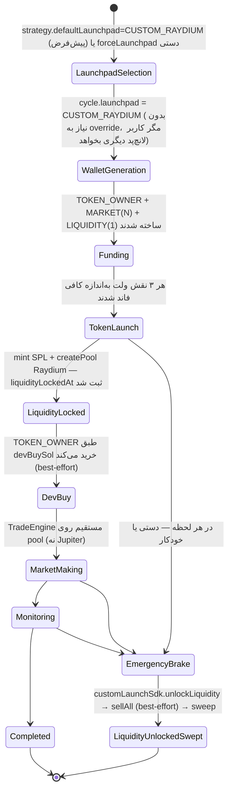

# Manual Launchpad (CUSTOM_RAYDIUM) — راهنمای عمیق فرانت‌اند

**مخاطب:** تیم Frontend / Admin Panel
**Base URL:** `/api/v1`
**Auth:** همه endpointهای زیر نیاز به هدر `X-API-Key: <API_KEY>` دارند.

> این سند منبع حقیقت UI برای **لانچ‌پد کاستوم اختصاصی** (`Launchpad = CUSTOM_RAYDIUM`) است — پنجمین لانچ‌پد سیستم، مستقل از Pump.fun/letsbonk/FourMeme، با ولت لیکوئیدیتی اختصاصی + قفل کاستودی + آنلاک فوری.
> این سند **مکمل** [`admin-panel-spec.md`](./admin-panel-spec.md)، [`market-making-frontend.md`](./market-making-frontend.md) و [`frontend-emergency-treasury.md`](./frontend-emergency-treasury.md) است — فقط تفاوت‌ها و بخش‌های اختصاصی CUSTOM_RAYDIUM اینجا آمده، برای جلوگیری از تکرار.
> **قابلیت جدید:** لاک خودکار (اختیاری) موجودی TOKEN_OWNER در همان pool، کاملاً مستند در سند جدا [`ui-owner-liquidity-auto-lock.md`](./ui-owner-liquidity-auto-lock.md) — این سند فقط به آن اشاره می‌کند، برای جزئیات کامل به همان سند مراجعه کن.
> آخرین هم‌ترازی با کد: ژوئیه ۲۰۲۶.

---

## ۱. این لانچ‌پد چیست و چرا UI جدا لازم دارد؟

بر خلاف Pump.fun/letsbonk/FourMeme (که APIهای خارجی‌اند)، در CUSTOM_RAYDIUM **خود پلتفرم**:

1. یک SPL Token استاندارد mint می‌کند (metadata شبیه دقیق pump.fun).
2. یک Raydium CPMM pool برای توکن+SOL می‌سازد.
3. LP tokenها را در یک **ولت لیکوئیدیتی اختصاصی (custodial)** نگه می‌دارد — بدون on-chain time-lock قراردادی، برای این‌که آنلاک اضطراری همیشه و فوری ممکن باشد.

**پیامد مستقیم برای UI:**

- یک **نقش ولت چهارم** (`LIQUIDITY`) در همه صفحاتی که ولت نشان می‌دهند ظاهر می‌شود.
- صفحه جزئیات توکن/سیکل باید فیلدهای اختصاصی pool/LP را نشان دهد.
- **این لانچ‌پد پیش‌فرض سیستم است** (`strategy.defaultLaunchpad = "CUSTOM_RAYDIUM"`) — سیکل‌هایی
  که بدون `forceLaunchpad` استارت می‌شوند (شامل سیکل‌های زمان‌بندی‌شده/cron) به‌طور خودکار روی
  `CUSTOM_RAYDIUM` لانچ می‌شوند. فرم «شروع سیکل» باید هم امکان override دستی به لانچ‌پدهای دیگر
  و هم گزینه‌ی «Auto (امتیازدهی GMGN)» را نشان دهد — نه فقط یک گزینه‌ی «کاستوم». جزئیات کامل در
  بخش ۴.۱.
- بنر ترمز اضطراری باید توضیح دهد که ولت لیکوئیدیتی هم خودکار آنلاک+سویپ می‌شود.

---

## ۲. مدل ولت — نقش چهارم

| نقش | Enum | تعداد در سیکل | چه زمانی ساخته می‌شود | نمایش در Wallet Overview |
|-----|------|----------------|--------------------------|----------------------------|
| Token Owner | `TOKEN_OWNER` | ۱ | `WALLET_GENERATION` | `type=TOKEN_OWNER` |
| Market | `MARKET` | N (`marketWalletCount`) | `WALLET_GENERATION` | `type=MARKET` |
| **Liquidity** | `LIQUIDITY` | **۱ — فقط اگر `launchpad=CUSTOM_RAYDIUM`** | `WALLET_GENERATION` (خودکار، بدون pool/reuse — برخلاف TOKEN_OWNER) | `type=LIQUIDITY` |

**قوانین UI:**

- ولت `LIQUIDITY` **فقط** روی سیکل‌هایی که `launchpad = CUSTOM_RAYDIUM` است ظاهر می‌شود؛ روی PUMP_FUN/LETS_BONK/FOUR_MEME همیشه صفر است — دکمه/تب مخصوص را conditionally نشان بده.
- بر خلاف TOKEN_OWNER، ولت لیکوئیدیتی **pool/reuse ندارد** — هر سیکل CUSTOM_RAYDIUM یک ولت لیکوئیدیتی تازه می‌گیرد.
- `balanceUsd` این ولت فقط **native SOL** است؛ ارزش LP قفل‌شده در آن **شمرده نمی‌شود** — برای وضعیت LP از فیلدهای `token.*` (بخش ۴) استفاده کن، نه از balance ولت.

---

## ۳. فلوی کامل — دیاگرام برای UI



### مراحل و نگاشت به state machine مشترک سیستم

هیچ state جدیدی اضافه نشده — همان `PENDING → TREND_GENERATION → LAUNCHPAD_SELECTION → WALLET_GENERATION → SECURITY_CHECK → FUNDING → TOKEN_LAUNCH → MARKET_MAKING → MONITORING → COMPLETED | FAILED | ABORTED` سراسری است. فقط داخل `TOKEN_LAUNCH` یک شاخه اضافه (mint + createPool + lock) اجرا می‌شود و لاگ‌های سیکل (`GET /core-trigger/cycles/:id` → `logs[]`) این مرحله را با step=`TOKEN_LAUNCH` و پیام‌هایی مثل «Custom Raydium pool created» نشان می‌دهند.

---

## ۴. شروع سیکل با لانچ‌پد کاستوم

### ۴.۱ پیش‌فرض سیستم + Override دستی

از این پس **`CUSTOM_RAYDIUM` پیش‌فرض کل سیستم است** — نیازی به فرستادن `forceLaunchpad` نیست:

```http
POST /api/v1/core-trigger/cycles
Content-Type: application/json

{
  "network": "SOLANA",
  "dryRun": false,
  "ignorePeakSchedule": false
}
```

این درخواست (و هر سیکل زمان‌بندی‌شده/cron) بدون هیچ فیلد اضافه‌ای روی `CUSTOM_RAYDIUM` لانچ
می‌شود، چون `strategy.defaultLaunchpad` به‌صورت پیش‌فرض `"CUSTOM_RAYDIUM"` است. اگر ادمین از
تنظیمات (`PATCH /settings`) این مقدار را عوض کند، رفتار پیش‌فرض سیستم عوض می‌شود — بدون نیاز به
تغییر کد فرانت‌اند.

برای override **دستی روی یک سیکل خاص** (مثلاً یک بار می‌خواهیم روی Pump.fun لانچ کنیم بدون
تغییر تنظیمات کلی)، همان‌طور که قبلاً بود `forceLaunchpad` بفرست:

```http
POST /api/v1/core-trigger/cycles
Content-Type: application/json

{
  "network": "SOLANA",
  "forceLaunchpad": "PUMP_FUN",
  "dryRun": false,
  "ignorePeakSchedule": false
}
```

**گزینه‌های پیشنهادی UI برای فرم «شروع سیکل» (dropdown لانچ‌پد):**

| گزینه UI | مقدار ارسالی | توضیح |
|---|---|---|
| «پیش‌فرض سیستم (Custom Raydium)» | فیلد `forceLaunchpad` اصلاً فرستاده نشود | استفاده از `strategy.defaultLaunchpad` فعلی — امروز یعنی `CUSTOM_RAYDIUM` |
| «Custom Raydium (دستی)» | `forceLaunchpad: "CUSTOM_RAYDIUM"` | همیشه کاستوم، حتی اگر پیش‌فرض سیستم بعداً عوض شد |
| «Pump.fun» / «letsbonk» / «Four.meme» | `forceLaunchpad: "PUMP_FUN"` / `"LETS_BONK"` / `"FOUR_MEME"` | لانچ‌پد مشخص، فقط برای این سیکل |

> `forceLaunchpad` فقط یک مقدار واقعی `Launchpad` می‌پذیرد (`"AUTO"` معتبر نیست و با خطای اعتبارسنجی enum رد می‌شود). برای بازگرداندن رفتار خودکار قدیمی (امتیازدهی GMGN/لیکوئیدیتی بین Pump.fun/letsbonk) در همه‌ی سیکل‌های بعدی — نه فقط یکی — باید از صفحه تنظیمات `strategy.defaultLaunchpad` را به `"AUTO"` تغییر داد؛ فرم «شروع سیکل» راهی برای «Auto فقط همین یک‌بار» ندارد چون auto-selection یک تنظیم سراسری است، نه per-cycle.

**صفحه تنظیمات** (بخش «Strategy» در `admin-panel-spec.md`) باید یک انتخاب‌گر جدا برای
`strategy.defaultLaunchpad` داشته باشد: `CUSTOM_RAYDIUM` (پیش‌فرض) \| `PUMP_FUN` \| `LETS_BONK` \|
`FOUR_MEME` \| `AUTO` — این همان چیزی است که رفتار سراسری سیستم (شامل سیکل‌های cron) را کنترل
می‌کند، برخلاف `forceLaunchpad` که فقط یک سیکل را تحت تأثیر قرار می‌دهد.

**مهم:** `GET /token-factory/launchpads/best` هنوز فقط پیش‌نمایش الگوریتم امتیازدهی خودکار قدیمی
(بین `PUMP_FUN`/`LETS_BONK`) است و به `strategy.defaultLaunchpad` کاری ندارد — از آن فقط برای
نمایش «اگر روی Auto بودیم چی پیشنهاد می‌شد» استفاده کن، نه برای نمایش لانچ‌پدی که واقعاً روی
سیکل بعدی استفاده خواهد شد.

**خطاهای رایج فرم:**

| HTTP | پیام | علت | UI |
|------|------|-----|-----|
| `409` | `Launchpad CUSTOM_RAYDIUM is not supported on network BSC` | تلاش برای `forceLaunchpad: CUSTOM_RAYDIUM` دستی روی BSC (فقط Solana پشتیبانی می‌شود) | disable گزینه CUSTOM_RAYDIUM وقتی `network=BSC` انتخاب شده |
| (بدون خطا) | سیکل BSC با `strategy.defaultLaunchpad = "CUSTOM_RAYDIUM"` بی‌صدا از `FOUR_MEME` استفاده می‌کند | پیش‌فرض ناسازگار با شبکه به‌جای خطا، به auto-selection سوییچ می‌کند | توضیح این رفتار در tooltip کنار انتخاب‌گر تنظیمات |
| `409` | یک سیکل فعال دیگر در جریان است | طبق قانون عمومی «یک سیکل فعال در هر لحظه» | همان رفتار فرم استارت سیکل معمولی |

### ۴.۲ لانچ دستی روی سیکل موجود (پیشرفته)

```http
POST /api/v1/token-factory/launch
{ "cycleId": "uuid", "launchpad": "CUSTOM_RAYDIUM", "dryRun": false }
```

معمولاً لازم نیست — pipeline خودش بعد از `FUNDING` این را صدا می‌زند. فقط برای retry دستی مرحله `TOKEN_LAUNCH` از پنل استفاده کن.

**پاسخ (`TokenLaunchResponseDto`):**

```json
{
  "id": "uuid",
  "cycleId": "uuid",
  "network": "SOLANA",
  "launchpad": "CUSTOM_RAYDIUM",
  "address": "7xKXtg2CW87d97TXJSDpbD5jBkheTqA83TZRuJosgAsU",
  "name": "Moon Pepe",
  "symbol": "MOPE",
  "ownerWalletId": "uuid",
  "txHash": "5KJp...hash",
  "dryRun": false,
  "explorer": {
    "tokenUrl": "https://solscan.io/token/7xKXtg2CW87d97TXJSDpbD5jBkheTqA83TZRuJosgAsU",
    "txUrl": "https://solscan.io/tx/5KJp...hash",
    "launchpadUrl": "https://dexscreener.com/solana/7xKXtg2CW87d97TXJSDpbD5jBkheTqA83TZRuJosgAsU"
  }
}
```

> برای CUSTOM_RAYDIUM، `explorer.launchpadUrl` همیشه لینک **DexScreener** است (نه pump.fun/letsbonk) — چون pool اختصاصی خودمان است و صفحه‌ی نمایش عمومی روی هیچ لانچ‌پد شخص‌ثالثی وجود ندارد.

---

## ۵. فیلدهای اختصاصی `token` در جزئیات سیکل

```http
GET /api/v1/core-trigger/cycles/{cycleId}
```

فیلد `token` (همان شیء کامل ردیف DB) برای `launchpad = CUSTOM_RAYDIUM` این فیلدهای اضافه را دارد (برای بقیه لانچ‌پدها `null`):

```typescript
interface CustomLaunchTokenFields {
  totalSupply: string;                 // raw base units، decimal string (مثلاً "1000000000000000")
  decimals: number;                    // مثلاً 6
  mintAuthorityRevoked: boolean;
  freezeAuthorityRevoked: boolean;
  poolAddress: string | null;          // آدرس Raydium CPMM pool
  lpMint: string | null;               // LP token mint
  poolTxHash: string | null;           // تراکنش createPool
  liquidityWalletId: string | null;    // FK → Wallet (type=LIQUIDITY)
  liquidityLockedAt: string | null;    // ISO — زمان lock اولیه (بلافاصله بعد از createPool)
  liquidityUnlockedAt: string | null;  // ISO — null یعنی هنوز قفل است؛ ست‌شده یعنی برای همیشه آنلاک شده (ترمز/درین)
}
```

> **قابلیت اختیاری «Owner Liquidity Auto-Lock»:** اگر `customLaunch.autoLockOwnerLiquidity` فعال باشد، سه فیلد دیگر هم روی همین `token` اضافه می‌شود (`ownerLiquidityLockedAt` / `ownerLiquidityUnlockedAt` / `ownerLiquidityLockTxHash`) — کاملاً مستند در [`ui-owner-liquidity-auto-lock.md`](./ui-owner-liquidity-auto-lock.md) §۵.۱، اینجا تکرار نشده.

### نمایش پیشنهادی در صفحه جزئیات توکن/سیکل

| عنصر UI | منبع | یادداشت |
|----------|------|----------|
| Badge «Pool: Raydium CPMM» | `token.launchpad === 'CUSTOM_RAYDIUM'` | فقط برای این لانچ‌پد نشان بده |
| لینک Pool | `https://dexscreener.com/solana/{token.address}` یا `explorer.launchpadUrl` | |
| Badge وضعیت لاک | `liquidityUnlockedAt == null` → 🔒 «Liquidity Locked» (سبز) / غیر null → 🔓 «Unlocked — swept» (زرد/قرمز) | |
| ساپلای نمایشی | `Number(totalSupply) / 10 ** decimals` | مثلاً ۱ میلیارد توکن |
| Mint/Freeze authority | `mintAuthorityRevoked` / `freezeAuthorityRevoked` | برای اعتمادسازی مثل pump.fun نشان بده (باید `true` باشند) |
| ولت لیکوئیدیتی | لینک به `GET /wallets/{liquidityWalletId}` | نمایش balance SOL جاری |

---

## ۶. مارکت‌میکینگ روی pool اختصاصی

فلو و endpointها **دقیقاً همان [`market-making-frontend.md`](./market-making-frontend.md)** است (`start`/`stop`/`session` روی `cycleId`) — هیچ endpoint جدیدی نیست. تنها تفاوت‌های داخلی backend (بدون تأثیر روی contract فرانت):

| جنبه | Pump.fun | CUSTOM_RAYDIUM |
|------|----------|-----------------|
| مسیر خرید/فروش | Pump.fun bonding curve API | مستقیم Raydium CPMM (`poolAddress`) |
| Liquidity ratio | bonding curve progress % | `liquidityAnalyzer` (مثل letsbonk) — ممکن است چند دقیقه اول ۰ باشد تا GMGN pool را ایندکس کند |
| `marketCapUsd` در session | از bonding curve | از قیمت pool (GMGN/on-chain) |

**نکته UI:** اگر بلافاصله بعد از لانچ CUSTOM_RAYDIUM دکمه Start را بزنید و متریک‌های liquidity/marketCap چند تیک اول صفر باشند، این طبیعی است (تأخیر ایندکس GMGN) — toast اطلاع‌رسانی «در حال sync دیتای بازار…» نشان بده، نه خطا.

---

## ۷. ترمز اضطراری — رفتار اختصاصی ولت لیکوئیدیتی

Endpointها دقیقاً همان [`frontend-emergency-treasury.md`](./frontend-emergency-treasury.md) §۳ هستند (`POST /emergency/brake`، `GET /emergency/brake/:jobId`، `POST /emergency/resume`) — **بدون فیلد جدید در body**. تفاوت فقط در رفتار داخلی backend است که باید در UI توضیح داده شود:

### ۷.۱ چه اتفاقی می‌افتد؟

هر برک (چه `GLOBAL` چه `CYCLE`، با هر `convertTo`) روی سیکل‌های فعال `CUSTOM_RAYDIUM`:

1. ولت‌های `LIQUIDITY` مربوطه را پیدا می‌کند (`liquidityUnlockedAt == null`).
2. LP را آنلاک می‌کند (`customLaunchSdk.unlockLiquidity`) و تراکنش را confirm می‌کند.
3. تلاش می‌کند توکن‌های آزادشده را بفروشد (`sellAll` — **best-effort**؛ شکست آن برک را متوقف نمی‌کند).
4. باقیمانده SOL ولت را به آدرس withdrawal سویپ می‌کند.
5. `token.liquidityUnlockedAt` را ثبت و ولت `LIQUIDITY` را آرشیو می‌کند.

این **موازی و علاوه بر** فروش عادی TOKEN_OWNER/MARKET (که با همان برک انجام می‌شود) اجرا می‌شود.

### ۷.۲ نمایش در UI

**فرم brake — متن راهنما اضافه کن:**

> «اگر سیکل فعال با لانچ‌پد کاستوم (CUSTOM_RAYDIUM) وجود داشته باشد، ولت لیکوئیدیتی آن هم به‌طور خودکار آنلاک، فروخته و به ولت برداشت سویپ می‌شود.»

**پاسخ `POST /emergency/brake` — همان schema قبلی**؛ `walletsAffected` شامل ولت‌های LIQUIDITY هم می‌شود (عدد بزرگ‌تر از قبل اگر سیکل CUSTOM_RAYDIUM فعال باشد).

**Poll `GET /emergency/brake/:jobId`** — `progress.walletsProcessed/Sold/Failed` شامل ولت لیکوئیدیتی هم است؛ schema جدید ندارد، فقط عدد پایه بزرگ‌تر می‌شود.

**بعد از تکمیل:** برای دیدن نتیجه دقیق per-token، `GET /core-trigger/cycles/{cycleId}` را refetch کن و `token.liquidityUnlockedAt` را چک کن (باید پر شده باشد).

### ۷.۳ Treasury Full Drain — همین رفتار

`POST /treasury/drain` (یا `fullDrain: true` در brake) هم **قبل از** inventory scan، تمام ولت‌های LIQUIDITY فعال را آنلاک+سویپ می‌کند — یعنی drain کامل هم ارزش LP را برمی‌گرداند، نه فقط ترمز دستی. هیچ فیلد UI جدیدی لازم نیست؛ فقط در متن توضیحی صفحه Treasury همین نکته را اضافه کن.

### ۷.۴ Owner Liquidity Auto-Lock — همان مسیر آنلاک

اگر قابلیت اختیاری «لاک خودکار owner» (بخش ۱۰.۲) فعال بوده باشد، همین برک/درین کامل **owner liquidity** را هم دقیقاً هم‌زمان با LIQUIDITY آنلاک می‌کند — یک فیلد جدید در پاسخ `POST /emergency/brake` اضافه شده (`ownerLiquidityWalletsUnlocking`). جزئیات کامل + نمونه پاسخ در [`ui-owner-liquidity-auto-lock.md`](./ui-owner-liquidity-auto-lock.md) §۵.

---

## ۸. Treasury Consolidate — مقصد دستی

`POST /treasury/consolidate` (طبق [`frontend-emergency-treasury.md`](./frontend-emergency-treasury.md) §۵) هم برای ولت‌های TOKEN_OWNER/MARKET سیکل CUSTOM_RAYDIUM پشتیبانی کامل دارد (فروش مستقیم روی pool رادیوم). **ولت LIQUIDITY را جزو `walletIds` این endpoint قرار نده** — unlock/sell LP فقط از مسیر Emergency Brake / Treasury Drain پشتیبانی می‌شود (بخش ۷)، نه consolidate دستی تک‌ولتی.

---

## ۹. Wallet Overview — فیلتر `LIQUIDITY`

طبق [`wallet-overview.md`](./wallet-overview.md) به‌روزشده:

```http
GET /api/v1/wallets/overview/balances?type=LIQUIDITY
```

```json
{
  "totalsByType": {
    "MARKET": { "walletCount": 140, "totalUsd": 3500 },
    "TOKEN_OWNER": { "walletCount": 10, "totalUsd": 221.5 },
    "LIQUIDITY": { "walletCount": 1, "totalUsd": 2.1 }
  }
}
```

اگر `totalsByType.LIQUIDITY.walletCount === 0`، کارت/تب LIQUIDITY را در KPI مخفی کن (یعنی هیچ سیکل CUSTOM_RAYDIUM فعالی نیست).

---

## ۱۰. تنظیمات — فرم Settings برای این لانچ‌پد

### ۱۰.۱ `GET /settings` — فیلدهای مرتبط

```json
{
  "integrations": {
    "runtime": {
      "customLaunch": {
        "totalSupply": "1000000000000000",
        "decimals": 6,
        "initialLiquiditySol": 2,
        "initialLiquidityTokenPercent": 90,
        "feeConfigIndex": 0,
        "slippageBps": 700,
        "emergencySlippageBps": 2500,
        "priorityFeeMicroLamports": 100000,
        "computeUnitLimit": 600000,
        "sellerFeeBasisPoints": 0,
        "devBuySol": 0.25,
        "httpTimeoutMs": 60000,
        "autoLockOwnerLiquidity": false,
        "ownerLiquidityLockSolBuffer": 1
      }
    }
  },
  "strategy": {
    "liquidityWalletFundingSol": 2.3,
    "defaultLaunchpad": "CUSTOM_RAYDIUM"
  }
}
```

### ۱۰.۲ توضیح فیلدها برای فرم

| فیلد | مسیر | نوع | توضیح UI |
|------|------|-----|-----------|
| Total Supply | `integrations.runtime.customLaunch.totalSupply` | string (عدد صحیح بزرگ) | ساپلای خام؛ نمایش انسانی = `totalSupply / 10^decimals` |
| Decimals | `...customLaunch.decimals` | number | معمولاً ۶ (مثل اکثر SPL memecoinها) |
| Initial Liquidity (SOL) | `...customLaunch.initialLiquiditySol` | number | SOL اولیه seed شده در pool — باید ≤ `strategy.liquidityWalletFundingSol` باشد |
| Initial Liquidity Token % | `...customLaunch.initialLiquidityTokenPercent` | 0–100 | درصد ساپلای که وارد pool می‌شود؛ باقی برای TOKEN_OWNER (dev buy / توزیع) |
| Slippage (bps) | `...customLaunch.slippageBps` / `emergencySlippageBps` | number | عادی vs اضطراری |
| Dev Buy (SOL) | `...customLaunch.devBuySol` | number | خرید اولیه TOKEN_OWNER بعد از لانچ (best-effort) |
| **Liquidity Wallet Funding (SOL)** | `strategy.liquidityWalletFundingSol` | number | **مهم‌ترین فیلد** — باید seed pool + rent + fee پروتکل + بافر gas اضطراری را پوشش دهد؛ پیش‌فرض **۲.۳** |
| **Default Launchpad** | `strategy.defaultLaunchpad` | `"CUSTOM_RAYDIUM"` \| `"PUMP_FUN"` \| `"LETS_BONK"` \| `"FOUR_MEME"` \| `"AUTO"` | لانچ‌پد سیکل‌هایی که `forceLaunchpad` ندارند (شامل cron) — **پیش‌فرض سیستم `CUSTOM_RAYDIUM`**؛ برای بازگشت به انتخاب خودکار قدیمی روی `"AUTO"` بگذار |
| Owner Liquidity Auto-Lock | `...customLaunch.autoLockOwnerLiquidity` + `...customLaunch.ownerLiquidityLockSolBuffer` | boolean + number | قابلیت اختیاری جدید — فرم کامل + فلو + اندپوینت‌ها در سند جدا [`ui-owner-liquidity-auto-lock.md`](./ui-owner-liquidity-auto-lock.md) |

**اعتبارسنجی پیشنهادی فرم (سمت UI، قبل از PATCH):**

- `initialLiquiditySol < strategy.liquidityWalletFundingSol` — وگرنه هشدار «ولت لیکوئیدیتی برای seed + کارمزد کافی نیست».
- `initialLiquidityTokenPercent` بین ۱ تا ۱۰۰.
- `devBuySol` اختیاری (۰ مجاز است — یعنی بدون dev buy).

> **هشدار production:** تغییر `totalSupply`/`decimals` فقط روی **لانچ‌های بعدی** اثر می‌گذارد؛ توکن‌های از قبل لانچ‌شده مقدار خودشان را در DB (`token.totalSupply`/`token.decimals`) نگه می‌دارند و تغییر نمی‌کنند.

### ۱۰.۳ PATCH نمونه

```http
PATCH /api/v1/settings
Content-Type: application/json

{
  "integrations": {
    "runtime": {
      "customLaunch": { "devBuySol": 0.5 }
    }
  },
  "strategy": { "liquidityWalletFundingSol": 2.5 }
}
```

فقط فیلدهای تغییرکرده را بفرست — مثل بقیه‌ی PATCHهای `/settings` در سیستم (deep-merge سمت backend).

---

## ۱۱. نقشه صفحات پیشنهادی UI

### `/cycles/new` (یا مودال Start Cycle)

| المان | جزئیات |
|--------|--------|
| Radio لانچ‌پد | `پیش‌فرض سیستم (Custom Raydium)` (پیش‌فرض انتخاب‌شده — بدون فیلد اضافه) / `Custom Raydium (دستی)` / `Pump.fun` / `letsbonk` / `Four.meme` / `Auto (امتیازدهی GMGN)` — این گزینه آخر فقط لینک به صفحه تنظیمات است، چون Auto یک تنظیم سراسری (`strategy.defaultLaunchpad`) است نه per-cycle |
| توضیح زیر گزینه Custom | «لانچ‌پد اختصاصی ما — ولت لیکوئیدیتی جدا، قفل کاستودی، آنلاک فوری در اضطرار» |
| Submit | اگر «پیش‌فرض سیستم» انتخاب شده: فیلد `forceLaunchpad` اصلاً فرستاده نمی‌شود. برای هر گزینه‌ی دیگر (Custom/Pump.fun/letsbonk/Four.meme): `POST /core-trigger/cycles` با `forceLaunchpad: "<LAUNCHPAD>"` مربوطه |

### `/cycles/:id` — بخش‌های اضافه فقط وقتی `token.launchpad === 'CUSTOM_RAYDIUM'`

| بخش | محتوا |
|------|--------|
| کارت Pool | آدرس pool، لینک DexScreener، LP mint، badge لاک/آنلاک |
| کارت Liquidity Wallet | آدرس، balance SOL، لینک به `/wallets/:id` |
| Authority badges | Mint revoked ✅ / Freeze revoked ✅ |
| تب Market Making | همان کامپوننت مشترک (بخش ۶) |

### `/wallets` (Wallet Overview)

- افزودن `LIQUIDITY` به dropdown فیلتر type (بخش ۹).
- ستون Type باید badge جدا برای `LIQUIDITY` داشته باشد (مثلاً رنگ بنفش، آیکون قفل).

### `/settings`

- بخش جدید «Manual Launchpad (Custom Raydium)» با فرم بخش ۱۰.
- Cross-link به بخش Treasury برای `liquidityWalletFundingSol` (چون از `strategy` می‌آید نه `integrations`، ممکن است در تب دیگری از فرم فعلی settings باشد — هماهنگ کن با ساختار فعلی فرم Strategy).

### `/emergency`

- در متن راهنمای فرم brake، جمله بخش ۷.۲ را اضافه کن.

---

## ۱۲. خطاهای اختصاصی این لانچ‌پد

| پیام (تقریبی) | کجا | علت | UI |
|----------------|-----|-----|-----|
| `Launchpad CUSTOM_RAYDIUM is not supported on network BSC` | `POST /core-trigger/cycles` | انتخاب اشتباه شبکه | disable گزینه در فرم وقتی BSC انتخاب شده |
| `Liquidity wallet must be funded before launch (required ≥ $X USD)` | `TOKEN_LAUNCH` (لاگ سیکل / exception) | ولت LIQUIDITY هنوز به تلورانس ۹۵٪ نرسیده | نمایش در تب Funding — «منتظر شارژ ولت لیکوئیدیتی» |
| `CUSTOM_RAYDIUM token … is missing poolAddress — cannot sell` | Emergency/Profit/Consolidate (لاگ backend) | لانچ ناقص مانده (توکن mint شده ولی pool ساخته نشده) | نباید در مسیر عادی رخ دهد؛ اگر دیدی، لینک به لاگ‌های سیکل بده برای بررسی دستی |
| «در حال sync دیتای بازار…» (نه یک HTTP error) | Market Making session بلافاصله بعد لانچ | تأخیر ایندکس GMGN روی pool تازه | toast اطلاع‌رسانی، نه خطای قرمز |

---

## ۱۳. چک‌لیست UI (Acceptance)

- [ ] فرم Start Cycle گزینه «Custom Raydium (Manual)» دارد و فقط روی Solana فعال است
- [ ] صفحه جزئیات سیکل/توکن، برای `launchpad=CUSTOM_RAYDIUM`: badge لاک/آنلاک + لینک pool + authority badges
- [ ] Wallet Overview: فیلتر و KPI برای `type=LIQUIDITY` (مخفی اگر `walletCount=0`)
- [ ] بنر/توضیح ترمز اضطراری: ولت لیکوئیدیتی خودکار آنلاک+سویپ می‌شود
- [ ] بنر Treasury Drain: همان توضیح برای drain کامل
- [ ] فرم Settings: بخش Custom Launchpad + `liquidityWalletFundingSol` با اعتبارسنجی seed<funding
- [ ] Market Making روی سیکل CUSTOM_RAYDIUM: همان کامپوننت مشترک، بدون کد اختصاصی جدید
- [ ] توضیح تأخیر ایندکس GMGN بلافاصله بعد از لانچ (toast، نه error)
- [ ] Consolidate دستی: ولت LIQUIDITY را در انتخاب walletIds قابل انتخاب **نکن**
- [ ] Owner Liquidity Auto-Lock: چک‌لیست جدا در [`ui-owner-liquidity-auto-lock.md`](./ui-owner-liquidity-auto-lock.md) §۸

---

## ۱۴. مرجع کد بک‌اند

| فایل | نقش |
|------|-----|
| `src/integrations/custom-launch/custom-launch-sdk.service.ts` | mint + createPool + buy/sell/sellAll + unlockLiquidity |
| `src/modules/token-factory/token-factory.service.ts` | orchestration لانچ (`createOnLaunchpad` → شاخه CUSTOM_RAYDIUM) |
| `src/modules/core-trigger/core-trigger.service.ts` | validation `forceLaunchpad` + resolve `strategy.defaultLaunchpad` (`resolveCycleLaunchpad`) + فاندینگ LIQUIDITY |
| `src/modules/token-factory/token-launch.util.ts` | `resolveCycleLaunchpad`/`resolveDefaultLaunchpadMode`/`DEFAULT_LAUNCHPAD_MODE` — منطق خالص انتخاب لانچ‌پد پیش‌فرض |
| `src/modules/core-trigger/processors/wallet-generation.processor.ts` | ساخت ولت LIQUIDITY (خودکار، بدون pool) |
| `src/modules/market-generator/trade-engine.service.ts` | خرید/فروش مارکت‌میکینگ مستقیم روی pool |
| `src/modules/profit-extractor/profit-sell-executor.service.ts` + `token-supply.service.ts` | فروش سود + ساپلای از DB |
| `src/modules/emergency/emergency-brake-coordinator.service.ts` + `processors/emergency-sell.processor.ts` | targets + unlock/sweep/sell |
| `src/modules/treasury-lifecycle/treasury-drain-runner.service.ts` | unlock LP قبل از drain کامل |
| `src/modules/treasury-consolidator/consolidate-executor.service.ts` | فروش دستی به مقصد دلخواه |
| `.cursor/skills/custom-raydium-launchpad/SKILL.md` + `reference.md` | مستند فنی کامل (agent skill) |
| [`docs/main-info.md`](./main-info.md) §۲۶ | مستند معماری کامل (بک‌اند + سود + ترمز) |
| [`docs/ui-owner-liquidity-auto-lock.md`](./ui-owner-liquidity-auto-lock.md) | مستند کامل قابلیت جدید «لاک خودکار owner» |

---

*این سند مکمل است — برای رفتار عمومی سیکل/ولت/ترمز/خزانه به اسناد مرجع بالا مراجعه کن.*
