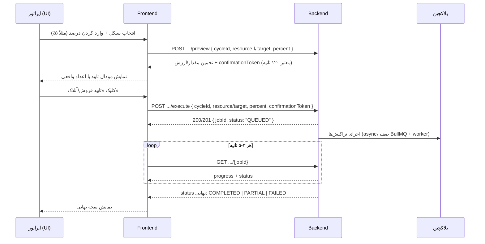

# راهنمای فرانت — سه سیکل مدیریت دستی: فروش مارکت ولت‌ها · فروش ولت اونر · آنلاک درصدی لیکوئیدیتی

**مخاطب:** تیم Frontend / Admin Panel
**Base URL:** `/api/v1`
**Auth:** همه‌ی endpointهای زیر نیاز به هدر `x-api-key: <API_KEY>` دارند (header case-insensitive است).
**وضعیت این سند:** ✅ **کاملاً پیاده‌سازی‌شده و تست‌شده روی بک‌اند.** همه‌ی مسیرها، DTOها، کدهای خطا و رفتار توضیح داده‌شده در این سند دقیقاً منطبق با کد فعلی است — چیزی «فرضی» یا «آینده» در بخش‌های اصلی نیست؛ هر جا چیزی هنوز پیاده‌سازی نشده (مثل تاریخچه/history)، صراحتاً در بخش [محدودیت‌های نسخه‌ی فعلی](#۱۰-محدودیت‌های-نسخه‌ی-فعلی) گفته شده.
**آخرین هم‌ترازی با کد:** ۲ ژوئیه ۲۰۲۶ (شامل افزودن `target: BOTH/AUTO` به آنلاک لیکوئیدیتی) — ماژول `src/modules/manual-ops/*`.

> این سند مکمل [`frontend-emergency-treasury.md`](./frontend-emergency-treasury.md) است. تفاوت کلیدی: Emergency Brake یک عملیات «همه یا هیچ + توقف کامل سیستم» است؛ سه سیکل این سند **دستی، جزئی (درصدی)، و بدون توقف سیستم** هستند — برای عملیات‌های روزمره‌ی اپراتور روی یک سیکل مشخص، نه بحران.

---

## ۱. خلاصه سه سیکل

| # | نام سیکل | ولت هدف | Endpoint اجرا (execute) | تاثیر روی سیستم |
|---|----------|---------|---------------|-------------------|
| ۱ | فروش موجودی مارکت ولت‌ها | همه‌ی ولت‌های `MARKET` سیکل | `POST /manual-ops/sell/execute` با `resource: "MARKET"` | بدون halt — market making ادامه دارد |
| ۲ | فروش موجودی ولت اونر توکن | ولت `TOKEN_OWNER` سیکل | `POST /manual-ops/sell/execute` با `resource: "TOKEN_OWNER"` | بدون halt |
| ۳ | آنلاک درصدی لیکوئیدیتی | ولت `LIQUIDITY` (`POOL`) و/یا LP قفل‌شده‌ی owner (`OWNER`) — قابل انتخاب با `target: POOL \| OWNER \| BOTH \| AUTO` | `POST /manual-ops/liquidity-unlock/execute` | بدون halt — فقط روی لانچ‌پد `CUSTOM_RAYDIUM` |

**نکته‌ی مهم معماری:** سیکل ۱ و ۲ روی **یک endpoint واحد** (`/manual-ops/sell/*`) پیاده شده‌اند و فقط با فیلد `resource` (`MARKET` یا `TOKEN_OWNER`) از هم جدا می‌شوند — نه دو مسیر جدا. این با نسخه‌ی قبلی این سند فرق دارد.

هر سه سیکل دقیقاً همین الگوی دو-مرحله‌ای UI را دارند:



---

## ۲. مفاهیم مشترک (قبل از خواندن هر سه بخش)

### ۲.۱ معنای دقیق «درصد»

**برای فروش (سیکل ۱ و ۲):** `percent` به‌صورت **مستقل روی موجودی فعلی هر ولت جداگانه** اعمال می‌شود (نه یک هدف تجمیعی که به ترتیب از ولت‌ها کم شود). یعنی برای `percent=5`:

```
برای هر ولت واجد شرایط (resource = MARKET یا TOKEN_OWNER) با موجودی توکن > 0:
    مقدار فروش این ولت = موجودی فعلی این ولت × 0.05
```

از نظر ریاضی این دقیقاً معادل «فروش ۵٪ از مجموع موجودی همه‌ی ولت‌ها»ست (چون `Σ(0.05 × balance_i) = 0.05 × Σ(balance_i)`)، با این مزیت که هر ولت مستقل و به‌صورت موازی (concurrency=8، ثابت در کد) قابل اجراست و اگر یک ولت fail شود فقط سهم همان ولت fail می‌شود — بقیه ادامه پیدا می‌کنند و job نهایتاً `PARTIAL` می‌شود، نه `FAILED` کامل. این منطق در `ProfitSellExecutorService.executeIndependentPercentSell` پیاده شده و هر چهار لانچ‌پد (`PUMP_FUN`, `LETS_BONK`, `FOUR_MEME`, `CUSTOM_RAYDIUM`) را پشتیبانی می‌کند.

**برای آنلاک لیکوئیدیتی (سیکل ۳):** `percent` روی **موجودی فعلی LP token** همان ولت (`LIQUIDITY` یا owner) اعمال می‌شود — نه نسبت به LP اولیه‌ی روز لانچ. اگر `target` روی `BOTH` یا `AUTO` باشد، همین `percent` به‌صورت **کاملاً مستقل** روی هر دو leg (`POOL` و `OWNER`) جداگانه اعمال می‌شود (نه یک‌بار روی مجموع) — یعنی `percent=5` با `target=BOTH` یعنی «۵٪ از LP فعلی pool، **و جداگانه** ۵٪ از LP فعلی owner». محاسبه‌ی هر leg کاملاً **قطعی (deterministic)** است:

```
lpAmountToWithdrawRaw = lpBalanceRaw × percent / 100
lpBalanceAfterRaw     = lpBalanceRaw − lpAmountToWithdrawRaw   (دقیق، بدون round-trip اضافه به چین)
fullyUnlockedAfter    = (lpBalanceAfterRaw === "0")
```

> ⚠️ **این یک تصمیم طراحی مهم است که باید حتماً به تیم فرانت منتقل شود:** چون هر بار `percent` روی موجودی **فعلیِ همان لحظه** اعمال می‌شود، اگر دو بار پشت‌سرهم ۵۰٪ آنلاک کنید، در مجموع فقط ۷۵٪ از LP اصلی آزاد شده (نه ۱۰۰٪) — چون دفعه‌ی دوم روی نصف باقی‌مانده حساب می‌شود. به همین دلیل **backend هیچ فیلد «درصد تجمعی از مبدا» ذخیره یا برنمی‌گرداند** (نسخه‌ی قبلی این سند چنین فیلدی پیشنهاد داده بود که از نظر ریاضی نادرست بود). به‌جای آن، UI باید همیشه از `lpBalanceRaw` **زنده** (همان چیزی که هر `preview` برمی‌گرداند) به‌عنوان مبنای «چقدر باقی مانده» استفاده کند، و از `fullyUnlockedAfter` / `fullyUnlocked` برای نمایش وضعیت «کامل آزاد شد».

### ۲.۲ فلوی preview → execute (اجباری، هر دو مرحله)

هیچ‌کدام از `POST /manual-ops/sell/execute` و `POST /manual-ops/liquidity-unlock/execute` بدون `confirmationToken` معتبر پذیرفته نمی‌شوند. یعنی:

1. UI **همیشه** باید اول `preview` را صدا بزند.
2. `confirmationToken` یک رشته‌ی **opaque** است (امضاشده با HMAC-SHA256 روی `API_KEY` سرور) — فرانت نباید آن را parse یا تغییر دهد، فقط عیناً به `execute` پاس بدهد.
3. توکن به‌صورت داخلی به این فیلدها «قفل» است: `cycleId`, `tokenId` (خودکار از روی cycle resolve می‌شود، نیازی به ارسال از فرانت نیست), `resource`/`target`, `percent`. اگر هرکدام از این‌ها بین preview و execute فرق کند → `400 CONFIRMATION_MISMATCH`. **نکته‌ی مهم برای `target: BOTH`/`AUTO`:** چیزی که قفل می‌شود همان مقدار **درخواستی** (`"BOTH"` یا `"AUTO"`) است، نه لیست resolve‌شده (`resolvedTargets`) — چون `resolvedTargets` هر بار (هم در preview، هم در execute) به‌صورت زنده از روی موجودی/ساختار لحظه‌ای دوباره محاسبه می‌شود؛ ممکن است بین preview و execute کمی فرق کند (مثلاً owner leg بین این دو لحظه به صفر برسد) — این خطا نیست، فقط `resolvedTargets` در پاسخ execute/status می‌تواند کوچک‌تر از چیزی باشد که در preview دیده بودید.
4. عمر توکن: **دقیقاً ۱۲۰ ثانیه** (`expiresAt` در پاسخ preview، ثابت `CONFIRMATION_TOKEN_TTL_SECONDS`).
5. **یک‌بار مصرف** — با Redis (`setJsonNx` روی `jti` داخل توکن) enforce می‌شود؛ بعد از یک `execute` موفق، همان توکن دیگر قابل استفاده نیست حتی اگر هنوز منقضی نشده باشد.
6. اگر کاربر بیش از ۱۲۰ ثانیه روی مودال تایید معطل بماند → `410 Gone` با کد `STALE_CONFIRMATION`. اگر همان توکن دوباره ارسال شود (مثلاً double-click) → `410 Gone` با کد `CONFIRMATION_ALREADY_USED`. در هر دو حالت UI باید silent دوباره `preview` بگیرد.
7. **نکته‌ی مهم برای فروش:** مقدار واقعی که فروخته می‌شود، از روی موجودی **زنده در لحظه‌ی execute** دوباره محاسبه می‌شود (نه از روی snapshot preview) — یعنی اگر بین preview و execute موجودی ولت تغییر کند (مثلاً مارکت میکر معامله کرده)، عدد نهایی می‌تواند کمی با تخمین preview فرق داشته باشد. همین قاعده برای LP در آنلاک لیکوئیدیتی هم صادق است.

### ۲.۳ قفل هم‌زمانی (Concurrency guard)

برای هر ترکیب `(cycleId, resource)` (فروش) یا `(cycleId, POOL)` / `(cycleId, OWNER)` (آنلاک) در هر لحظه فقط **یک job** می‌تواند در حال اجرا باشد (Redis lock، TTL ۹۰۰ ثانیه به‌عنوان safety net در صورت crash worker). تلاش دوم روی همان ترکیب قبل از تمام‌شدن اولی → `409 Conflict` با کد `ALREADY_IN_PROGRESS`. پاسخ خطا شامل `activeJobId` **نیست** — UI باید خودش آخرین `jobId` ارسالی همان resource را نگه دارد و روی آن poll کند، یا فقط پیام خطا را نمایش دهد و به کاربر بگوید صبر کند.

**برای `target: BOTH`/`AUTO`:** قفل به‌صورت جداگانه روی هر leg رزالو‌شده گرفته می‌شود (یعنی یک `execute` با `BOTH` که به `[POOL, OWNER]` resolve شده، **دو** قفل مجزا می‌گیرد: `(cycleId, POOL)` و `(cycleId, OWNER)`). اگر گرفتن هرکدام از این قفل‌ها fail شود (چون یک `POOL`-only یا `OWNER`-only job دیگر همان لحظه در حال اجراست)، کل درخواست با `409 ALREADY_IN_PROGRESS` رد می‌شود و قفل‌(های) قبلاً گرفته‌شده بلافاصله آزاد می‌شوند (rollback کامل — هیچ قفل نیمه‌گرفته باقی نمی‌ماند).

### ۲.۴ رابطه با Emergency Brake / سیستم halt / فعال‌بودن قابلیت

- اگر سیستم در حالت halt باشد (Emergency Brake فعال)، هر دو endpoint `preview` **و** `execute` روی هر سه سیکل با `409 Conflict` و کد `SYSTEM_HALTED` رد می‌شوند.
- هر دو قابلیت جدا از هم toggle می‌شوند: `settings.strategy.manualSell.enabled` و `settings.strategy.manualLiquidityUnlock.enabled` (پیش‌فرض هر دو `true`). اگر یکی `false` باشد → `409 Conflict` با کد `FEATURE_DISABLED`.
- این سه سیکل جایگزین Emergency Brake نیستند. برای خروج کامل و فوری (۱۰۰٪ + توقف سیستم) همچنان از `POST /emergency/brake` استفاده کنید.
- محدوده‌ی مجاز `percent`: عددی `> 0` و `≤ 100` (بدون محدودیت رقم اعشار خاص در validation، ولی روی دیتابیس با ۲ رقم اعشار ذخیره می‌شود). علاوه بر این، یک سقف قابل‌تنظیم دیگر هم هست: `settings.strategy.manualSell.maxPercentPerRequest` / `manualLiquidityUnlock.maxPercentPerRequest` (پیش‌فرض `100`) — اگر `percent` از این سقف بیشتر باشد، `preview` با `400 Bad Request` (بدون `code` — پیام ساده‌ی متنی) رد می‌شود.

### ۲.۵ فرمت خطای عمومی (دقیقاً همان‌طور که سرور برمی‌گرداند)

همه‌ی پاسخ‌های `GlobalExceptionFilter` این پوشش بیرونی را دارند:

```json
{
  "statusCode": 409,
  "message": { "...": "..." },
  "timestamp": "2026-07-02T10:39:03.055Z"
}
```

سه شکل مختلف برای `message` وجود دارد بسته به نوع خطا:

**۱) خطاهای دامنه‌ای این ماژول (`ManualOpsException` و زیرکلاس‌هایش) — دارای `code`:**

```json
{
  "statusCode": 422,
  "message": {
    "statusCode": 422,
    "code": "UNSUPPORTED_LAUNCHPAD",
    "message": "Liquidity unlock is only available for CUSTOM_RAYDIUM tokens with a Raydium pool (this token uses PUMP_FUN)"
  },
  "timestamp": "2026-07-02T10:39:03.055Z"
}
```

**۲) خطاهای اعتبارسنجی ورودی (`class-validator`, HTTP 400) — بدون `code`، `message` آرایه‌ای از رشته:**

```json
{
  "statusCode": 400,
  "message": {
    "statusCode": 400,
    "error": "Bad Request",
    "message": ["percent must not be greater than 100", "resource must be one of the following values: MARKET, TOKEN_OWNER"]
  },
  "timestamp": "..."
}
```

**۳) خطاهای عمومی NestJS (404 `NotFoundException`, 401 `UnauthorizedException`) — بدون `code`، `message` رشته‌ی ساده:**

```json
{
  "statusCode": 404,
  "message": { "statusCode": 404, "error": "Not Found", "message": "Cycle or token not found for this cycle" },
  "timestamp": "..."
}
```

**قانون عملی برای UI:** همیشه اول `body.message.code` را چک کنید — اگر وجود داشت طبق جدول بخش ۶ رفتار کنید؛ اگر نبود، `body.message.message` را (رشته یا اولین آیتم آرایه) به‌عنوان پیام خطای عمومی نمایش دهید.

---

## ۳. سیکل ۱ و ۲ — فروش موجودی مارکت / اونر (`POST /manual-ops/sell/*`)

هر دو سیکل روی همین سه endpoint پیاده شده‌اند؛ تفاوت فقط مقدار `resource` است.

### ۳.۱ Preview

```http
POST /api/v1/manual-ops/sell/preview
Content-Type: application/json
x-api-key: <API_KEY>

{
  "cycleId": "b3f1c2a0-4e9d-4a3f-9c2b-1a2b3c4d5e6f",
  "resource": "MARKET",
  "percent": 5,
  "slippageBps": 300
}
```

| فیلد | نوع | اجباری | توضیح |
|------|-----|--------|--------|
| `cycleId` | `uuid` | بله | |
| `resource` | `"MARKET"` \| `"TOKEN_OWNER"` | بله | سیکل ۱ = `MARKET`، سیکل ۲ = `TOKEN_OWNER` |
| `percent` | `number`، `0 < percent ≤ 100` | بله | درصد از موجودی هر ولت واجد شرایط |
| `slippageBps` | `number` عدد صحیح، `1` تا `2000` | خیر | اگر ارسال نشود از `strategy.manualSell.defaultSlippageBps` (پیش‌فرض `300` = ۳٪) استفاده می‌شود |

**پاسخ (`ManualSellPreviewResponseDto`):**

```typescript
interface ManualSellPreviewResponse {
  cycleId: string;
  tokenId: string;                 // uuid داخلی توکن — نیازی به ارسال آن در execute نیست
  resource: 'MARKET' | 'TOKEN_OWNER';
  percent: number;
  walletsEligible: number;         // تعداد ولت با موجودی توکن > 0
  balanceBeforeTokens: string;     // مجموع موجودی UI-unit همه‌ی ولت‌های واجد شرایط (رشته چون ممکن است اعشار بلند/بزرگ باشد)
  targetTokens: string;            // balanceBeforeTokens * percent / 100 — مقداری که قرار است فروخته شود
  estimatedUsdValue?: number;      // targetTokens × قیمت لحظه‌ای — best-effort، ممکن است غایب باشد اگر قیمت resolve نشود
  slippageBps: number;             // مقداری که واقعاً استفاده می‌شود (ورودی یا پیش‌فرض)
  confirmationToken: string;       // opaque — بدون تغییر به execute پاس بدهید
  expiresAt: string;               // ISO — دقیقاً ۱۲۰ ثانیه بعد از این پاسخ
}
```

نمونه‌ی واقعی:

```json
{
  "cycleId": "b3f1c2a0-4e9d-4a3f-9c2b-1a2b3c4d5e6f",
  "tokenId": "4fc790b7-0e32-4891-b9ae-413e419fa73f",
  "resource": "MARKET",
  "percent": 5,
  "walletsEligible": 42,
  "balanceBeforeTokens": "125000000.123456789",
  "targetTokens": "6250000.006172839",
  "estimatedUsdValue": 187.5,
  "slippageBps": 300,
  "confirmationToken": "eyJjeWNsZUlkIjoi...==.c2lnbmF0dXJl",
  "expiresAt": "2026-07-02T09:37:00.000Z"
}
```

### ۳.۲ Execute

```http
POST /api/v1/manual-ops/sell/execute
Content-Type: application/json
x-api-key: <API_KEY>

{
  "confirmationToken": "eyJjeWNsZUlkIjoi...==.c2lnbmF0dXJl",
  "cycleId": "b3f1c2a0-4e9d-4a3f-9c2b-1a2b3c4d5e6f",
  "resource": "MARKET",
  "percent": 5,
  "reason": "برداشت سود میان‌دوره‌ای دستی"
}
```

| فیلد | نوع | اجباری | توضیح |
|------|-----|--------|--------|
| `confirmationToken` | `string` | بله | از پاسخ preview |
| `cycleId` | `uuid` | بله | باید برابر همان preview باشد |
| `resource` | `"MARKET"` \| `"TOKEN_OWNER"` | بله | باید برابر همان preview باشد |
| `percent` | `number` | بله | باید **دقیقاً** برابر همان preview باشد (وگرنه `CONFIRMATION_MISMATCH`) |
| `reason` | `string`، حداکثر ۵۰۰ کاراکتر | خیر | برای لاگ/گزارش اپراتور |

> توجه: `slippageBps` در بدنه‌ی execute **وجود ندارد** — همان مقداری که preview استفاده کرد (چه ورودی چه پیش‌فرض) داخل خود `confirmationToken` حمل می‌شود و مستقیماً استفاده می‌شود.

**پاسخ (`ManualSellJobResponseDto`):**

```json
{
  "jobId": "manual-sell-1751450000000-1234",
  "status": "QUEUED"
}
```

### ۳.۳ Poll status

```http
GET /api/v1/manual-ops/sell/{jobId}
x-api-key: <API_KEY>
```

**پاسخ (`ManualSellJobDetailDto`):**

```typescript
interface ManualSellJobDetail {
  jobId: string;
  status: 'QUEUED' | 'RUNNING' | 'COMPLETED' | 'PARTIAL' | 'FAILED';
  cycleId: string;
  tokenId: string;
  resource: 'MARKET' | 'TOKEN_OWNER';
  requestedPercent: number;
  balanceBeforeTokens: string;   // snapshot لحظه‌ی execute (نه preview)
  targetTokens: string;
  walletsTotal: number;
  walletsSold: number;
  walletsFailed: number;
  tokensSold?: string;           // مجموع واقعی فروخته‌شده — فقط وقتی job تمام شده پر می‌شود
  usdRecovered?: number;
  txHashes?: string[];           // هر ولت موفق یک tx hash
  errorMessage?: string;         // فقط اگر FAILED
  durationMs?: number;
  createdAt: string;
  completedAt?: string;
}
```

نمونه در حین اجرا:

```json
{
  "jobId": "manual-sell-1751450000000-1234",
  "status": "RUNNING",
  "cycleId": "b3f1c2a0-...",
  "tokenId": "4fc790b7-...",
  "resource": "MARKET",
  "requestedPercent": 5,
  "balanceBeforeTokens": "125000000.123456789",
  "targetTokens": "6250000.006172839",
  "walletsTotal": 42,
  "walletsSold": 0,
  "walletsFailed": 0,
  "createdAt": "2026-07-02T09:36:10.000Z"
}
```

**Terminal statuses:** `COMPLETED` (همه‌ی ولت‌ها موفق) · `PARTIAL` (بعضی ولت‌ها fail شدند، `walletsFailed > 0`) · `FAILED` (کل job قبل از شروع پردازش fail شد — نادر).

**نحوه‌ی محاسبه‌ی `status` توسط سرور:** تا وقتی رکورد دیتابیس `RUNNING` است، سرور وضعیت لحظه‌ای صف BullMQ را نشان می‌دهد (`QUEUED` اگر هنوز شروع نشده، `RUNNING` اگر worker در حال پردازش است). به‌محض این‌که worker کار را تمام کند، رکورد دیتابیس مستقیماً `COMPLETED`/`PARTIAL`/`FAILED` می‌شود و از آن به بعد همیشه همان مقدار برگردانده می‌شود (صرف‌نظر از وضعیت صف).

---

## ۴. تفاوت‌های سیکل ۲ (`resource: "TOKEN_OWNER"`) نسبت به سیکل ۱

فقط مقدار `resource` عوض می‌شود؛ ساختار درخواست/پاسخ عیناً یکی است.

| | سیکل ۱ (`MARKET`) | سیکل ۲ (`TOKEN_OWNER`) |
|---|---|---|
| `walletsEligible` معمول | ده‌ها تا صدها ولت | معمولاً **۱ ولت** (هر سیکل یک `TOKEN_OWNER` دارد) |
| قفل هم‌زمانی مستقل از سیکل ۱؟ | بله — کلید Redis شامل `resource` است، پس فروش هم‌زمان MARKET و TOKEN_OWNER روی یک سیکل مجاز است | همان |

> **نکته‌ی edge-case مهم:** اگر روی این سیکل `customLaunch.autoLockOwnerLiquidity` فعال بوده و owner در لحظه‌ی لانچ کل موجودی SPL‌اش را داخل pool قفل کرده باشد، موجودی SPL آزاد owner می‌تواند صفر باشد. در این حالت `preview` روی سیکل ۲ با `422 Unprocessable Entity` و کد `NO_ELIGIBLE_WALLETS` رد می‌شود (پیام دقیق: `No TOKEN_OWNER wallets with a positive balance were found for cycle <id>`). UI باید در این حالت به کاربر پیشنهاد دهد از سیکل ۳ با `target: "OWNER"` استفاده کند.

---

## ۵. سیکل ۳ — آنلاک درصدی لیکوئیدیتی (`POST /manual-ops/liquidity-unlock/*`, فقط لانچ‌پد `CUSTOM_RAYDIUM`)

### ۵.۱ پیش‌نیاز و محدودیت

- فقط روی سیکل‌هایی با `token.launchpad === 'CUSTOM_RAYDIUM'` **و** `token.poolAddress` ست‌شده کار می‌کند. تلاش روی سیکل غیر-`CUSTOM_RAYDIUM` → `422` با کد `UNSUPPORTED_LAUNCHPAD`.
- چهار مقدار برای `target` قابل انتخاب است — دقیقاً مطابق درخواست تیم (لیکوئیدیتی ولت / توکن اونر ولت / هر دو / اتومات):

| `target` | معنی | leg(های) نهایی (`resolvedTargets`) |
|----------|------|--------------------------------------|
| `POOL` | فقط ولت `LIQUIDITY` (لیکوئیدیتی ولت) | همیشه دقیقاً `["POOL"]` — اگر `token.liquidityWalletId` ست نباشد یا LP آن صفر باشد → `422 NO_ELIGIBLE_WALLETS` |
| `OWNER` | فقط ولت `TOKEN_OWNER` (توکن اونر ولت) — فقط اگر لاک اختیاری owner فعال بوده | همیشه دقیقاً `["OWNER"]` — اگر `token.ownerLiquidityLockedAt == null` یا LP آن صفر باشد → `422 NO_ELIGIBLE_WALLETS` |
| `BOTH` | هر دو (POOL **و** OWNER)، هرکدام `percent`٪ از موجودی خودش، **مستقل** | `["POOL","OWNER"]` اگر هر دو واجد شرط باشند؛ اگر فقط یکی واجد شرط بود (مثلاً OWNER lock نشده یا LP آن قبلاً خالی شده)، به‌جای خطا با همان یکی ادامه می‌دهد (مثلاً `["POOL"]`) — `resolvedTargets` پاسخ همیشه نشان می‌دهد واقعاً چه چیزی اجرا شده/می‌شود. فقط اگر **هیچ‌کدام** واجد شرط نباشند → `422 NO_ELIGIBLE_WALLETS` |
| `AUTO` | اتومات — «هرچی الان واجد شرط و باقی‌مانده هست را آزاد کن، لازم نیست بدانم POOL هست یا OWNER یا هر دو» | از نظر منطق رزالو **کاملاً یکسان با `BOTH`** — تنها تفاوت، قصد/معناشناسی برای UI: وقتی کاربر نمی‌خواهد یا نمی‌داند بین POOL/OWNER/BOTH انتخاب کند، `AUTO` بفرستید |

> **نکته‌ی کلیدی برای UI:** `BOTH` و `AUTO` از نظر رفتار سرور **دقیقاً یک چیز** هستند (هر دو → تلاش برای POOL و OWNER، با ادامه‌ی graceful اگر فقط یکی موجود باشد). تفاوت فقط برای خوانایی/UX روی دکمه‌هاست — پیشنهاد: چهار گزینه‌ی رادیویی «لیکوئیدیتی ولت»(`POOL`) / «توکن اونر ولت»(`OWNER`) / «هر دو»(`BOTH`) / «اتومات»(`AUTO`) دقیقاً مطابق چیزی که درخواست شده.
>
> اگر بخواهید فقط بدانید الان چقدر LP باقی مانده بدون اجرای واقعی، یک `preview` با `percent` دلخواه (اجرا نمی‌شود تا `execute` صدا نزنید) کافی‌ست.

### ۵.۲ Preview

```http
POST /api/v1/manual-ops/liquidity-unlock/preview
Content-Type: application/json
x-api-key: <API_KEY>

{
  "cycleId": "b3f1c2a0-4e9d-4a3f-9c2b-1a2b3c4d5e6f",
  "target": "AUTO",
  "percent": 5,
  "slippageBps": 300
}
```

| فیلد | نوع | اجباری | توضیح |
|------|-----|--------|--------|
| `cycleId` | `uuid` | بله | |
| `target` | `"POOL"` \| `"OWNER"` \| `"BOTH"` \| `"AUTO"` | بله | بخش ۵.۱ |
| `percent` | `number`، `0 < percent ≤ 100` | بله | درصد از موجودی **فعلی** LP هر leg — روی `BOTH`/`AUTO` مستقل روی هر leg اعمال می‌شود |
| `slippageBps` | `number`، `1`-`2000` | خیر | پیش‌فرض `strategy.manualLiquidityUnlock.defaultSlippageBps` (۳۰۰ = ۳٪) — برای همه‌ی legها یکسان است |

**پاسخ (`LiquidityUnlockPreviewResponseDto`) — حالا breakdown-based (یک آیتم به‌ازای هر leg رزالو‌شده):**

```typescript
interface LiquidityUnlockLegPreview {
  target: 'POOL' | 'OWNER';
  poolAddress: string;
  lpBalanceRaw: string;          // موجودی فعلی LP همین leg همین لحظه (raw base units)
  lpAmountToWithdrawRaw: string; // = lpBalanceRaw × percent / 100 — قطعی
  lpBalanceAfterRaw: string;     // = lpBalanceRaw − lpAmountToWithdrawRaw — قطعی
  fullyUnlockedAfter: boolean;   // true اگر lpBalanceAfterRaw === "0"
  estimatedSolOut: number;       // تخمین بر اساس سهم متناسب از reserve — صرف‌نظر از fee/اسلیپیج واقعی
  estimatedTokenOut: number;
}

interface LiquidityUnlockPreviewResponse {
  cycleId: string;
  tokenId: string;
  requestedTarget: 'POOL' | 'OWNER' | 'BOTH' | 'AUTO'; // عیناً همان چیزی که فرستادید
  resolvedTargets: ('POOL' | 'OWNER')[];               // leg(های) واقعی — همیشه زیرمجموعه‌ی غیرخالی [POOL, OWNER]
  percent: number;
  breakdown: LiquidityUnlockLegPreview[];   // به همان ترتیب resolvedTargets
  totalEstimatedSolOut: number;             // = Σ breakdown[].estimatedSolOut — برای نمایش یک عدد جمع در UI
  totalEstimatedTokenOut: number;           // = Σ breakdown[].estimatedTokenOut
  slippageBps: number;
  confirmationToken: string;
  expiresAt: string;
}
```

نمونه‌ی `target: "POOL"` (فقط یک leg در breakdown):

```json
{
  "cycleId": "b3f1c2a0-...",
  "tokenId": "4fc790b7-...",
  "requestedTarget": "POOL",
  "resolvedTargets": ["POOL"],
  "percent": 5,
  "breakdown": [
    {
      "target": "POOL",
      "poolAddress": "9pQd7xKXtg2CW87d97TXJSDpbD5jBkheTqA83TZRuJosgAsU",
      "lpBalanceRaw": "981234567890",
      "lpAmountToWithdrawRaw": "49061728394",
      "lpBalanceAfterRaw": "932172839496",
      "fullyUnlockedAfter": false,
      "estimatedSolOut": 2.418,
      "estimatedTokenOut": 3050000.5
    }
  ],
  "totalEstimatedSolOut": 2.418,
  "totalEstimatedTokenOut": 3050000.5,
  "slippageBps": 300,
  "confirmationToken": "eyJjeWNsZUlkIjoi...==.c2lnbmF0dXJl",
  "expiresAt": "2026-07-02T09:45:00.000Z"
}
```

نمونه‌ی `target: "BOTH"` یا `"AUTO"` وقتی هر دو leg واجد شرطند (دو آیتم در breakdown):

```json
{
  "cycleId": "b3f1c2a0-...",
  "tokenId": "4fc790b7-...",
  "requestedTarget": "AUTO",
  "resolvedTargets": ["POOL", "OWNER"],
  "percent": 5,
  "breakdown": [
    {
      "target": "POOL",
      "poolAddress": "9pQd7xKXtg2CW87d97TXJSDpbD5jBkheTqA83TZRuJosgAsU",
      "lpBalanceRaw": "981234567890",
      "lpAmountToWithdrawRaw": "49061728394",
      "lpBalanceAfterRaw": "932172839496",
      "fullyUnlockedAfter": false,
      "estimatedSolOut": 2.418,
      "estimatedTokenOut": 3050000.5
    },
    {
      "target": "OWNER",
      "poolAddress": "9pQd7xKXtg2CW87d97TXJSDpbD5jBkheTqA83TZRuJosgAsU",
      "lpBalanceRaw": "120000000",
      "lpAmountToWithdrawRaw": "6000000",
      "lpBalanceAfterRaw": "114000000",
      "fullyUnlockedAfter": false,
      "estimatedSolOut": 0.296,
      "estimatedTokenOut": 372800.2
    }
  ],
  "totalEstimatedSolOut": 2.714,
  "totalEstimatedTokenOut": 3423300.7,
  "slippageBps": 300,
  "confirmationToken": "eyJjeWNsZUlkIjoi...==.c2lnbmF0dXJl",
  "expiresAt": "2026-07-02T09:45:00.000Z"
}
```

**نکته‌ی UI برای `BOTH`/`AUTO`:** همیشه روی `breakdown` (نه یک عدد واحد) iterate کنید تا هر leg را جدا نشان دهید (مثلاً «۲.۴۱۸ SOL از Pool + ۰.۲۹۶ SOL از Owner»)، و از `totalEstimatedSolOut`/`totalEstimatedTokenOut` فقط برای یک خلاصه‌ی بالای مودال استفاده کنید. اگر `resolvedTargets.length === 1` باشد (یعنی فقط یکی از دو طرف الان واقعاً موجود بود)، یک پیام کوچک نشان دهید مثل «فقط از لیکوئیدیتی ولت آنلاک می‌شود — ولت توکن اونر LP قفل‌شده‌ای ندارد».

### ۵.۳ Execute

```http
POST /api/v1/manual-ops/liquidity-unlock/execute
Content-Type: application/json
x-api-key: <API_KEY>

{
  "confirmationToken": "eyJjeWNsZUlkIjoi...==.c2lnbmF0dXJl",
  "cycleId": "b3f1c2a0-4e9d-4a3f-9c2b-1a2b3c4d5e6f",
  "target": "AUTO",
  "percent": 5,
  "reason": "آزادسازی جزئی برای تست عمق نقدینگی"
}
```

`target` باید عیناً همان مقداری باشد که در `preview` ارسال شده (`"BOTH"` باید `"BOTH"` بماند، نه `resolvedTargets` را بفرستید — سرور خودش دوباره resolve می‌کند، این بار روی موجودی زنده‌ی لحظه‌ی execute).

**پاسخ (`LiquidityUnlockJobResponseDto`) — بدون تغییر نسبت به قبل، مستقل از تعداد legها همیشه یک `jobId`:**

```json
{
  "jobId": "manual-unlock-1751450600000-5678",
  "status": "QUEUED"
}
```

### ۵.۴ Poll status

```http
GET /api/v1/manual-ops/liquidity-unlock/{jobId}
x-api-key: <API_KEY>
```

**پاسخ (`LiquidityUnlockJobDetailDto`) — همان مدل breakdown-based، این‌بار با نتیجه‌ی واقعی on-chain هر leg:**

```typescript
interface LiquidityUnlockLegResult {
  target: 'POOL' | 'OWNER';
  poolAddress: string;
  lpBalanceBeforeRaw: string;     // snapshot لحظه‌ی queue شدن همین leg
  lpAmountToWithdrawRaw: string;  // قطعی، محاسبه‌شده در لحظه‌ی queue
  lpAmountWithdrawnRaw?: string;  // مقدار واقعاً برداشت‌شده روی چین — فقط بعد از COMPLETED همین leg
  fullyUnlocked?: boolean;        // true اگر همین leg کل LP باقی‌مانده‌اش را خالی کرده باشد
  estimatedSolOut?: number;
  estimatedTokenOut?: number;
  txHash?: string;
  status: 'PENDING' | 'COMPLETED' | 'FAILED';
  errorMessage?: string;          // فقط اگر همین leg به‌تنهایی FAILED شد
}

interface LiquidityUnlockJobDetail {
  jobId: string;
  status: 'QUEUED' | 'RUNNING' | 'COMPLETED' | 'PARTIAL' | 'FAILED';
  cycleId: string;
  tokenId: string;
  requestedTarget: 'POOL' | 'OWNER' | 'BOTH' | 'AUTO'; // همان چیزی که در execute فرستاده شد
  resolvedTargets: ('POOL' | 'OWNER')[];
  requestedPercent: number;
  breakdown: LiquidityUnlockLegResult[]; // به همان ترتیب resolvedTargets
  errorMessage?: string;                 // فقط اگر کل job قبل از شروع پردازش هیچ leg‌ای fail شد (نادر)
  durationMs?: number;
  createdAt: string;
  completedAt?: string;
}
```

**معنای `status` کلی وقتی چند leg داریم (`target: BOTH`/`AUTO` با ۲ leg):**

| `status` کلی | شرط |
|---|---|
| `COMPLETED` | هر دو leg موفق (`breakdown[].status === 'COMPLETED'`) |
| `PARTIAL` | یکی موفق، یکی `FAILED` — مثلاً POOL آنلاک شد ولی tx مربوط به OWNER fail شد (rare — RPC/on-chain issue) |
| `FAILED` | هر دو leg fail شدند |

نمونه‌ی `PARTIAL` (leg اول موفق، leg دوم fail):

```json
{
  "jobId": "manual-unlock-1751450600000-5678",
  "status": "PARTIAL",
  "cycleId": "b3f1c2a0-...",
  "tokenId": "4fc790b7-...",
  "requestedTarget": "AUTO",
  "resolvedTargets": ["POOL", "OWNER"],
  "requestedPercent": 5,
  "breakdown": [
    {
      "target": "POOL",
      "poolAddress": "9pQd7xKXtg2CW87d97TXJSDpbD5jBkheTqA83TZRuJosgAsU",
      "lpBalanceBeforeRaw": "981234567890",
      "lpAmountToWithdrawRaw": "49061728394",
      "lpAmountWithdrawnRaw": "49061728394",
      "fullyUnlocked": false,
      "estimatedSolOut": 2.418,
      "estimatedTokenOut": 3050000.5,
      "txHash": "5x...abcd",
      "status": "COMPLETED"
    },
    {
      "target": "OWNER",
      "poolAddress": "9pQd7xKXtg2CW87d97TXJSDpbD5jBkheTqA83TZRuJosgAsU",
      "lpBalanceBeforeRaw": "120000000",
      "lpAmountToWithdrawRaw": "6000000",
      "status": "FAILED",
      "errorMessage": "Liquidity unlock transaction ... was not confirmed on-chain"
    }
  ],
  "durationMs": 8300,
  "createdAt": "2026-07-02T09:46:00.000Z",
  "completedAt": "2026-07-02T09:46:08.300Z"
}
```

**نکات مهم برای UI:**

- برای نمایش «چقدر از LP این ولت باقی مانده»، همیشه یک `preview` تازه (بدون اجرا) بزنید و از `lpBalanceRaw` هر آیتم `breakdown` استفاده کنید — این تنها منبع صحت زنده است.
- روی صفحه‌ی نتیجه، `breakdown` را همیشه به‌صورت یک ردیف/کارت جدا برای هر leg نمایش دهید (نه فقط `status` کلی) — چون در `PARTIAL` کاربر باید دقیقاً بداند کدام leg موفق شد و کدام fail.
- اگر `status` کلی `PARTIAL` یا `FAILED` بود و کاربر می‌خواهد leg fail‌شده را دوباره تلاش کند، کافی‌ست یک `preview`/`execute` **جدید** با `target` مساوی همان leg (`POOL` یا `OWNER`، نه `BOTH`) بفرستد — نیازی به retry کل job نیست.

---

## ۶. جدول کامل خطاها (هر سه سیکل)

| HTTP | `code` | علت | رفتار پیشنهادی UI |
|------|--------|-----|----------|
| `400` | *(ندارد)* | خطای اعتبارسنجی ورودی (`percent` خارج بازه، `cycleId`/`resource`/`target` نامعتبر، فیلد اضافه/غایب) | نمایش `message.message` (آرایه یا رشته) زیر فیلد فرم مربوطه |
| `400` | *(ندارد)* | `percent` بیشتر از `strategy.*.maxPercentPerRequest` | نمایش پیام سرور |
| `400` | `INVALID_CONFIRMATION` | `confirmationToken` ساختار/امضای نامعتبر دارد | preview دوباره بگیرید |
| `400` | `CONFIRMATION_MISMATCH` | پارامترهای execute (`percent`/`resource`/`target`/`cycleId`) با چیزی که در preview امضا شده فرق دارد | preview دوباره بگیرید با همان مقادیر جدید |
| `401` | *(ندارد)* | هدر `x-api-key` غلط یا غایب | ریدایرکت به صفحه‌ی ورود/تنظیم کلید |
| `404` | *(ندارد)* | `cycleId` وجود ندارد یا سیکل توکن ندارد («Cycle or token not found for this cycle») | نمایش خطای عمومی |
| `404` | *(ندارد)* | `jobId` نامعتبر در endpoint وضعیت | نمایش خطای عمومی |
| `409` | `SYSTEM_HALTED` | سیستم در Emergency Halt است | disable دکمه‌ها + لینک به بنر halt |
| `409` | `FEATURE_DISABLED` | `strategy.manualSell.enabled` یا `strategy.manualLiquidityUnlock.enabled` روی `false` است | hide/disable کارت مربوطه با پیام «این قابلیت غیرفعال است» |
| `409` | `ALREADY_IN_PROGRESS` | job دیگری روی همین `(cycleId, resource)` (فروش) یا همین `(cycleId, POOL)`/`(cycleId, OWNER)` (آنلاک) در حال اجراست — برای `target: BOTH`/`AUTO` کافی‌ست فقط یکی از دو leg مشغول باشد تا کل درخواست رد شود | پیام «عملیات دیگری در حال اجراست، صبر کنید» — روی `jobId` قبلی که فرانت نگه داشته poll کنید |
| `410` | `STALE_CONFIRMATION` | `confirmationToken` منقضی شده (بیش از ۱۲۰ ثانیه گذشته) | preview دوباره بگیرید (silent) |
| `410` | `CONFIRMATION_ALREADY_USED` | همان توکن قبلاً یک‌بار مصرف شده (double-click/retry) | preview دوباره بگیرید (silent) |
| `422` | `NO_ELIGIBLE_WALLETS` | همه‌ی ولت‌های هدف موجودی صفر دارند (فروش) یا LP آن ولت صفر است (آنلاک) | پیام «چیزی برای فروش/آنلاک نیست» |
| `422` | `UNSUPPORTED_LAUNCHPAD` | (فقط سیکل ۳) لانچ‌پد سیکل `CUSTOM_RAYDIUM` نیست | hide کردن کامل کارت آنلاک لیکوئیدیتی برای این سیکل |
| `500` | *(ندارد)* | خطای غیرمنتظره‌ی سرور | پیام عمومی خطا + گزارش لاگ |

---

## ۷. جدول Polling نهایی

| Context | Endpoint | فاصله‌ی پیشنهادی | توقف در |
|---------|----------|-------|---------|
| فروش مارکت/اونر | `GET /manual-ops/sell/{jobId}` | ۳ ثانیه | terminal (`COMPLETED`/`PARTIAL`/`FAILED`) |
| آنلاک لیکوئیدیتی | `GET /manual-ops/liquidity-unlock/{jobId}` | ۳ ثانیه | terminal |
| بنر halt (چک قبل از هر فرم) | `GET /emergency/halt` | ۱۰ ثانیه (background) | — |

---

## ۸. مقایسه با سایر عملیات موجود (برای جلوگیری از سردرگمی تیم فرانت)

| | Manual Sell / Unlock (این سند) | Profit Extractor (`/profit-extractor/run`) | Emergency Brake (`/emergency/brake`) |
|---|---|---|---|
| چه کسی تصمیم می‌گیرد؟ | اپراتور، درصد دستی | خودکار، طبق تنظیمات استراتژی | اپراتور، دکمه‌ی بحران |
| مقدار فروش/آنلاک | دقیقاً همان `percent` ورودی، مستقل روی هر ولت | محاسبه‌شده از تنظیمات (batch/TWAP) | همیشه ۱۰۰٪ |
| Halt سیستم؟ | خیر | خیر | بله |
| لیکوئیدیتی؟ | آنلاک درصدی، قابل کنترل (`target: POOL`/`OWNER`/`BOTH`/`AUTO`) | دخالتی ندارد | همیشه ۱۰۰٪ آنلاک |
| نیاز به preview → execute دو مرحله‌ای؟ | بله (این سند) | خیر (فقط trigger) | خیر (یک submit) |
| Endpoint | `/manual-ops/sell/*`, `/manual-ops/liquidity-unlock/*` | `/profit-extractor/run` | `/emergency/brake` |

---

## ۹. نقشه‌ی پیشنهادی صفحه‌ی UI

### کارت «فروش دستی» در صفحه جزئیات سیکل

```
┌ فروش موجودی مارکت ولت‌ها ────────────────────────┐
│ درصد فروش:  [====●=====] ۵٪                        │
│                                                       │
│  تخمین: ۴۲ ولت · ۶,۲۵۰,۰۰۰ توکن (~$۱۸۷.۵)             │
│                                                       │
│              [ فروش ۵٪ ]  ← باز کردن مودال تایید      │
└───────────────────────────────────────────────────────┘

┌ فروش موجودی ولت اونر توکن ───────────────────────┐
│ درصد فروش:  [==●========] ۵٪                        │
│  تخمین: ۱ ولت · ۴۵۰,۰۰۰,۰۰۰ توکن                     │
│              [ فروش ۵٪ ]                             │
└───────────────────────────────────────────────────────┘

┌ آنلاک لیکوئیدیتی (فقط CUSTOM_RAYDIUM) ───────────┐
│ منبع: ( ) لیکوئیدیتی ولت  ( ) توکن اونر ولت           │
│        ( ) هر دو          (●) اتومات                 │
│ درصد آنلاک: [=●==========] ۵٪                       │
│                                                       │
│  تخمین (resolvedTargets=[POOL, OWNER]):              │
│    · Pool:  ۲.۴۱۸ SOL + ۳,۰۵۰,۰۰۰ توکن                │
│    · Owner: ۰.۲۹۶ SOL +   ۳۷۲,۸۰۰ توکن                │
│    جمع:     ۲.۷۱۴ SOL + ۳,۴۲۳,۳۰۰ توکن                │
│              [ آنلاک ۵٪ ]                            │
└───────────────────────────────────────────────────────┘
```

**مودال تایید (هر سه یکسان):**

```
⚠️ تایید فروش ۵٪ از موجودی مارکت ولت‌ها

مقدار: ۶,۲۵۰,۰۰۰ توکن (~$۱۸۷.۵۰)
تعداد ولت: ۴۲
اسلیپیج: ۳٪ (پیش‌فرض)

این عملیات سیستم را متوقف نمی‌کند و برگشت‌پذیر نیست.

[ انصراف ]                          [ تایید فروش ]
```

---

## ۱۰. محدودیت‌های نسخه‌ی فعلی (صراحتاً چه چیزی پیاده‌سازی نشده)

- **بدون endpoint تاریخچه/history.** رکوردهای هر job در جدول‌های `manual_sell_logs` و `manual_liquidity_unlock_logs` در دیتابیس باقی می‌مانند (قابل کوئری از بک‌اند)، اما هیچ `GET .../history` یا `GET .../logs` روی این‌ها expose نشده است. اگر تیم فرانت به صفحه‌ی تاریخچه نیاز دارد، این باید به‌عنوان یک feature جدید (شبیه `GET /profit-extractor/logs`) درخواست و پیاده‌سازی شود.
- **بدون فیلد «درصد تجمعی آنلاک‌شده» روی مدل توکن.** به‌جای آن از `lpBalanceRaw` زنده (هر preview) استفاده کنید — دلیل در بخش ۲.۱ توضیح داده شده.
- **بدون فیلد `activeJobId` در پاسخ خطای `ALREADY_IN_PROGRESS`.** فرانت باید خودش آخرین `jobId` ارسالی را نگه دارد.
- **`target: BOTH`/`AUTO` هرگز دو job/دو `jobId` جدا نمی‌دهند** — همیشه یک `jobId` واحد با `breakdown` چند-آیتمی. اگر لازم شد فقط یک leg خاص را دوباره retry کنید، یک درخواست جدید با `target: POOL` یا `target: OWNER` (نه `BOTH`) بفرستید — این «retry جزئی» است، نه یک قابلیت خودکار سرور.

---

## ۱۱. تنظیمات (Settings) — از قبل در بک‌اند فعال است

این تنظیمات از قبل زیر `strategy` در schema سرتاسری تنظیمات (`SettingsService` / `starter/settings.defaults.json`) وجود دارند و از طریق `PATCH /api/v1/settings` قابل تغییرند — تیم فرانت نیازی به «افزودن» چیزی به بک‌اند ندارد، فقط باید یک فرم برای ویرایش این دو بلوک اضافه کند:

```json
{
  "strategy": {
    "manualSell": {
      "enabled": true,
      "defaultSlippageBps": 300,
      "maxPercentPerRequest": 100
    },
    "manualLiquidityUnlock": {
      "enabled": true,
      "defaultSlippageBps": 300,
      "maxPercentPerRequest": 100
    }
  }
}
```

| فیلد | نوع | پیش‌فرض | توضیح |
|------|-----|---------|--------|
| `manualSell.enabled` | `boolean` | `true` | کلید کلی — اگر `false`، هر دو endpoint سیکل ۱/۲ با `409 FEATURE_DISABLED` رد می‌شوند |
| `manualSell.defaultSlippageBps` | `number` | `300` (۳٪) | وقتی `slippageBps` در preview ارسال نشود |
| `manualSell.maxPercentPerRequest` | `number` | `100` | سقف مجاز `percent` در هر preview |
| `manualLiquidityUnlock.enabled` | `boolean` | `true` | همان برای سیکل ۳ |
| `manualLiquidityUnlock.defaultSlippageBps` | `number` | `300` (۳٪) | |
| `manualLiquidityUnlock.maxPercentPerRequest` | `number` | `100` | |

پیشنهاد UI: این دو بلوک را زیر تیتر فرعی «فروش/آنلاک دستی» در همان صفحه‌ی تنظیماتی که `profitExtract` و `emergencyBrake` را نشان می‌دهد اضافه کنید.

---

## ۱۲. مرجع فایل‌های بک‌اند (برای دیباگ مشترک با تیم بک‌اند)

| بخش | فایل |
|------|------|
| Controller (مسیرهای HTTP) | `src/modules/manual-ops/manual-ops.controller.ts` |
| منطق فروش (preview/execute/status) | `src/modules/manual-ops/manual-sell.service.ts` |
| Worker فروش (اجرای واقعی on-chain) | `src/modules/manual-ops/processors/manual-sell.processor.ts` |
| منطق آنلاک لیکوئیدیتی | `src/modules/manual-ops/liquidity-unlock.service.ts` |
| Worker آنلاک لیکوئیدیتی | `src/modules/manual-ops/processors/liquidity-unlock.processor.ts` |
| کدهای خطا و کلاس `ManualOpsException` | `src/modules/manual-ops/manual-ops.errors.ts` |
| امضا/اعتبارسنجی/یک‌بارمصرف `confirmationToken` | `src/modules/manual-ops/confirmation-token.service.ts` |
| DTOها + Swagger schema | `src/common/swagger/dto/manual-ops.swagger.dto.ts` |
| فروش مستقل درصدی هر ولت (on-chain) | `ProfitSellExecutorService.executeIndependentPercentSell` در `src/modules/profit-extractor/profit-sell-executor.service.ts` |
| تخمین read-only آنلاک LP | `RaydiumCpmmService.previewWithdrawLiquidity` در `src/integrations/custom-launch/raydium-cpmm.service.ts` |
| مدل‌های دیتابیس | `ManualSellLog`, `ManualLiquidityUnlockLog` (فیلدهای `resolvedTargets` + `breakdown` JSON) در `prisma/schema.prisma` |
| تنظیمات پیش‌فرض | `strategy.manualSell` / `strategy.manualLiquidityUnlock` در `starter/settings.defaults.json` |

Swagger زنده‌ی این سه endpoint (schema دقیق + امکان تست مستقیم) روی مسیر داکیومنتیشن OpenAPI پروژه، زیر تگ **«Manual Operations»** در دسترس است.

---

*این سند مکمل است — برای مدل کلی ولت‌ها و ترمز اضطراری/درین به [`frontend-emergency-treasury.md`](./frontend-emergency-treasury.md)، برای فلوی کامل لانچ‌پد کاستوم و لاک اولیه‌ی لیکوئیدیتی به [`manual-launchpad-frontend.md`](./manual-launchpad-frontend.md) و [`ui-owner-liquidity-auto-lock.md`](./ui-owner-liquidity-auto-lock.md) مراجعه کنید.*
