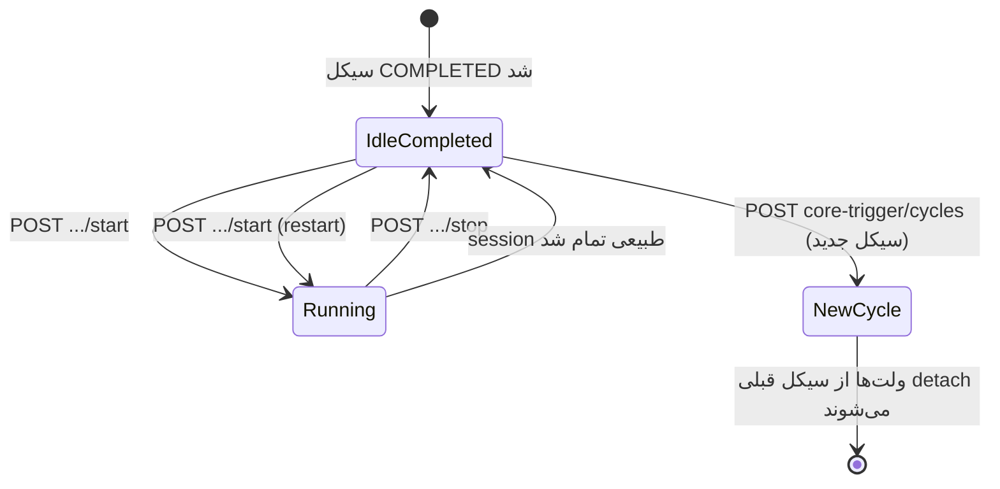

# Market Making — راهنمای فرانت‌اند

مستند کامل برای پیاده‌سازی پنل **شروع / توقف / مانیتورینگ Market Making** روی سیکل‌هایی که قبلاً `COMPLETED` یا `MONITORING` شده‌اند و اپراتور می‌خواهد دوباره روی همان توکن و همان ولت‌ها ترید کند.

---

## پایه API

| مورد | مقدار |
|------|--------|
| Base URL | `{HOST}/api/v1` |
| Auth | هدر `X-API-Key: <API_KEY>` روی همه درخواست‌ها |
| Swagger | `{HOST}/api` (OpenAPI) |
| Content-Type | `application/json` |

---

## خلاصه فلو (برای UI)



### نکات مهم برای فرانت

1. **بعد از `COMPLETED` ولت‌ها قطع نمی‌شوند** — `cycleId`، `tokenId` و `isActive` حفظ می‌مانند تا بتوانید دوباره MM بزنید.
2. **فقط با `startCycle` جدید** ولت‌ها از سیکل قبلی جدا و به پول برمی‌گردند.
3. **Manual MM** شمارنده ترید (`tradesExecuted`) را **ریست نمی‌کند** — ادامه از همان session قبلی.
4. هنگام MM دستی، `cycle.status` موقتاً `MARKET_MAKING` می‌شود؛ بعد از Stop به وضعیت قبلی (مثلاً `COMPLETED`) برمی‌گردد.
5. اگر **Emergency Halt** فعال باشد، Start مسدود است تا `POST /emergency/resume` زده شود.

---

## اندپوینت‌های اصلی Market Making

### 1. شروع / ری‌استارت دستی (پیشنهادی برای پنل)

```http
POST /api/v1/market-generator/cycles/{cycleId}/start
```

بدون body. معادل `manual: true`.

**موفق — `200`**

همان ساختار `MarketSessionDetailResponse` (زیر).

**خطاهای رایج**

| HTTP | معنی | اقدام UI |
|------|------|----------|
| `404` | سیکل یا توکن پیدا نشد | سیکل باید توکن لانچ‌شده داشته باشد |
| `409` | وضعیت سیکل مجاز نیست | فقط بعد از لانچ توکن (جدول وضعیت‌های مجاز پایین) |
| `409` | System is halted | دکمه Resume سیستم + `POST /emergency/resume` |
| `409` | Automated MM in progress | صبر یا Abort سیکل |
| `500` / پیام error | ولت فعال/فاند کافی نیست | sync بالانس + نمایش پیام سرور |

---

### 2. توقف دستی

```http
POST /api/v1/market-generator/cycles/{cycleId}/stop
```

- اگر `session.status === RUNNING` → session به `STOPPED` می‌رود و `cycle.status` به وضعیت قبل از MM (مثلاً `COMPLETED`) برمی‌گردد.
- اگر session از قبل متوقف بود → فقط tickهای صف پاک می‌شود.

**موفق — `200`** — همان `MarketSessionDetailResponse`.

---

### 3. وضعیت لحظه‌ای session (Polling)

```http
GET /api/v1/market-generator/cycles/{cycleId}/session
```

**Polling پیشنهادی:** هر **۲–۳ ثانیه** وقتی `status === RUNNING'`.

**`404`** — هنوز session ساخته نشده (قبل از اولین MM). UI: دکمه Start فعال، متریک‌ها خالی.

**جایگزین با sessionId:**

```http
GET /api/v1/market-generator/sessions/{sessionId}
```

---

### 4. شروع با body (اختیاری)

```http
POST /api/v1/market-generator/start
Content-Type: application/json

{
  "cycleId": "uuid",
  "tokenId": "uuid",   // اختیاری — از توکن سیکل resolve می‌شود
  "manual": true       // حتماً true برای COMPLETED/MONITORING
}
```

برای پنل اپراتور **همان `POST .../cycles/:id/start` کافی است**.

---

### 5. توقف با sessionId (اختیاری)

```http
POST /api/v1/market-generator/sessions/{sessionId}/stop
```

در عمل همان `stopManualSession(cycleId)` را صدا می‌زند.

---

## پاسخ Session — فیلدهای UI

```typescript
interface MarketSessionDetail {
  id: string;
  cycleId: string;
  tokenId: string;
  status: 'RUNNING' | 'STOPPED' | 'COMPLETED' | 'FAILED';
  startedAt: string;       // ISO
  stoppedAt: string | null;

  // متریک‌های اصلی داشبورد
  tradesExecuted: number;
  tradesPerMinute: number;
  marketCapUsd: number;
  volumeUsd: number;
  priceChangePercent: number;
  gasSpentUsd: number;

  // استراتژی (در پاسخ واقعی API هم هست — Swagger کامل نیست)
  phase?: string;                    // مثلاً BLITZ
  blitzMode?: boolean;
  blitzIndex?: number;
  strategyTargetTradesPerMinute?: number;
  baseTargetTradesPerMinute?: number;
  buyBiasPercent?: number;
  visibilityPhase?: string;
  botMagnetActive?: boolean;
  targetMarketCapUsd?: number;
}
```

### نگاشت دکمه‌ها به `session.status`

| `cycle.status` | `session.status` | UI |
|----------------|------------------|-----|
| `COMPLETED` | `STOPPED` / `COMPLETED` / 404 | **شروع MM** |
| `COMPLETED` | `RUNNING` | **توقف MM** + polling |
| `MARKET_MAKING` | `RUNNING` | **توقف MM** + polling (manual فعال) |
| `MONITORING` | هر وضعیت | مثل COMPLETED — Start مجاز |
| `PENDING` … `TOKEN_LAUNCH` | — | Start غیرفعال — توکن لانچ نشده |
| `ABORTED` | — | Start غیرفعال (مگر retry سیکل) |

---

## وضعیت‌های مجاز برای Start دستی

Manual start فقط وقتی `cycle.status` یکی از این‌ها باشد:

| وضعیت | توضیح |
|--------|--------|
| `SECURITY_CHECK` | بعد از gate امنیتی (توکن هنوز لانچ نشده باشد Start خطا می‌دهد) |
| `MARKET_MAKING` | ری‌استارت روی همان سیکل |
| `MONITORING` | بعد از ignition خودکار |
| `COMPLETED` | **سناریوی اصلی شما** — ارز دوباره جان بگیرد |
| `FAILED` | بعد از شکست pipeline (اگر توکن لانچ شده باشد) |

**غیرمجاز:** `PENDING`, `TREND_GENERATION`, `WALLET_GENERATION`, `FUNDING`, `TOKEN_LAUNCH` (در حال اجرا), `ABORTED`.

---

## اندپوینت‌های کمکی (همان صفحه سیکل)

### جزئیات سیکل + لاگ

```http
GET /api/v1/core-trigger/cycles/{cycleId}
```

شامل: `status`, `token`, `marketSession`, `logs[]` (پیام‌های `MARKET_MAKING` مثل «Manual market making started»).

### لیست سیکل‌ها

```http
GET /api/v1/core-trigger/cycles?page=1&limit=20&status=COMPLETED
```

### آنالیز سرمایه و موجودی توکن ولت‌ها

```http
GET  /api/v1/cycles/{cycleId}/analysis
POST /api/v1/cycles/{cycleId}/analysis/sync
```

برای نمایش قبل از Start: آیا مارکت ولت‌ها native و token balance دارند.

`sync` از RPC زنجیره می‌خواند — قبل از Start در صورت شک به موجودی، یک بار بزنید.

### بالانس مارکت ولت‌ها (سریع‌تر از analysis)

```http
GET  /api/v1/wallets/cycles/{cycleId}/market-balances
POST /api/v1/wallets/cycles/{cycleId}/market-balances/sync
```

### لیست ولت‌های سیکل

```http
GET /api/v1/wallets?cycleId={cycleId}&type=MARKET&page=1&limit=50
GET /api/v1/wallets?cycleId={cycleId}&type=TOKEN_OWNER
```

---

## Emergency / System Halt

قبل از Start چک کنید:

```http
GET /api/v1/emergency/halt
```

اگر `halted: true`:

```http
POST /api/v1/emergency/resume
{ "jobId": "<از پاسخ halt>" }
```

---

## شروع سیکل جدید (جدا از MM دستی)

```http
POST /api/v1/core-trigger/cycles
{ "network": "SOLANA" }
```

**تأثیر روی ولت‌ها:** ولت‌های سیکل `COMPLETED` قبلی detach می‌شوند و به سیکل جدید assign می‌شوند. در UI هشدار بدهید: «با شروع سیکل جدید، MM روی سیکل قبلی دیگر با همان ولت‌ها ممکن نیست».

---

## فلو پیشنهادی پیاده‌سازی فرانت

### بارگذاری صفحه جزئیات سیکل

```
1. GET /core-trigger/cycles/:cycleId
2. GET /market-generator/cycles/:cycleId/session   (404 → session=null)
3. GET /cycles/:cycleId/analysis                   (یا sync اگر دکمه Refresh)
```

### دکمه «شروع Market Making»

```
1. (اختیاری) GET /emergency/halt → اگر halted، مودال Resume
2. (اختیاری) POST /wallets/cycles/:id/market-balances/sync
3. POST /market-generator/cycles/:cycleId/start
4. شروع polling GET .../session هر 2–3s
5. نمایش toast از message لاگ سیکل (اختیاری — refetch cycle detail)
```

### دکمه «توقف Market Making»

```
1. POST /market-generator/cycles/:cycleId/stop
2. یک بار GET session + GET cycle detail
3. قطع polling
```

### حین RUNNING

- نمایش: `tradesExecuted`, `tradesPerMinute`, `marketCapUsd`, `volumeUsd`, `phase`, `blitzMode`
- `cycle.status` در DB موقتاً `MARKET_MAKING` است — در header سیکل هر دو را نشان دهید: «سیکل: MARKET_MAKING (manual)»

---

## تفاوت Manual vs Pipeline

| | Pipeline (خودکار) | Manual (پنل) |
|--|-------------------|----------------|
| تریگر | orchestrator سیکل | `POST .../start` |
| `tradesExecuted` | در restart pipeline صفر می‌شود | **حفظ می‌شود** |
| `cycle.status` بعد از stop | MONITORING / … | **برمی‌گردد به COMPLETED** (یا MONITORING اگر قبلاً آن بود) |
| حداقل ولت فاند | سخت‌گیرانه‌تر (ignition) | حداقل **۱** ولت فاند کافی است |
| تعداد ولت فعال | باید برابر تنظیمات (`marketWalletCount`) | همان |

---

## پیش‌نیازهای Start (خطاهای محتمل در body/message)

پیام‌ها در `500` یا exception متن انگلیسی دارند — در UI همان را نشان دهید:

| پیام (تقریبی) | علت |
|----------------|------|
| `0 active MARKET wallets on cycle` | ولت‌ها detach شده‌اند یا `isActive=false` — باگ قدیمی یا سیکل جدید شروع شده |
| `only X/Y active MARKET wallets` | تعداد ولت فعال کمتر از `marketWalletCount` در settings |
| `no on-chain balance for trades` | native balance کمتر از حد معامله |
| `Token is not launched on-chain` | آدرس توکن هنوز معتبر on-chain نیست |
| `Manual market making not allowed while cycle is X` | وضعیت سیکل در لیست مجاز نیست |

---

## نمونه درخواست‌ها (cURL)

### Start

```bash
curl -s -X POST "$BASE/api/v1/market-generator/cycles/$CYCLE_ID/start" \
  -H "X-API-Key: $API_KEY"
```

### Stop

```bash
curl -s -X POST "$BASE/api/v1/market-generator/cycles/$CYCLE_ID/stop" \
  -H "X-API-Key: $API_KEY"
```

### Poll session

```bash
curl -s "$BASE/api/v1/market-generator/cycles/$CYCLE_ID/session" \
  -H "X-API-Key: $API_KEY"
```

---

## چک‌لیست UI (Acceptance)

- [ ] روی سیکل `COMPLETED` با توکن لانچ‌شده دکمه **Start Market Making** فعال است
- [ ] حین `RUNNING` دکمه **Stop** + متریک‌های live با polling
- [ ] بعد از Stop، `cycle.status` دوباره `COMPLETED` (یا MONITORING) و دکمه Start دوباره فعال
- [ ] `tradesExecuted` بعد از stop/start دستی کم نمی‌شود
- [ ] خطای halt → مودال با لینک به Emergency Resume
- [ ] قبل از `startCycle` جدید هشدار detach ولت‌ها
- [ ] تب ولت‌ها / analysis: نمایش موجودی token + native برای مارکت و TOKEN_OWNER
- [ ] Handle `404` روی `GET .../session` برای سیکل بدون session

---

## مرجع کد بک‌اند

| فایل | نقش |
|------|-----|
| `src/modules/market-generator/market-generator.controller.ts` | Routeها |
| `src/modules/market-generator/market-generator.service.ts` | start/stop/getSession |
| `src/modules/market-generator/market-making-manual.util.ts` | وضعیت‌های مجاز و restore status |
| `src/common/swagger/dto/market.swagger.dto.ts` | DTOهای Swagger |

---

*آخرین به‌روزرسانی: هم‌راستا با رفتار «ولت‌ها بعد از COMPLETED متصل می‌مانند تا startCycle جدید».*
