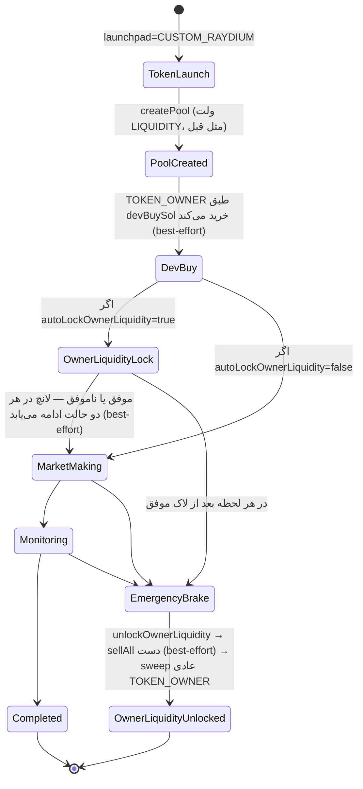

# UI Spec: Owner Liquidity Auto-Lock (TOKEN_OWNER → Raydium LP)

**Audience:** Frontend / Admin Panel team
**Backend version:** `/api/v1` (Nest global prefix)
**Feature flag:** `integrations.runtime.customLaunch.autoLockOwnerLiquidity` (default `false` — opt-in)
**Scope:** فقط لانچ‌پد `CUSTOM_RAYDIUM` (لانچ‌پد اختصاصی خودمان). روی `PUMP_FUN`/`LETS_BONK`/`FOUR_MEME` این قابلیت اصلاً اجرا نمی‌شود.
**سند مکمل:** این سند مکمل [`manual-launchpad-frontend.md`](./manual-launchpad-frontend.md) (بخش‌های ۲، ۵، ۷) و [`frontend-emergency-treasury.md`](./frontend-emergency-treasury.md) است — فقط تفاوت‌ها/فیلدهای این قابلیت جدید اینجا آمده.
**آخرین هم‌ترازی با کد:** ژوئیه ۲۰۲۶.

---

## 1. خلاصه محصول

تا امروز فقط ولت **LIQUIDITY** (ولت اختصاصی pool) موجودی‌اش را به‌صورت custodial قفل می‌کرد. حالا **اختیاری** می‌توان ولت **TOKEN_OWNER** را هم مجبور کرد که بلافاصله بعد از لانچ، **کل موجودی توکنش** (سهم mint + هر مقدار dev buy) را به‌عنوان لیکوئیدیتی اضافه به همان pool واریز کند:

- **چرا؟** روی اسکنرها (DexScreener/Solscan) موجودی سازنده (creator) صفر دیده می‌شود چون دیگر به‌صورت SPL token ساده نیست، بلکه به‌شکل LP قفل‌شده است → **اعتمادسازی بیشتر** برای خریداران، دقیقاً مثل قفل لیکوئیدیتی که پروژه‌های معتبر معمولاً تبلیغ می‌کنند.
- **مدل قفل:** دقیقاً مثل ولت LIQUIDITY — **custodial** (نه on-chain time-lock قراردادی). یعنی هیچ‌کس جز خود پلتفرم (کلید همان ولت owner) نمی‌تواند LP را بردارد، ولی از نظر بک‌اند این یک قفل نرم است که هر لحظه با ترمز اضطراری/درین کامل قابل آنلاک است.
- **کاملاً opt-in و قابل خاموش/روشن کردن** — یک سوییچ در تنظیمات (بخش ۲).
- **آنلاک** دقیقاً هم‌زمان و هم‌مسیر با آنلاک ولت LIQUIDITY انجام می‌شود: ترمز دستی (`POST /emergency/brake`) و درین کامل خزانه (`POST /treasury/drain` یا `fullDrain: true`). **هیچ endpoint جدیدی برای آنلاک جدا وجود ندارد.**

این سند فقط این قابلیت جدید را پوشش می‌دهد؛ برای فلوی کامل لانچ/ولت LIQUIDITY/ترمز به اسناد مرجع بالا مراجعه کن.

---

## 2. تنظیمات (Settings)

### 2.1 فیلدهای جدید

| فیلد | مسیر کامل | نوع | پیش‌فرض | توضیح UI |
|------|-----------|-----|---------|----------|
| فعال/غیرفعال لاک خودکار | `integrations.runtime.customLaunch.autoLockOwnerLiquidity` | `boolean` | `false` | Toggle اصلی این قابلیت — وقتی خاموش است، رفتار سیستم دقیقاً مثل قبل (owner توکن خودش را نگه می‌دارد) |
| بافر SOL برای matching liquidity | `integrations.runtime.customLaunch.ownerLiquidityLockSolBuffer` | `number` | `1` | SOL اضافه‌ای که به بودجه‌ی فاندینگ TOKEN_OWNER اضافه می‌شود تا بتواند در کنار توکن‌هایش، SOL معادل را هم به pool واریز کند (بخش ۳) |

### 2.2 خواندن

```http
GET /api/v1/settings
```

```json
{
  "integrations": {
    "runtime": {
      "customLaunch": {
        "totalSupply": "1000000000000000",
        "decimals": 6,
        "initialLiquiditySol": 2,
        "initialLiquidityTokenPercent": 90,
        "feeConfigIndex": 0,
        "slippageBps": 700,
        "emergencySlippageBps": 2500,
        "priorityFeeMicroLamports": 100000,
        "computeUnitLimit": 600000,
        "sellerFeeBasisPoints": 0,
        "devBuySol": 0.25,
        "httpTimeoutMs": 60000,
        "autoLockOwnerLiquidity": false,
        "ownerLiquidityLockSolBuffer": 1
      }
    }
  }
}
```

### 2.3 نوشتن (PATCH)

```http
PATCH /api/v1/settings
Content-Type: application/json

{
  "integrations": {
    "runtime": {
      "customLaunch": {
        "autoLockOwnerLiquidity": true,
        "ownerLiquidityLockSolBuffer": 1.5
      }
    }
  }
}
```

فقط فیلدهای تغییرکرده را بفرست (deep-merge سمت بک‌اند، مثل بقیه‌ی PATCHهای `/settings`). این دو فیلد به‌صورت جدا اعتبارسنجی نمی‌شوند (هر عدد/بولین قبول می‌شود) — کنترل محدوده (مثلاً بافر منفی) را در فرم UI انجام بده:

- `autoLockOwnerLiquidity`: باید switch/checkbox ساده باشد.
- `ownerLiquidityLockSolBuffer`: عدد اعشاری ≥ 0 (پیشنهاد UI: بین 0.3 تا 3، پیش‌فرض 1). مقدار خیلی کوچک ریسک شکست لاک را بالا می‌برد (بخش ۳).

### 2.4 نمایش در فرم Settings

بخش «Manual Launchpad (Custom Raydium)» در `admin-panel-spec.md` / `manual-launchpad-frontend.md` §۱۰ باید این دو فیلد جدید را زیر یک تیتر فرعی «Owner Liquidity Auto-Lock» اضافه کند:

```
┌ Owner Liquidity Auto-Lock ──────────────────────────────┐
│ [ ] فعال‌سازی لاک خودکار موجودی TOKEN_OWNER               │
│                                                            │
│ بافر SOL برای واریز متناسب: [ 1.0 ] SOL                   │
│ (این مقدار به بودجه‌ی فاندینگ TOKEN_OWNER هر سیکل           │
│  Solana اضافه می‌شود، حتی روی سیکل‌های Pump.fun/letsbonk —  │
│  سرمایه هدر نمی‌رود، فقط در درین بعدی برمی‌گردد)             │
└────────────────────────────────────────────────────────┘
```

> **نکته مهم برای توضیح در UI (tooltip):** این بافر روی **همه‌ی سیکل‌های Solana** اعمال می‌شود، نه فقط سیکل‌هایی که واقعاً از CUSTOM_RAYDIUM استفاده می‌کنند (محدودیت شناخته‌شده بک‌اند). یعنی اگر سیستم مخلوطی از Pump.fun/letsbonk/Custom Raydium دارد، ولت TOKEN_OWNER کمی بیشتر از لازم فاند می‌شود وقتی این سوییچ روشن است. این پول از بین نمی‌رود — فقط بلااستفاده روی ولت می‌ماند تا درین/تجمیع بعدی.

---

## 3. فلوی کامل — دیاگرام برای UI



### توضیح مرحله‌به‌مرحله

1. **لانچ + createPool** — بدون تغییر نسبت به قبل.
2. **Dev Buy** — بدون تغییر؛ اگر موفق شود، توکن‌های خریداری‌شده هم بعداً جزو «کل موجودی» owner لاک می‌شوند.
3. **Owner Liquidity Lock (جدید)** — اگر سوییچ فعال باشد: بک‌اند موجودی SPL فعلی ولت TOKEN_OWNER برای این mint را می‌خواند (سهم mint + هر مقدار dev buy) و آن را کامل (۱۰۰٪، نه بخشی از آن) به‌عنوان deposit به همان pool اضافه می‌کند. SOL معادل هم به‌صورت خودکار از موجودی SOL خود ولت owner کم می‌شود (طبق نسبت لحظه‌ای pool).
   - **Best-effort** — اگر شکست بخورد (مثلاً SOL کافی نبود)، فقط لاگ می‌شود؛ لانچ fail نمی‌شود و owner توکن‌هایش را unlocked نگه می‌دارد (دقیقاً مثل حالت سوییچ خاموش).
   - بعد از لاک موفق، موجودی SPL ساده‌ی owner برای این mint **صفر** می‌شود (چون همه‌اش LP شده) — این یعنی روی اسکنرها owner دیگر توکن غیرقفل‌شده نشان نمی‌دهد.
4. **Market Making / Monitoring / Completed** — بدون تغییر؛ owner دیگر جزو فروش‌های trim/profit-extract معمولی نمی‌آید چون موجودی ساده‌اش صفر است (طبیعی و مورد انتظار).
5. **Emergency Brake / Treasury Drain (هر زمان)** — دقیقاً مثل ولت LIQUIDITY: LP owner آنلاک می‌شود، هر token dust باقی‌مانده فروخته می‌شود (best-effort)، و SOL آزادشده در همان چرخه‌ی sweep عادی TOKEN_OWNER جمع‌آوری می‌شود (بخش ۵).

---

## 4. تأثیر روی فاندینگ TOKEN_OWNER

وقتی `autoLockOwnerLiquidity=true` باشد، هدف فاندینگ TOKEN_OWNER برای هر سیکل **Solana** (`ownerLaunchFundingUsd`) به‌اندازه‌ی `ownerLiquidityLockSolBuffer × قیمت SOL` بیشتر می‌شود — چون owner باید علاوه بر dev buy، SOL اضافه برای واریز متناسب لیکوئیدیتی هم داشته باشد.

**نکات UI:**

- این تغییر **خودکار** است — فرم «هدف فاندینگ» یا مقدار ارسالی به ChangeNOW جای جداگانه‌ای برای نمایش این بافر ندارد؛ فقط عدد کل بزرگ‌تر می‌شود. اگر صفحه‌ای عدد `ownerLaunchFundingUsd`/`computeOwnerFundingSendUsd` را نمایش می‌دهد، بعد از فعال‌سازی سوییچ همان‌جا افزایش را می‌بینی — نیازی به فیلد UI جدید نیست.
- اگر owner با وجود این بافر باز هم SOL کم بیاورد (مثلاً قیمت SOL نوسان کرده)، لاک فقط **شکست می‌خورد و لاگ می‌شود** — سیکل fail نمی‌شود. اگر می‌خواهی نرخ موفقیت را بالاتر ببری، بافر را در تنظیمات افزایش بده.

---

## 5. اندپوینت‌ها و فیلدهای پاسخ

### 5.1 جزئیات سیکل/توکن — فیلدهای جدید

```http
GET /api/v1/core-trigger/cycles/{cycleId}
```

فیلد `token` سه فیلد جدید دارد (فقط برای `launchpad=CUSTOM_RAYDIUM`؛ برای بقیه همیشه `null`):

```typescript
interface OwnerLiquidityLockFields {
  ownerLiquidityLockedAt: string | null;    // ISO — زمان لاک موفق owner؛ null یعنی لاک نشده (سوییچ خاموش بوده یا شکست خورده)
  ownerLiquidityUnlockedAt: string | null;  // ISO — null یعنی هنوز قفل است؛ مقداردار یعنی برای همیشه آنلاک شده (ترمز/درین)
  ownerLiquidityLockTxHash: string | null;  // تراکنش addLiquidity — برای لینک به Solscan
}
```

**نمایش پیشنهادی در کارت Pool صفحه جزئیات سیکل/توکن (کنار badge لاک/آنلاک ولت LIQUIDITY موجود):**

| وضعیت | شرط | Badge |
|-------|-----|-------|
| قفل نشده (سوییچ خاموش یا شکست) | `ownerLiquidityLockedAt == null` | چیزی نشان نده (یا badge خاکستری «Owner: Unlocked») |
| قفل‌شده | `ownerLiquidityLockedAt != null && ownerLiquidityUnlockedAt == null` | 🔒 «Owner Liquidity Locked» (سبز) + لینک تراکنش (`ownerLiquidityLockTxHash` → `https://solscan.io/tx/{hash}`) |
| آنلاک‌شده | `ownerLiquidityUnlockedAt != null` | 🔓 «Owner Liquidity Unlocked — swept» (زرد/قرمز) |

> **محدودیت شناخته‌شده:** پاسخ `POST /token-factory/launch` (`TokenLaunchResponseDto`) این فیلدها را ندارد — بلافاصله بعد از لانچ برای دیدن نتیجه‌ی لاک باید `GET /core-trigger/cycles/{cycleId}` را refetch/poll کنی (دقیقاً مثل فیلدهای `poolAddress`/`liquidityLockedAt` موجود).

### 5.2 ترمز اضطراری — فیلد جدید در پاسخ

```http
POST /api/v1/emergency/brake
```

پاسخ (`EmergencyBrakeResponseDto`) یک فیلد جدید دارد، کنار `liquidityWalletsUnlocking` موجود:

```json
{
  "jobId": "emergency_1751450000000_1234",
  "status": "QUEUED",
  "mode": "SELL_SWEEP",
  "convertTo": "NATIVE",
  "fullDrain": false,
  "walletsAffected": 152,
  "sellTargets": 150,
  "liquidityWalletsUnlocking": 1,
  "ownerLiquidityWalletsUnlocking": 1,
  "chainDrainJobId": null,
  "sweepNativeToWithdrawal": false,
  "message": "Emergency brake: sell all tokens → sweep TOKEN_OWNER SOL/BNB to withdrawal only"
}
```

| فیلد جدید | نوع | توضیح |
|-----------|-----|-------|
| `ownerLiquidityWalletsUnlocking` | `number` | تعداد توکن‌های CUSTOM_RAYDIUM که owner‌شان لاک فعال داشته و در این برک آنلاک می‌شود (معمولاً ۰ یا ۱، ولی روی سیکل‌های موازی می‌تواند بیشتر باشد) |

**نمایش UI:** در بنر/نتیجه‌ی برک، همان‌جا که «ولت LIQUIDITY آنلاک شد» نشان می‌دهی، یک خط هم برای owner اضافه کن:

> «۱ ولت Token Owner با لیکوئیدیتی قفل‌شده هم آنلاک و SOL آزادشده‌اش برداشت شد.»

**`GET /emergency/brake/:jobId`** — schema فعلی تغییر **نکرده**؛ `progress.walletsSold/Failed` جمع کل (sell + liquidity unlock + owner liquidity unlock) را نشان می‌دهد، بدون breakdown جدا برای owner-liquidity. برای جزئیات دقیق per-token بعد از تکمیل، `GET /core-trigger/cycles/{cycleId}` را refetch کن و فیلدهای بخش ۵.۱ را چک کن.

### 5.3 Treasury Full Drain — همین رفتار، بدون فیلد جدید

```http
POST /api/v1/treasury/drain
```

(یا `fullDrain: true` در بدنه‌ی `/emergency/brake`) — قبل از inventory scan، علاوه بر ولت‌های LIQUIDITY، هر owner-liquidity قفل‌شده‌ی آنلاک‌نشده هم آنلاک می‌شود. **schema پاسخ تغییر نکرده** — فقط در متن توضیحی صفحه‌ی Treasury همین نکته را اضافه کن (مثل بخش ۷.۳ سند `manual-launchpad-frontend.md`).

---

## 6. Wallet Overview — بدون تغییر ساختاری

ولت TOKEN_OWNER همچنان همان `type=TOKEN_OWNER` قبلی است — **نقش جدیدی اضافه نشده** (برخلاف ولت LIQUIDITY که یک `type` کاملاً جدا بود). فقط توجه کن:

- `balanceUsd` ولت owner بعد از لاک موفق، فقط **SOL باقیمانده** را نشان می‌دهد — ارزش LP قفل‌شده در آن **شمرده نمی‌شود** (دقیقاً مثل ولت LIQUIDITY، بخش ۲ سند مرجع). برای وضعیت LP از فیلدهای بخش ۵.۱ استفاده کن، نه از `balanceUsd`.
- در جدول/کارت TOKEN_OWNER، اگر بخواهی نشان بدهی «این owner لیکوئیدیتی‌اش قفل است»، باید از طریق توکن مرتبط (`GET /core-trigger/cycles/{cycleId}` یا مشابه) این را resolve کنی — روی خود ردیف ولت فیلد مستقیمی برای این نیست.

---

## 7. خطاها و حالت‌های حاشیه‌ای

| رفتار | کجا | علت | UI |
|-------|-----|-----|-----|
| لانچ موفق ولی بدون `ownerLiquidityLockedAt` | `GET /core-trigger/cycles/:id` بعد از لانچ | سوییچ خاموش بوده، **یا** لاک شکست خورده (معمولاً کمبود SOL) — از بیرون این دو حالت قابل تفکیک نیستند مگر لاگ‌های سیکل را چک کنی | اگر سوییچ در تنظیمات فعال است ولی این فیلد خالی ماند، لینک «مشاهده لاگ‌ها» بده، نه خطای قرمز — لانچ خودش موفق بوده |
| موجودی owner روی اسکنر همیشه ۰ بعد از لاک | طبیعی و مورد انتظار | تمام SPL balance به LP تبدیل شده | این را در توضیح UI به‌عنوان «ویژگی» (اعتمادسازی) معرفی کن، نه باگ |
| Profit-extractor / trim owner هیچ‌وقت روی این owner اجرا نمی‌شود | صفحه Profit Extraction | موجودی ساده‌ی owner صفر است → چیزی برای trim کردن نیست | طبیعی؛ اگر جایی «Owner Trim: Skipped» نمایش می‌دهی، متن را عمومی نگه‌دار (این یکی از دلایل ممکن آن است) |
| فاندینگ owner کمی بیشتر از قبل، حتی روی سیکل‌های Pump.fun/letsbonk وقتی سوییچ فعال است | صفحه فاندینگ/بودجه سیکل | محدودیت شناخته‌شده بک‌اند (بخش ۲.۴) | توضیح tooltip طبق بخش ۲.۴ |

---

## 8. چک‌لیست UI (Acceptance)

- [ ] فرم Settings: سوییچ «Owner Liquidity Auto-Lock» + فیلد بافر SOL (بخش ۲)
- [ ] Tooltip توضیح اثر بافر روی فاندینگ همه‌ی سیکل‌های Solana (بخش ۲.۴)
- [ ] کارت Pool در صفحه جزئیات سیکل/توکن: badge لاک/آنلاک owner + لینک تراکنش (بخش ۵.۱)
- [ ] بنر نتیجه‌ی Emergency Brake: نمایش `ownerLiquidityWalletsUnlocking` کنار `liquidityWalletsUnlocking` (بخش ۵.۲)
- [ ] بنر Treasury Drain: همان توضیح آنلاک owner (بخش ۵.۳)
- [ ] عدم نمایش خطا برای موجودی صفر owner بعد از لاک موفق (بخش ۷)

---

## 9. مرجع کد بک‌اند

| فایل | نقش |
|------|-----|
| `src/integrations/custom-launch/raydium-cpmm.service.ts` | `addLiquidity()` — واریز متناسب به pool موجود |
| `src/integrations/custom-launch/custom-launch-sdk.service.ts` | `lockOwnerLiquidity()` / `unlockOwnerLiquidity()` + فراخوانی خودکار در `createToken()` |
| `src/common/funding/owner-launch-funding.util.ts` | `computeOwnerLiquidityLockBufferUsd()` — بافر فاندینگ |
| `src/modules/token-factory/token-factory.service.ts` | persist کردن `ownerLiquidityLockedAt`/`ownerLiquidityLockTxHash` روی `Token` |
| `src/modules/emergency/emergency-brake-coordinator.service.ts` | `buildOwnerLiquidityUnlockTargets()` |
| `src/modules/emergency/processors/emergency-sell.processor.ts` | `unlockOwnerLiquidityPositions()` — آنلاک + دامپ dust + فولد به sweep عادی |
| `src/modules/treasury-lifecycle/treasury-drain-runner.service.ts` | `unlockOwnerLiquidity()` — همین آنلاک قبل از درین کامل |
| `.cursor/skills/custom-raydium-launchpad/SKILL.md` + `reference.md` | مستند فنی کامل (agent skill) — بخش «Owner liquidity auto-lock» |

---

*این سند مکمل است — برای فلوی کامل لانچ/ولت LIQUIDITY/ترمز عمومی به [`manual-launchpad-frontend.md`](./manual-launchpad-frontend.md) و [`frontend-emergency-treasury.md`](./frontend-emergency-treasury.md) مراجعه کن.*
