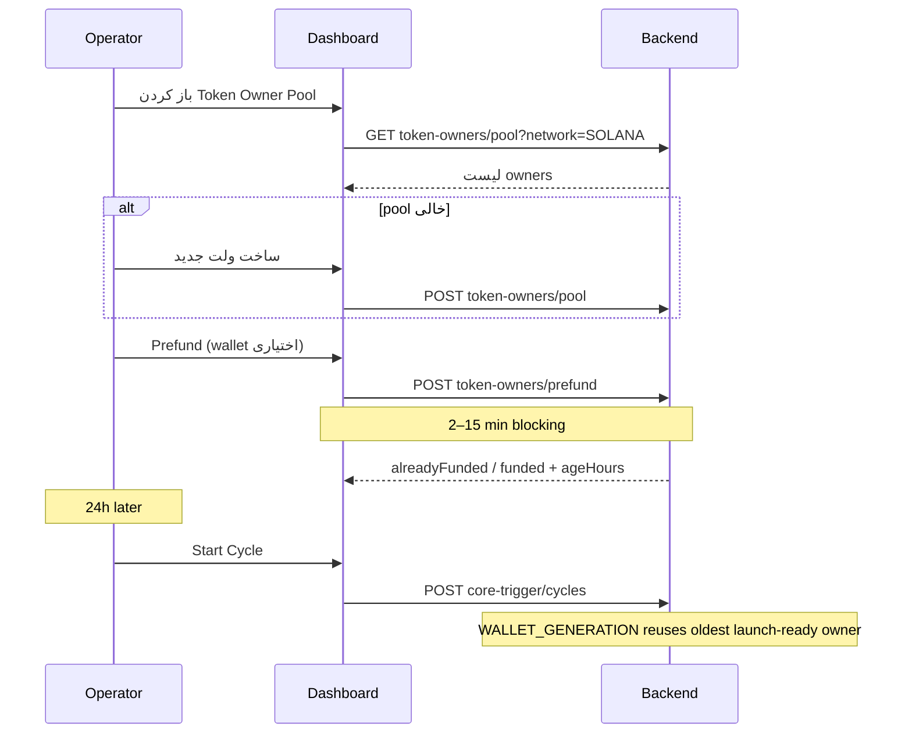

# UI Spec: TOKEN_OWNER Wallet Pool & Reuse

**Audience:** Frontend / dashboard team  
**Backend version:** `api/v1` (Nest global prefix)  
**Feature flag:** `settings.strategy.tokenOwnerReuseEnabled` (default `true`)

---

## 1. خلاصه محصول

قبلاً هر سیکل یک ولت `TOKEN_OWNER` **یک‌بارمصرف** (`SINGLE_USE`) می‌ساخت. الان:

- ولت‌های owner **قابل استفاده مجدد** (`MULTI_USE`) در یک **pool** نگه‌داری می‌شوند.
- شروع سیکل: اگر owner فاندشده/نیمه‌فاند در pool باشد → **reuse**؛ اگر کم باشد → **top-up**؛ اگر نباشد → **ساخت جدید**.
- اپراتور می‌تواند **قبل از سیکل** owner را بسازد و **prefund** کند (برای **سن ولت** و آماده‌سازی لانچ).

این سند فقط بخش **UI/API مربوط به Token Owner Pool** است؛ فلو کامل سیکل در لاگ‌های `core-trigger/cycles/:id` قابل مشاهده است.

---

## 2. تنظیمات (Settings)

| Field | Path | Type | Default | UI |
|-------|------|------|---------|-----|
| فعال/غیرفعال reuse | `strategy.tokenOwnerReuseEnabled` | `boolean` | `true` | Toggle در Strategy / Wallet |
| هدف فاند on-chain | `strategy.ownerLaunchFundingUsd` | `number` | `550` | نمایش در جدول pool (ستون «هدف») |

**خواندن:** `GET /api/v1/settings`  
**نوشتن:** `PATCH /api/v1/settings` با `{ "strategy": { "tokenOwnerReuseEnabled": true } }`

اگر `tokenOwnerReuseEnabled === false`:

- اندپوینت‌های pool/prefund → `400 Bad Request`
- سیکل مثل قبل owner `SINGLE_USE` می‌سازد (بدون pool UI)

---

## 3. اندپوینت‌ها

Base URL: `/api/v1/core-trigger`

همه درخواست‌ها نیاز به **همان auth** بقیه dashboard دارند (Bearer / session طبق env).

### 3.1 لیست pool

```http
GET /api/v1/core-trigger/token-owners/pool?network=SOLANA&limit=50
```

| Query | Required | Description |
|-------|----------|-------------|
| `network` | ✅ | `SOLANA` \| `BSC` |
| `limit` | ❌ | 1–200، پیش‌فرض 50 |

**Response:** آرایه JSON (نه object با `data`)

```json
[
  {
    "id": "uuid",
    "address": "7xKX...",
    "network": "SOLANA",
    "balanceUsd": 412.5,
    "cycleId": null,
    "createdAt": "2026-06-28T10:00:00.000Z",
    "ageHours": 26.4,
    "isAssignable": true
  }
]
```

| Field | UI usage |
|-------|----------|
| `ageHours` | سن ولت — **هرچه بیشتر بهتر** برای anti-bot / wallet age |
| `balanceUsd` | موجودی cached DB؛ برای دقیق → `GET /api/v1/wallets/:id/balance` |
| `cycleId` | `null` = در pool آزاد؛ non-null = هنوز به سیکلی attach است (نباید در لیست assignable بیاید مگر stale) |
| `isAssignable` | همیشه `true` در پاسخ فعلی؛ برای disable دکمه «انتخاب» اگر `cycleId != null` |

**خطاها:**

| Status | Body | UI |
|--------|------|-----|
| 400 | `TOKEN_OWNER reuse is disabled in settings` | پیام + لینک به Settings |
| 401/403 | استاندارد | — |

---

### 3.2 ساخت owner جدید در pool

```http
POST /api/v1/core-trigger/token-owners/pool
Content-Type: application/json

{ "network": "SOLANA" }
```

**Response 200:**

```json
{
  "id": "uuid",
  "address": "7xKX...",
  "network": "SOLANA",
  "type": "TOKEN_OWNER",
  "usageMode": "MULTI_USE",
  "balanceNative": "0",
  "balanceUsd": 0,
  "isActive": true,
  "ageHours": 0
}
```

**UI:** دکمه «ساخت ولت Owner جدید» → toast موفق → refresh لیست pool.

---

### 3.3 Prefund (یک‌کلیکی — سن + فاند)

```http
POST /api/v1/core-trigger/token-owners/prefund
Content-Type: application/json

{
  "network": "SOLANA",
  "walletId": "optional-uuid"
}
```

| Body | Description |
|------|-------------|
| `network` | الزامی |
| `walletId` | اختیاری — اگر نباشد: بهترین owner از pool (قدیمی‌ترین launch-ready → partial → خالی) |
| `wait` | **فقط `true` مجاز** — اگر `false` باشد → `400` |

**این endpoint synchronous است** (تا پایان ChangeNOW صبر می‌کند؛ ممکن است چند دقیقه طول بکشد).

**UI الزامی:**

- Loading state با progress / «در حال فاندینگ…»
- **Timeout UI** حداقل 10–15 دقیقه
- غیرفعال کردن دوباره کلیک تا پاسخ بیاید

**Response — قبلاً فاند شده (`alreadyFunded: true`):**

```json
{
  "walletId": "uuid",
  "address": "7xKX...",
  "network": "SOLANA",
  "balanceUsd": 560.2,
  "targetUsd": 550,
  "alreadyFunded": true,
  "poolCycleId": "uuid-staging",
  "ageHours": 30.1
}
```

**Response — فاند انجام شد:**

```json
{
  "walletId": "uuid",
  "address": "7xKX...",
  "network": "SOLANA",
  "balanceUsd": 545.0,
  "targetUsd": 550,
  "topUpSendUsd": 120.5,
  "shortfallUsd": 108.2,
  "alreadyFunded": false,
  "jobId": "12345",
  "poolCycleId": "uuid-staging",
  "waited": true,
  "ageHours": 28.1
}
```

| Field | UI |
|-------|-----|
| `alreadyFunded` | badge سبز «آماده لانچ» |
| `topUpSendUsd` / `shortfallUsd` | نمایش در toast: «فقط X$ top-up شد» |
| `jobId` | اختیاری در جزئیات / لاگ اپراتور |
| `poolCycleId` | **فقط diagnostic** — سیکل staging داخلی؛ در UI کاربر نشان نده مگر حالت debug |

**خطاها:**

| Status | علت | UI |
|--------|-----|-----|
| 400 | reuse غیرفعال | Settings |
| 400 | `wait: false` | حذف گزینه async از UI |
| 404 | `walletId` نامعتبر | — |
| 409/422 | pool contention | «دوباره تلاش کنید» |
| 5xx / funding fail | ChangeNOW / main wallet | نمایش `message` + لینک main-fee-wallet |

---

### 3.4 اندپوینت‌های مرتبط (موجود)

| Endpoint | Usage در UI Token Owner |
|----------|-------------------------|
| `GET /api/v1/wallets/:walletId` | جزئیات + `usageMode`, `cycleId`, `tokenId` |
| `GET /api/v1/wallets/:walletId/balance` | refresh on-chain قبل از prefund |
| `GET /api/v1/wallets?type=TOKEN_OWNER&network=SOLANA` | لیست legacy (همه ownerها، نه فقط pool) |
| `GET /api/v1/core-trigger/cycles/:cycleId` | owner فعال سیکل در `wallets` |
| `POST /api/v1/core-trigger/cycles` | شروع سیکل — reuse خودکار backend |

---

## 4. فلوهای UI پیشنهادی

### 4.1 صفحه «Token Owner Pool»

```
┌─────────────────────────────────────────────────────────────┐
│ Token Owner Pool          [Network: SOLANA ▼]  [Refresh]   │
│ Reuse: ON (ownerLaunchFundingUsd: $550)                     │
├─────────────────────────────────────────────────────────────┤
│ [+ ساخت ولت جدید]  [Prefund بهترین candidate]               │
├─────────────────────────────────────────────────────────────┤
│ Address      │ Age (h) │ Balance USD │ Target │ Status │ Act │
│ 7xKX...      │ 26.4    │ $412        │ $550   │ Partial│ [Prefund] │
│ 9abc...      │ 48.2    │ $560        │ $550   │ Ready  │ —       │
│ 3def...      │ 0.1     │ $0          │ $550   │ Empty  │ [Prefund] │
└─────────────────────────────────────────────────────────────┘
```

**Status (محاسبه سمت کلاینت):**

```ts
const target = settings.strategy.ownerLaunchFundingUsd ?? 300;
const minReady = target * 0.5; // TOKEN_OWNER_PREFUND_TOLERANCE

function ownerStatus(balanceUsd: number): 'ready' | 'partial' | 'empty' {
  if (balanceUsd >= minReady) return 'ready';
  if (balanceUsd > 0) return 'partial';
  return 'empty';
}
```

### 4.2 فلو «آماده‌سازی ۲۴ ساعت قبل»



### 4.3 فلو داخل سیکل (فقط نمایش — بدون اکشن جدا)

Backend خودکار:

1. `WALLET_GENERATION` — assign از pool یا create
2. `FUNDING` — skip / top-up / full
3. `TOKEN_LAUNCH` — همان owner
4. `COMPLETED` / `ABORTED` — owner به pool برمی‌گردد

**UI Cycle Detail — لاگ‌های مهم برای نمایش:**

| Step | Message pattern |
|------|-----------------|
| `WALLET_GENERATION` | `Reused TOKEN_OWNER wallet {id} (balance $X, launch-ready if ≥$Y...)` |
| `FUNDING` | `top-up $X` یا `prefunded — skip ChangeNOW` |
| `FUNDING` | `Queued owner funding job ...` |

فیلتر لاگ: `step IN (WALLET_GENERATION, FUNDING)`.

---

## 5. TypeScript types (کلاینت)

```ts
export type Network = 'SOLANA' | 'BSC';

export interface TokenOwnerPoolWallet {
  id: string;
  address: string;
  network: Network;
  balanceUsd: number;
  cycleId: string | null;
  createdAt: string;
  ageHours: number;
  isAssignable: boolean;
}

export interface CreatePoolTokenOwnerResponse {
  id: string;
  address: string;
  network: Network;
  type: 'TOKEN_OWNER';
  usageMode: 'MULTI_USE' | 'SINGLE_USE';
  balanceNative: string;
  balanceUsd: number;
  isActive: boolean;
  ageHours: number;
}

export interface PrefundTokenOwnerRequest {
  network: Network;
  walletId?: string;
  wait?: boolean; // must be true or omitted
}

export interface PrefundTokenOwnerResponse {
  walletId: string;
  address: string;
  network: Network;
  balanceUsd: number;
  targetUsd: number;
  topUpSendUsd?: number;
  shortfallUsd?: number;
  alreadyFunded: boolean;
  jobId?: string;
  poolCycleId?: string;
  waited?: boolean;
  ageHours: number;
}
```

---

## 6. حالت‌ها و edge cases برای UI

| Scenario | رفتار backend | UI |
|----------|---------------|-----|
| Reuse OFF | pool API → 400 | مخفی کردن منوی Pool |
| Owner `cycleId != null` | در حال استفاده سیکل دیگر | badge «In use» + disable prefund |
| Prefund در حین اجرا | درخواست دوم parallel | disable همه دکمه‌های prefund |
| Emergency brake بعد از سیکل | owner `DRAINED`, balance 0, در pool | status «Needs prefund» — سن حفظ می‌شود |
| سیکل FAILED + Retry | owner روی همان cycle می‌ماند | در cycle detail نشان بده؛ pool خالی‌تر به نظر می‌رسد |
| Legacy `SINGLE_USE` | روی terminal cycle → auto upgrade به `MULTI_USE` | نمایش `usageMode: MULTI_USE` بعد از اولین reuse |

---

## 7. چک‌لیست پیاده‌سازی UI

- [ ] صفحه/تب **Token Owner Pool** با selector شبکه
- [ ] جدول با ستون‌های: address (copy), ageHours, balanceUsd, status, actions
- [ ] دکمه **Create** → `POST token-owners/pool`
- [ ] دکمه **Prefund** per row + **Prefund best** (بدون `walletId`)
- [ ] Loading/blocking state برای prefund (long-running)
- [ ] Toggle `strategy.tokenOwnerReuseEnabled` در Settings
- [ ] نمایش `ownerLaunchFundingUsd` به عنوان target
- [ ] در Cycle detail: highlight لاگ reuse/top-up
- [ ] لینک از row به `GET /wallets/:id` برای explorer address
- [ ] Refresh balance قبل از prefund (اختیاری ولی UX بهتر)

---

## 8. تست دستی (QA)

1. `GET pool` — آرایه خالی یا پر
2. `POST pool` — owner جدید با `ageHours: 0`
3. `POST prefund` — صبر تا `alreadyFunded` یا balance ≥ 50% target
4. `POST cycles` — در لاگ ببین `Reused TOKEN_OWNER`
5. بعد از `COMPLETED` — `GET pool` همان address با `cycleId: null`
6. `tokenOwnerReuseEnabled: false` — pool endpoints 400

---

## 9. Swagger

مرجع زنده: `/api/docs` (یا مسیر swagger پروژه) — tag **CoreTrigger**:

- `GET token-owners/pool`
- `POST token-owners/pool`
- `POST token-owners/prefund`

---

## 10. تماس / سوالات backend

- منطق انتخاب pool: `TokenOwnerWalletPoolService.findBestReusable`
- فاند top-up: `computeOwnerFundingPlan` در `owner-launch-funding.util.ts`
- فلگ: `isTokenOwnerReuseEnabled()` — default `true` اگر field نباشد
