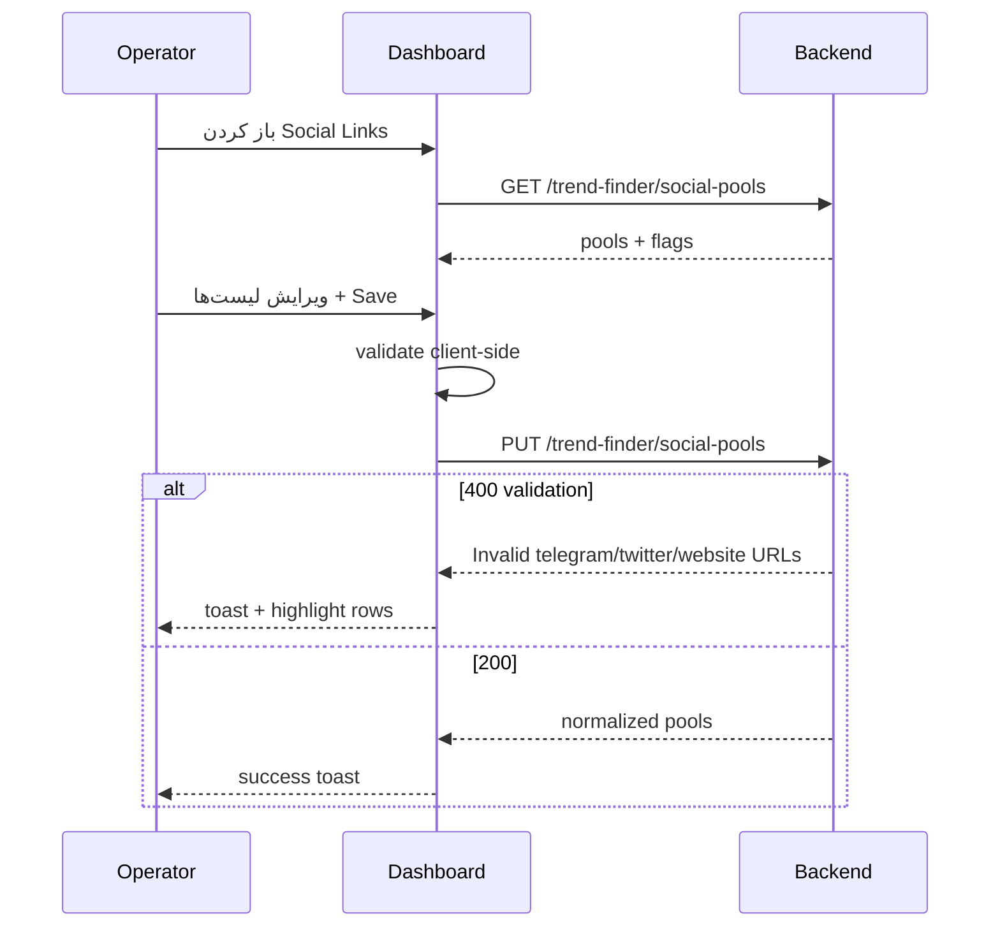
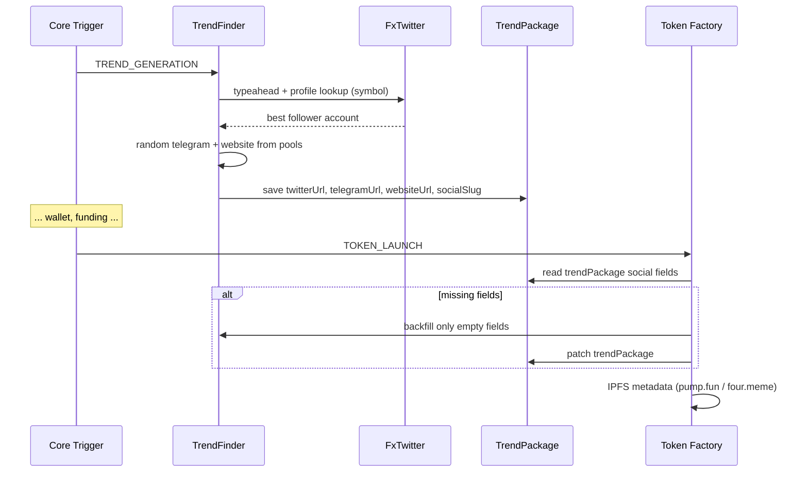

# UI Spec: Social Links (Twitter / Telegram / Website)

**Audience:** Frontend / dashboard team  
**Backend version:** `api/v1` (Nest global prefix)  
**مرتبط با:** Trend generation → Token launch metadata (Pump.fun / Four.meme / GMGN)

---

## 1. خلاصه محصول

برای هر توکن در سیکل، سه لینک social در metadata لانچ استفاده می‌شود:

| کانال | منبع | توضیح |
|-------|------|--------|
| **Twitter** | جستجوی خودکار X + pool اپراتور | سیستم symbol را روی X جستجو می‌کند، **بیشترین فالوور** را انتخاب می‌کند (GMGN اکانت و فالوور را چک می‌کند). **بدون API key** از FxTwitter. اگر اکانتی پیدا نشد → رندوم از لیست Twitter اپراتور |
| **Telegram** | pool اپراتور | رندوم از لیست — استفاده مجدد OK |
| **Website** | pool اپراتور | رندوم از لیست — استفاده مجدد OK |

**نکات مهم برای UI:**

- اپراتور **سه جدول/لیست URL** مدیریت می‌کند (Telegram, Website, Twitter).
- در هر لانچ از هر لیست **یک URL رندوم** انتخاب می‌شود.
- **استفاده تکراری** از همان URL در چند سیکل **مشکلی ندارد** — dedup غیرفعال است.
- لینک‌های نهایی روی `TrendPackage` ذخیره می‌شوند و در Cycle Detail قابل نمایش‌اند.
- تنظیمات Twitter search و poolها از **دو مسیر** قابل مدیریت‌اند: صفحه اختصاصی Social Pools + Settings کلی.

---

## 2. تنظیمات (Settings)

### 2.1 Social pools (مسیر اصلی UI)

| Field | Path در DB/Settings | Type | Default | UI |
|-------|---------------------|------|---------|-----|
| لیست Telegram | `strategy.trendFinder.social.telegramUrlPool` | `string[]` | `[]` | جدول چندسطره + add/remove |
| لیست Website | `strategy.trendFinder.social.websiteUrlPool` | `string[]` | `[]` | جدول چندسطره |
| لیست Twitter (fallback) | `strategy.trendFinder.social.twitterUrlPool` | `string[]` | `[]` | جدول چندسطره |
| جستجوی خودکار X | `strategy.trendFinder.social.twitterSearchEnabled` | `boolean` | `true` | Toggle |
| حداقل فالوور | `strategy.trendFinder.social.twitterMinFollowers` | `number` | `0` | Input عددی |

**خواندن/نوشتن اختصاصی (توصیه UI):**

```http
GET  /api/v1/trend-finder/social-pools
PUT  /api/v1/trend-finder/social-pools
```

**خواندن از Settings کلی:**

```http
GET /api/v1/settings
```

در پاسخ: `settings.strategy.trendFinder.social` (همان ساختار بالا)

**نوشتن جایگزین (merge عمیق):**

```http
PATCH /api/v1/settings
Content-Type: application/json

{
  "strategy": {
    "trendFinder": {
      "social": {
        "telegramUrlPool": ["https://t.me/channel1"],
        "websiteUrlPool": ["https://mysite.com"],
        "twitterUrlPool": ["https://x.com/memecoin", "@backup"],
        "twitterSearchEnabled": true,
        "twitterMinFollowers": 100
      }
    }
  }
}
```

> **توصیه:** برای صفحه Social Links Management فقط از `GET/PUT social-pools` استفاده کنید — validation اختصاصی و پیام خطای واضح‌تر دارد.

### 2.2 Integrations (اختیاری — فقط fallback پیشرفته)

| Field | Path | Type | UI |
|-------|------|------|-----|
| X API Bearer (اختیاری) | `integrations.xBearerToken` | `string` | Password field در Integrations — فقط اگر FxTwitter جواب نداد |
| FxTwitter base URL | `integrations.endpoints.fxTwitterBaseUrl` | `string` | Advanced — default `https://api.fxtwitter.com` |
| X API base URL | `integrations.endpoints.xApiBaseUrl` | `string` | Advanced — default `https://api.x.com` |

**خواندن:** `GET /api/v1/settings` → `integrations.xBearerToken` به صورت `***` mask می‌شود.

**نوشتن:**

```http
PATCH /api/v1/settings
{ "integrations": { "xBearerToken": "AAAA..." } }
```

### 2.3 Runtime (معمولاً فقط DevOps — نه اپراتور)

`integrations.runtime.xTwitter`:

| Field | Default | توضیح |
|-------|---------|--------|
| `httpTimeoutMs` | `10000` | timeout درخواست FxTwitter |
| `httpRetries` | `2` | retry |
| `maxDiscoveryUsers` | `24` | حداکثر اکانت برای ارزیابی per symbol |
| `profileLookupConcurrency` | `4` | lookup موازی profile |
| `profileProviderBaseUrls` | FxTwitter → VxTwitter | fallback وقتی یک provider بلاک است |
| `socialLookupTimeoutMs` | `20000` | سقف زمان auto-search در SOCIAL؛ بعد pool/synthetic |
| `maxUsernamesPerRequest` | `100` | فقط برای X API رسمی |

---

## 3. اندپوینت‌ها

Base: `/api/v1/trend-finder`  
Auth: همان Bearer/session بقیه dashboard.

### 3.1 GET social-pools

```http
GET /api/v1/trend-finder/social-pools
```

**Response 200:**

```json
{
  "telegramUrlPool": [
    "https://t.me/channel_alpha",
    "https://t.me/channel_beta"
  ],
  "websiteUrlPool": [
    "https://landing.example.com",
    "https://promo.io/token"
  ],
  "twitterUrlPool": [
    "https://x.com/official_meme",
    "@backup_account"
  ],
  "twitterSearchEnabled": true,
  "twitterMinFollowers": 0
}
```

| Field | UI |
|-------|-----|
| `telegramUrlPool` | جدول Telegram — هر سطر یک URL |
| `websiteUrlPool` | جدول Website |
| `twitterUrlPool` | جدول Twitter fallback — `@user` یا `https://x.com/user` |
| `twitterSearchEnabled` | Toggle «جستجوی خودکار X» |
| `twitterMinFollowers` | فیلتر: اکانت‌های زیر این آستانه در auto-search رد می‌شوند → می‌رود سراغ pool |

---

### 3.2 PUT social-pools

```http
PUT /api/v1/trend-finder/social-pools
Content-Type: application/json
```

**Body** — همه فیلدها اختیاری؛ اگر آرایه ارسال شود **کل لیست آن کانال جایگزین** می‌شود (نه append).

```json
{
  "telegramUrlPool": ["https://t.me/a", "https://t.me/b"],
  "websiteUrlPool": ["https://site.com"],
  "twitterUrlPool": ["https://x.com/account1", "@account2"],
  "twitterSearchEnabled": true,
  "twitterMinFollowers": 50
}
```

**Response 200:** همان شکل GET (مقادیر normalize شده)

**Validation / خطاها:**

| Status | شرط | پیام نمونه | UI |
|--------|------|------------|-----|
| `400` | URL تلگرام نامعتبر | `Invalid telegram URLs: ...` | highlight سطر خطا |
| `400` | URL وب نامعتبر | `Invalid website URLs: ...` | — |
| `400` | URL توییتر نامعتبر | `Invalid twitter URLs: ...` | — |
| `401/403` | auth | استاندارد | — |

**قوانین normalize (سمت سرور — برای validation کلاینت):**

```ts
// Telegram: فقط t.me | telegram.me | telegram.dog
/^https:\/\/(t\.me|telegram\.me|telegram\.dog)\/.+/i

// Website: http(s)://
// ورودی "example.com" → "https://example.com"

// Twitter: یکی از:
//   https://x.com/username
//   https://twitter.com/username
//   @username  → https://x.com/username
// رد: /search, /home, /intent
```

---

### 3.3 Trend package (خواندن لینک‌های resolve‌شده per cycle)

لینک‌های نهایی هر سیکل روی `TrendPackage` ذخیره می‌شوند.

**از Cycle detail:**

```http
GET /api/v1/core-trigger/cycles/:cycleId
```

در پاسخ: `trendPackage` object:

```json
{
  "trendPackage": {
    "id": "uuid",
    "cycleId": "uuid",
    "name": "Gold Rush",
    "symbol": "GDSR",
    "description": "...",
    "logoUrl": "https://...",
    "socialSlug": "gdsro",
    "twitterUrl": "https://x.com/gdsro",
    "telegramUrl": "https://t.me/channel_alpha",
    "websiteUrl": "https://landing.example.com",
    "trendTopic": "...",
    "createdAt": "2026-06-29T12:00:00.000Z"
  }
}
```

| Field | UI نمایش |
|-------|----------|
| `socialSlug` | badge / monospace — username یا slug |
| `twitterUrl` | لینک خارجی + آیکن X — **مهم برای GMGN** |
| `telegramUrl` | لینک t.me |
| `websiteUrl` | لینک وب |

**Regenerate trend (social دوباره resolve می‌شود):**

```http
POST /api/v1/trend-finder/regenerate/:cycleId
Content-Type: application/json

{ "force": true, "style": "viral" }
```

> بعد از regenerate، لینک‌های social **جدید** می‌شوند (رندوم جدید + جستجوی X جدید).

---

### 3.4 Settings (خواندن کلی)

```http
GET /api/v1/settings
```

بخش‌های مرتبط:

```json
{
  "strategy": {
    "trendFinder": {
      "symbolLookbackDays": 30,
      "logoMaxAttempts": 4,
      "style": "controversial",
      "social": {
        "telegramUrlPool": [],
        "websiteUrlPool": [],
        "twitterUrlPool": [],
        "twitterSearchEnabled": true,
        "twitterMinFollowers": 0
      }
    }
  },
  "integrations": {
    "xBearerToken": "***",
    "endpoints": {
      "fxTwitterBaseUrl": "https://api.fxtwitter.com",
      "xApiBaseUrl": "https://api.x.com"
    },
    "runtime": {
      "xTwitter": {
        "httpTimeoutMs": 10000,
        "httpRetries": 2,
        "maxDiscoveryUsers": 24,
        "profileLookupConcurrency": 4
      }
    }
  }
}
```

---

## 4. منطق resolve (برای نمایش در UI)

### 4.1 اولویت Twitter

```
1. FxTwitter auto-search (بدون API key)
   - typeahead: $SYMBOL, SYMBOL, slug candidates
   - profile lookup → followers_count
   - بیشترین فالوور برنده
2. X API v2 (فقط اگر xBearerToken ست باشد و مرحله ۱ null)
3. random(twitterUrlPool)
4. synthetic: https://x.com/{slug}
```

### 4.2 اولویت Telegram / Website

```
1. random(telegramUrlPool | websiteUrlPool)
2. synthetic telegram: https://t.me/{slug}
   synthetic website: https://x.com/search?q=%24{SYMBOL}
```

### 4.3 زمان resolve

| رویداد | رفتار |
|--------|--------|
| `TREND_GENERATION` → step `SOCIAL` | resolve کامل → ذخیره `TrendPackage` |
| `TOKEN_LAUNCH` | اگر هر ۴ فیلد پر باشد → همان‌ها؛ اگر ناقص → **فقط فیلدهای خالی** پر می‌شوند (موجودی حفظ می‌شود) |
| `regenerate` | resolve کامل از نو |

---

## 5. فلوهای UI پیشنهادی

### 5.1 صفحه «Social Links Management»

```
┌──────────────────────────────────────────────────────────────────┐
│ Social Links                              [Refresh] [Save]       │
├──────────────────────────────────────────────────────────────────┤
│ X Auto-Search: [ON ▼]    Min followers: [  0  ]                  │
│ (جستجوی خودکار بدون API key — FxTwitter)                         │
├──────────────────────────────────────────────────────────────────┤
│ Twitter URLs (fallback pool)                    [+ Add row]      │
│ ┌────────────────────────────────────────────────────────────┐   │
│ │ https://x.com/official_meme                          [×] │   │
│ │ @backup_account                                        [×] │   │
│ └────────────────────────────────────────────────────────────┘   │
├──────────────────────────────────────────────────────────────────┤
│ Telegram URLs                                   [+ Add row]      │
│ │ https://t.me/channel_alpha                             [×] │   │
│ │ https://t.me/channel_beta                              [×] │   │
├──────────────────────────────────────────────────────────────────┤
│ Website URLs                                    [+ Add row]      │
│ │ https://landing.example.com                            [×] │   │
│ │ https://promo.io                                       [×] │   │
└──────────────────────────────────────────────────────────────────┘
```

**Save flow:**



---

### 5.2 فلو داخل سیکل (read-only)



**UI Cycle Detail — بخش Social:**

```
┌─ Trend Package ─────────────────────────────────────┐
│ Symbol: GDSR    Name: Gold Rush                     │
│ Twitter:  https://x.com/gdsro          [open ↗]    │
│ Telegram: https://t.me/channel_alpha   [open ↗]    │
│ Website:  https://landing.example.com  [open ↗]    │
│ Slug: gdsro                                         │
│ Source: auto X search (FxTwitter)                   │
└─────────────────────────────────────────────────────┘
```

**تشخیص source (محاسبه کلاینت — تقریبی):**

```ts
type SocialSource = 'auto_x' | 'pool' | 'synthetic';

function inferTwitterSource(
  url: string,
  pool: string[],
  symbol: string,
): SocialSource {
  const normalized = url.toLowerCase();
  if (pool.some((p) => normalizeTwitter(p) === normalized)) return 'pool';
  const slug = symbol.toLowerCase();
  if (normalized === `https://x.com/${slug}`) return 'synthetic';
  return 'auto_x'; // یا pool اگر match نکرد
}
```

---

### 5.3 Settings → Integrations (تب جدا)

```
┌─ Integrations ──────────────────────────────────────┐
│ X API Bearer Token (optional fallback)  [••••] [Edit]│
│ ℹ فقط وقتی FxTwitter اکانتی پیدا نکند استفاده می‌شود │
└─────────────────────────────────────────────────────┘
```

---

## 6. TypeScript types (کلاینت)

```ts
export interface TrendSocialPoolsSnapshot {
  telegramUrlPool: string[];
  websiteUrlPool: string[];
  twitterUrlPool: string[];
  twitterSearchEnabled: boolean;
  twitterMinFollowers: number;
}

export interface TrendSocialPoolsUpdateDto {
  telegramUrlPool?: string[];
  websiteUrlPool?: string[];
  twitterUrlPool?: string[];
  twitterSearchEnabled?: boolean;
  twitterMinFollowers?: number;
}

export interface TrendPackageSocial {
  socialSlug: string;
  twitterUrl: string;
  telegramUrl: string;
  websiteUrl: string;
}

export interface TrendPackage extends TrendPackageSocial {
  id: string;
  cycleId: string | null;
  name: string;
  symbol: string;
  description: string;
  logoUrl: string;
  trendTopic: string;
  createdAt: string;
}

export interface CycleDetail {
  id: string;
  status: string;
  network: 'SOLANA' | 'BSC';
  trendPackage: TrendPackage | null;
  logs: Array<{ step: string; message: string; at: string }>;
}
```

**API client نمونه:**

```ts
const API = '/api/v1';

export async function getSocialPools(): Promise<TrendSocialPoolsSnapshot> {
  const res = await fetch(`${API}/trend-finder/social-pools`, {
    headers: { Authorization: `Bearer ${token}` },
  });
  if (!res.ok) throw await res.json();
  return res.json();
}

export async function saveSocialPools(
  body: TrendSocialPoolsUpdateDto,
): Promise<TrendSocialPoolsSnapshot> {
  const res = await fetch(`${API}/trend-finder/social-pools`, {
    method: 'PUT',
    headers: {
      Authorization: `Bearer ${token}`,
      'Content-Type': 'application/json',
    },
    body: JSON.stringify(body),
  });
  if (!res.ok) throw await res.json();
  return res.json();
}
```

---

## 7. حالت‌ها و edge cases

| Scenario | رفتار backend | UI |
|----------|---------------|-----|
| Pool خالی + auto-search ON | Twitter از FxTwitter؛ TG/Web synthetic | badge «Synthetic fallback» روی فیلد خالی pool |
| Pool خالی + auto-search OFF | همه synthetic | هشدار در Settings: «Pools empty» |
| FxTwitter down / timeout | Twitter → pool → synthetic (حداکثر `socialLookupTimeoutMs` پیش‌فرض ۲۰s) | بدون block سیکل |
| Trend legacy بدون social (skip generation) | backfill در `TREND_GENERATION` + retry در `TOKEN_LAUNCH` | log `socialBackfilled` یا `will retry at launch` |
| خطای DB/settings در resolve | synthetic fallback — launch ادامه می‌یابد | log WARN/ERROR در worker |
| `twitterMinFollowers: 100` و همه زیر 100 | auto null → pool | توضیح در tooltip toggle |
| همان URL در ۵ سیکل | مجاز | بدون warning dedup |
| `regenerate` trend | social جدید (رندوم جدید) | confirm dialog: «لینک‌ها عوض می‌شوند» |
| Launch با trend ناقص (migration) | backfill فقط فیلدهای خالی | در cycle detail «partial backfill» log |
| `twitterSearchEnabled: false` | مستقیم pool → synthetic | Toggle OFF — جدول Twitter pool **الزامی** توصیه شود |

---

## 8. چک‌لیست پیاده‌سازی UI

- [ ] صفحه/تب **Social Links Management**
- [ ] `GET social-pools` on mount + دکمه Refresh
- [ ] سه جدول editable: Twitter / Telegram / Website (add row, delete row, paste bulk)
- [ ] Toggle **X Auto-Search** + input **Min followers**
- [ ] دکمه Save → `PUT social-pools` با loading + error per row
- [ ] Client-side validation قبل از submit (regex بالا)
- [ ] در **Cycle Detail**: نمایش ۴ فیلد social + لینک خارجی
- [ ] در **Settings → Integrations**: فیلد masked `xBearerToken` (اختیاری)
- [ ] در **Settings → Strategy**: read-only mirror از `trendFinder.social` (اختیاری)
- [ ] Confirm قبل از `POST trend-finder/regenerate/:cycleId`
- [ ] Empty state وقتی همه poolها خالی‌اند
- [ ] Tooltip توضیح اولویت resolve (بخش 4)

---

## 9. تست دستی (QA)

1. `GET social-pools` — مقادیر default
2. `PUT` با ۲ telegram + ۲ website + ۲ twitter — `200` و dedupe
3. `PUT` با URL نامعتبر — `400` با پیام مشخص
4. شروع سیکل → `GET cycles/:id` — `trendPackage.twitterUrl` پر
5. با `twitterSearchEnabled: false` — twitter فقط از pool
6. pool خالی — synthetic URLs در trendPackage
7. `regenerate` — لینک‌ها تغییر کنند
8. `PATCH settings` با `xBearerToken` — GET بعدی `***`
9. دو سیکل پشت‌سرهم — reuse URL مجاز، بدون خطا

---

## 10. Swagger

مرجع زنده: `/api/docs`

| Tag | Endpoints |
|-----|-----------|
| **TrendFinder** | `GET/PUT trend-finder/social-pools` |
| **TrendFinder** | `POST trend-finder/generate`, `POST trend-finder/regenerate/:cycleId` |
| **Settings** | `GET/PATCH settings` |
| **CoreTrigger** | `GET core-trigger/cycles/:cycleId` |

---

## 11. فایل‌های backend (مرجع تیم فنی)

| موضوع | Path |
|-------|------|
| Resolve logic | `src/modules/trend-finder/trend-social-resolve.util.ts` |
| Registry service | `src/modules/trend-finder/trend-social-registry.service.ts` |
| Pools API | `src/modules/trend-finder/trend-social-pools.controller.ts` |
| FxTwitter client | `src/integrations/x-twitter/x-twitter-fx.client.ts` |
| VxTwitter fallback | `src/integrations/x-twitter/x-twitter-public.util.ts` |
| Launch backfill | `src/modules/token-factory/token-factory.service.ts` → `resolveTrendPackageSocialLinks` |
| Defaults | `starter/settings.defaults.json` → `strategy.trendFinder.social` |

---

## 12. ارتباط با سایر docs

- [ui-token-owner-wallet-pool.md](./ui-token-owner-wallet-pool.md) — Token Owner pool (موازی در سیکل)
- این سند جایگزین خلاصه قبلی `ui-trend-social-pools.md` است

---

## 13. عیب‌یابی FxTwitter / VxTwitter روی سرور

`https://api.fxtwitter.com` **سایت UI نیست** — API است. در مرورگر خالی یا خطا طبیعی است.

**تست از روی سرور:**

```bash
curl -sS "https://api.fxtwitter.com/elonmusk" | head -c 200
curl -sS "https://api.vxtwitter.com/elonmusk" | head -c 200
```

| نتیجه | علت احتمالی | کار |
|--------|-------------|-----|
| FxTwitter timeout / connection refused | IP دیتاسنتر بلاک | deploy کد جدید → VxTwitter fallback خودکار |
| هر دو fail | فایروال outbound | proxy فعال کنید (`settings.proxy`) |
| هر دو fail | — | `twitterUrlPool` پر کنید یا `xBearerToken` |

**تنظیم providerها** (در `integrations.runtime.xTwitter` — از merge با defaults می‌آید):

```json
"profileProviderBaseUrls": [
  "https://api.fxtwitter.com",
  "https://api.vxtwitter.com"
]
```

اگر FxTwitter از سرور شما اصلاً کار نمی‌کند، می‌توانید فقط VxTwitter بگذارید:

```json
"profileProviderBaseUrls": ["https://api.vxtwitter.com"]
```

> typeahead (جستجوی symbol گسترده) فقط FxTwitter دارد؛ با VxTwitter-only فقط slug candidateها lookup می‌شوند + pool fallback.
