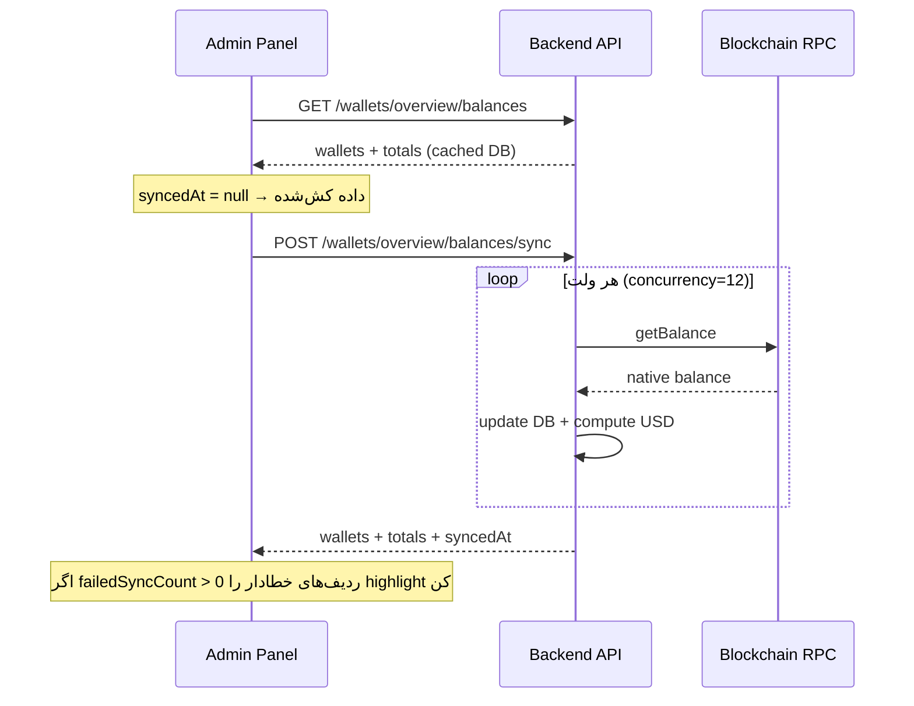

# Wallet Overview — راهنمای فرانت

صفحه‌ای در پنل مدیریت برای **دیدن همه ولت‌های ثبت‌شده در دیتابیس**، **سینک موجودی از بلاکچین**، و **نمایش جمع موجودی USD**.

---

## خلاصه

| مورد | مقدار |
|------|--------|
| Tag (Swagger) | `Wallets` |
| Base path | `/api/v1/wallets` |
| Auth | Header `X-API-Key` |
| Scope | فقط ولت‌های جدول `wallets` (`MARKET` + `TOKEN_OWNER` + `LIQUIDITY`) |
| خارج از scope | ولت‌های funding/withdrawal → [`GET /api/v1/main-fee-wallet`](#ولت‌های-خارج-از-scope) |

---

## فلو پیشنهادی UI



### مراحل UX

1. **Mount صفحه:** `GET /wallets/overview/balances` — بارگذاری سریع از کش DB.
2. **دکمه «Sync balances»:** `POST /wallets/overview/balances/sync` — disable + spinner تا پاسخ بیاید.
3. **بعد از sync:** `totalUsd` و `totalsByNetwork` / `totalsByType` را در header/kpi cards نشان بده.
4. **جدول ولت‌ها:** از فیلد `wallets` استفاده کن (server-side filter، نه paginate جدا — لیست کامل برمی‌گردد).
5. **فیلتر شبکه/نوع:** query را عوض کن و دوباره GET یا POST بزن.

> **زمان sync:** بسته به تعداد ولت‌ها ممکن است چند ثانیه تا ده‌ها ثانیه طول بکشد (۱۲ ولت همزمان از RPC). timeout کلاینت را حداقل **۶۰ ثانیه** بگذار.

---

## اندپوینت‌ها

### 1) مشاهده موجودی (کش)

```http
GET /api/v1/wallets/overview/balances
X-API-Key: <key>
```

**Query (همه اختیاری)**

| Param | Type | Values | توضیح |
|-------|------|--------|--------|
| `network` | enum | `SOLANA`, `BSC` | فقط یک شبکه |
| `type` | enum | `MARKET`, `TOKEN_OWNER`, `LIQUIDITY` | فقط یک نوع ولت — `LIQUIDITY` فقط برای سیکل‌های `CUSTOM_RAYDIUM` وجود دارد |

**نمونه**

```http
GET /api/v1/wallets/overview/balances?network=SOLANA&type=MARKET
```

- مقادیر `balanceNative` / `balanceUsd` از **آخرین sync موفق** در DB هستند.
- `syncedAt` در این endpoint همیشه **`null`** است (یعنی «آخرین زمان sync سراسری» set نشده).

---

### 2) سینک موجودی از chain

```http
POST /api/v1/wallets/overview/balances/sync
X-API-Key: <key>
```

همان queryهای `network` و `type` را می‌پذیرد.

- برای هر ولت، balance از RPC خوانده می‌شود، DB آپدیت می‌شود، USD محاسبه می‌شود.
- پاسخ **همان schema** endpoint GET است، با این تفاوت که:
  - `syncedAt` = ISO timestamp زمان اتمام sync
  - روی هر wallet ممکن است `refreshedAt` / `fromCache` / `syncError` بیاید

**Body لازم نیست** — فقط query.

---

## Response Schema

### Root — `SystemWalletBalancesResponse`

```ts
type Network = 'SOLANA' | 'BSC';
type WalletType = 'MARKET' | 'TOKEN_OWNER' | 'LIQUIDITY';

interface SystemWalletBalancesResponse {
  walletCount: number;
  activeWalletCount: number;
  totalUsd: number;                    // جمع USD همه ولت‌های برگشتی
  totalsByNetwork: Record<Network, NetworkTotals>;
  totalsByType: Record<WalletType, TypeTotals>;
  syncedAt: string | null;             // null = GET (کش) | ISO string = بعد از POST sync
  failedSyncCount: number;             // تعداد wallet با syncError
  wallets: SystemWalletBalanceRow[];
}

interface NetworkTotals {
  walletCount: number;
  activeWalletCount: number;
  totalNative: string;                 // جمع native همان شبکه (SOL یا BNB) — string decimal
  totalUsd: number;
}

interface TypeTotals {
  walletCount: number;
  totalUsd: number;
}

interface SystemWalletBalanceRow {
  id: string;                          // UUID
  address: string;
  network: Network;
  type: WalletType;
  cycleId: string | null;              // null = pool / detached owner
  balanceNative: string;             // string — برای دقت اعشار
  balanceUsd: number;
  isActive: boolean;
  refreshedAt?: string;                // فقط بعد از sync موفق
  fromCache?: boolean;                 // معمولاً false بعد از sync
  syncError?: string;                  // اگر sync این wallet fail شده
}
```

### نمونه پاسخ (بعد از sync)

```json
{
  "walletCount": 150,
  "activeWalletCount": 142,
  "totalUsd": 3721.5,
  "totalsByNetwork": {
    "SOLANA": {
      "walletCount": 100,
      "activeWalletCount": 95,
      "totalNative": "12.500000000",
      "totalUsd": 2500
    },
    "BSC": {
      "walletCount": 50,
      "activeWalletCount": 47,
      "totalNative": "1.850000000",
      "totalUsd": 1221.5
    }
  },
  "totalsByType": {
    "MARKET": { "walletCount": 140, "totalUsd": 3500 },
    "TOKEN_OWNER": { "walletCount": 10, "totalUsd": 221.5 },
    "LIQUIDITY": { "walletCount": 1, "totalUsd": 350.0 }
  },
  "syncedAt": "2026-07-01T12:00:00.000Z",
  "failedSyncCount": 1,
  "wallets": [
    {
      "id": "9c4e2a1b-7f3d-4e2a-9b1c-2d3e4f5a6b7c",
      "address": "7xKXtg2CW87d97TXJSDpbD5jBkheTqA83TZRuJosgAsU",
      "network": "SOLANA",
      "type": "MARKET",
      "cycleId": "a1b2c3d4-e5f6-7890-abcd-ef1234567890",
      "balanceNative": "0.0523",
      "balanceUsd": 9.32,
      "isActive": true,
      "refreshedAt": "2026-07-01T12:00:00.000Z",
      "fromCache": false
    },
    {
      "id": "deadbeef-dead-beef-dead-beefdeadbeef",
      "address": "pending:staging",
      "network": "SOLANA",
      "type": "MARKET",
      "cycleId": null,
      "balanceNative": "0",
      "balanceUsd": 0,
      "isActive": false,
      "syncError": "Wallet address is not tradable on-chain"
    }
  ]
}
```

---

## نکات نمایش در UI

### KPI Cards (پیشنهاد)

| Card | Field |
|------|-------|
| Total USD | `totalUsd` |
| Wallets | `walletCount` / `activeWalletCount` |
| Solana | `totalsByNetwork.SOLANA.totalUsd` + `totalNative` + « SOL» |
| BSC | `totalsByNetwork.BSC.totalUsd` + `totalNative` + « BNB» |
| Market wallets | `totalsByType.MARKET.totalUsd` |
| Token owners | `totalsByType.TOKEN_OWNER.totalUsd` |
| Liquidity wallets (CUSTOM_RAYDIUM) | `totalsByType.LIQUIDITY.totalUsd` — نمایش فقط اگر `walletCount > 0` |
| Sync errors | `failedSyncCount` (قرمز اگر > 0) |
| Last synced | `syncedAt` (اگر null → «Cached data») |

### جدول ولت‌ها

| Column | Field |
|--------|-------|
| Address | `address` (truncate + copy) |
| Network | `network` badge |
| Type | `type` |
| Cycle | `cycleId` → لینک به صفحه cycle اگر دارید |
| Native | `balanceNative` + unit (SOL/BNB) |
| USD | `balanceUsd` |
| Status | `isActive` |
| Sync | اگر `syncError` → tooltip با متن خطا |

### فیلترها

- **Network:** dropdown → `?network=SOLANA` یا `BSC`
- **Type:** dropdown → `?type=MARKET` یا `TOKEN_OWNER` یا `LIQUIDITY`
- ترکیب هر دو مجاز است.

> **ولت لیکوئیدیتی:** فقط برای سیکل‌های `CUSTOM_RAYDIUM` ساخته می‌شود؛ `balanceUsd` آن شامل SOL باقیمانده + ارزش LP قفل‌شده **نیست** (فقط native). برای وضعیت لاک/آنلاک از `GET /core-trigger/cycles/:id` → `token.liquidityLockedAt` / `token.liquidityUnlockedAt` استفاده کنید.

---

## خطاها

| HTTP | معنی | اقدام UI |
|------|------|----------|
| `401` | API key نامعتبر/ندارد | redirect login / toast |
| `400` | query نامعتبر (enum اشتباه) | validation روی فیلتر |
| `500` | RPC یا price feed down | toast + retry |

فرمت خطا:

```json
{
  "statusCode": 401,
  "message": {
    "message": "Invalid API key",
    "error": "Unauthorized",
    "statusCode": 401
  },
  "timestamp": "2026-07-01T12:00:00.000Z"
}
```

### sync جزئی (مهم)

Sync **atomic per wallet** است — اگر یک ولت fail شود، بقیه sync می‌شوند.

- `failedSyncCount > 0` → banner هشدار
- walletهای خطادار: `syncError` set شده؛ balance همان **مقدار قبلی DB** است
- UI نباید فرض کند همه `refreshedAt` دارند

---

## ولت‌های خارج از scope

این endpoint **ولت‌های عملیاتی مرکزی** را شامل نمی‌شود:

| منبع | Endpoint | محتوا |
|------|----------|--------|
| Funding / withdrawal | `GET /api/v1/main-fee-wallet` | USDC, ETH, SOL, BNB روی آدرس‌های ثابت env |

اگر در پنل «کل موجودی سیستم» لازم است، دو بخش جدا نشان بده:

1. **Operational wallets** → `main-fee-wallet`
2. **Cycle / pool wallets** → `wallets/overview/balances`

---

## اندپوینت‌های مرتبط (اختیاری)

| Endpoint | کاربرد |
|----------|--------|
| `GET /api/v1/wallets` | لیست paginated (page/limit) — برای CRUD/admin جدا از overview |
| `GET /api/v1/wallets/:walletId` | جزئیات یک ولت + balance refresh |
| `GET /api/v1/wallets/:walletId/balance` | فقط balance یک ولت |
| `GET /api/v1/wallets/cycles/:cycleId/market-balances` | جمع MARKET یک cycle (کش) |
| `POST /api/v1/wallets/cycles/:cycleId/market-balances/sync` | sync MARKET همان cycle |

> Overview سراسری برای **داشبورد admin**؛ cycle-specific برای **صفحه جزئیات cycle**.

---

## TypeScript — نمونه client

```ts
const API_BASE = import.meta.env.VITE_API_BASE_URL ?? 'http://localhost:5420/api/v1';
const API_KEY = '...';

type WalletOverviewQuery = {
  network?: 'SOLANA' | 'BSC';
  type?: 'MARKET' | 'TOKEN_OWNER' | 'LIQUIDITY';
};

function buildQuery(q: WalletOverviewQuery): string {
  const params = new URLSearchParams();
  if (q.network) params.set('network', q.network);
  if (q.type) params.set('type', q.type);
  const s = params.toString();
  return s ? `?${s}` : '';
}

async function fetchWalletOverview(
  q: WalletOverviewQuery,
  sync = false,
): Promise<SystemWalletBalancesResponse> {
  const path = `/wallets/overview/balances${buildQuery(q)}`;
  const res = await fetch(`${API_BASE}${sync ? `${path}/sync` : path}`, {
    method: sync ? 'POST' : 'GET',
    headers: { 'X-API-Key': API_KEY },
  });
  if (!res.ok) throw new Error(await res.text());
  return res.json();
}

// usage
const cached = await fetchWalletOverview({});
const fresh = await fetchWalletOverview({ network: 'SOLANA' }, true);
```

---

## Checklist پیاده‌سازی فرانت

- [ ] Header `X-API-Key` روی همه requestها
- [ ] KPI از `totalUsd`, `totalsByNetwork`, `totalsByType`
- [ ] جدول از `wallets` با highlight `syncError`
- [ ] دکمه sync → `POST .../sync` با loading طولانی
- [ ] نمایش `syncedAt` یا label «Cached»
- [ ] فیلتر network/type → re-fetch (شامل `LIQUIDITY`)
- [ ] (اختیاری) بخش جدا برای `GET /main-fee-wallet`
- [ ] (اختیاری) لینک ردیف `LIQUIDITY` به صفحه جزئیات cycle برای دیدن وضعیت لاک/آنلاک — [`manual-launchpad-frontend.md`](./manual-launchpad-frontend.md)

---

## Swagger

Operation IDs:

- `WalletGenerator_getSystemWalletBalances`
- `WalletGenerator_syncSystemWalletBalances`

Schema names: `SystemWalletBalancesResponseDto`, `SystemWalletBalanceRowDto`, `SystemWalletBalancesQueryDto`
